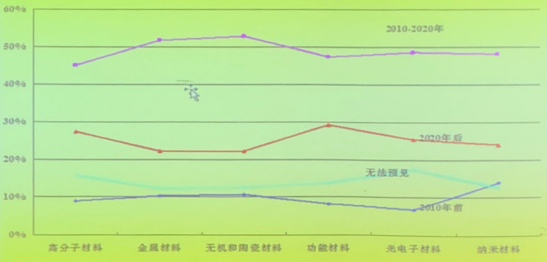
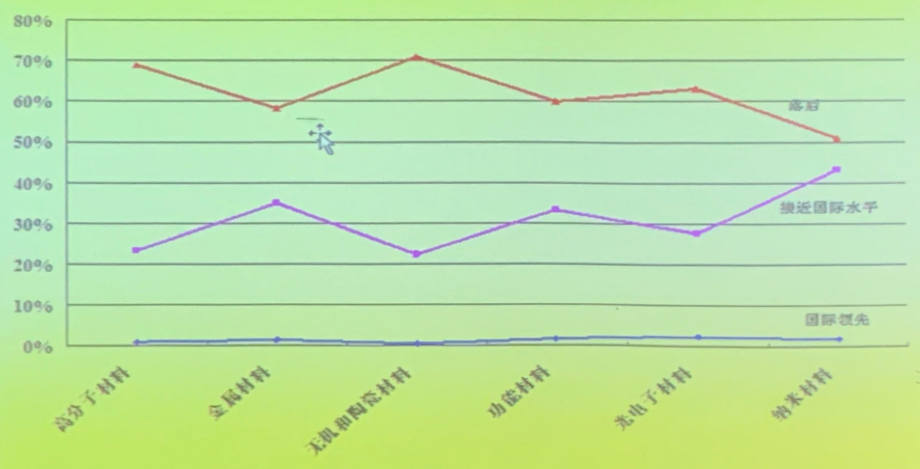
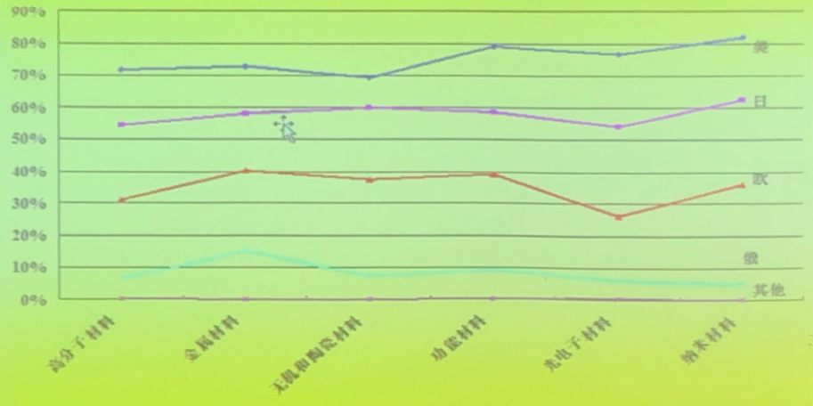
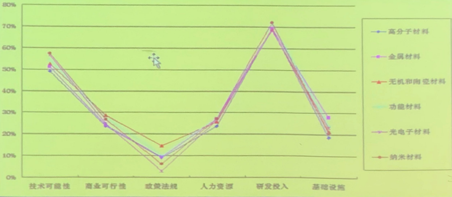

# 😀**自然辩证法课程知识点总结**

同步连接：[网页版](https://blog.creativecc.cn/posts/Lesson-Dialectics-Of-Nature.html)

# 世界科技体制的形成和中国科技体制的变革

**定义**：

- 科技体制：
  - 组织结构和运行机制：
    - 科技体制是指**科学技术的组织设置及其相互之间的组织性制约关系**；
    - 其机制是指科学技术在内外动力作用下产生动态过程的各相关因素互相制约的一般模式
- 原则：
  - **科技体制化**是科学技术产物发展的必然产物
  - 科技体制的形成与建设过程充分显示了社会对科技发展的或促进或制约的过程
  - 中国科技体制是**移植国外的，而非内生的，其有深刻的历史合理性与必然性**

## 1. 世界科学技术

> - 从小科学到大科学
> - 哥白尼天体运行论
> - 牛顿-自然哲学中的数学原理
> - 爱因斯坦-相对论

- 近代科学体系的建立：
  - 两个特点：逻辑演绎+实验验证
- 小科学特点：
  - **个体行为**（个人独立完成，无经费）
  - **追求知识**（无实际效益）
  - **自由探索**（兴趣使然，无具体目标）
- 大科学：**大目标，大投入，大设备，大协作，大效益**

> 曼哈顿就工程，阿波罗计划，国际空间站等
>
> 中国神六，嫦娥卫星：万人一杆枪
>
> 中国：从陈景润到王选、袁隆平

## 2. 世界科技体制的形成

- 古希腊：

  - 毕达哥拉斯，“伦理-政治学园”
  - 柏拉图：柏拉图学园
  - 亚里士多德：吕克昂学园
  - 亚历山大时期：谬赛昂学院，图书馆

  就科学而言，没有形成集体系统的研究，没有形成共同体，没有形成完整的体制

  - 科学：近代科学

  - 体制：近代科学的体制
  - 英国皇家学会、法国科学院

### 意大利-世俗大学

> 8世纪开始，教堂建立寺院学校
>
> 意大利波轮首先出现世俗的法律学校
>
> 12世纪，加上医学院和法学院，成为伯伦那大学
>
> 15世纪，欧洲共有80所大学，意大利20所
>
> 1603-1630，罗马成立猞狸学社

- 基础教育有7科：文法、修辞、逻辑、算术、几何、天文学、音乐
- 世俗大学教师出现，处于外围和业余地位，有若干专门职位
- 1400年，伯伦那大学教席数目：
  - 科学（自然哲学、物理学、占星学）3
  - 医学 11人

### 英语-皇家学会

> 皇家学会前身-无形学院
>
> 非正式小组-哲学学会
>
> 1660.11.28:英国皇家学会成立
>
> 1662-1669:获得皇家各种特许证，英女皇成为学会保护人，称“伦敦皇家自然知识促进学会”

- 世界首个有影响的科学家组织正式开始自己的历史

- 皇家学会宣布科学的价值与功能，规定了科学活动的规范

  - **组织定型**
  - **章程明确**
  - **活动记录完整**

  标志着科学活动在英国社会中得到正式承认，宣布了科学活动的体制化

> - 学会宗旨是促进自然科学的发展，是世界上历史最长而又从未中断过的科学学会
> - 皇家学会没有政府拨款，会员定期缴纳会费，每周固定集会
> - 1664年专门的委员会：机械69人，手工业35人，农业32人，天文学15人
> - 1665年，出版物直属刊物《哲学会刊》，开辟科学团体出版社杂志的先河，成为学术共同体形成与成熟的重要标志

- 特点与局限性：**独立团体，自主性强，成员混杂，业余科学，科学体制化的初步阶段，非职业化**

### 法国-科学院

> 私人赞助科学，规模较小，不稳定
>
> 科学考察、实验、仪器、原料费用增强
>
> 科学家提议，建立由国家支持的专门机构—自然科学院
>
> 国王：通过科学为王权增光
>
> 
>
> 1666年，法国科学院成立
>
> 1699年，改组学会
>
> 法国科学院的宗旨：**鼓励与保护研究精神，致力于提高教育和出版物质量并致力于维护法兰西科学用语的纯洁性及其作用**
>
> 法国科学院由院士、外国合作院士和通讯院士组成

- 历史上第一个“官办”科学机构
  - 经费国家提供，科学家专心致力于研究
  - 只吸收各领域的专门学者
  - 吸收国外著名科学家作为院士
- 特点与局限性：
  - **仅限于少数高级精英分子**
  - **院士有年薪和助手配置，由国家财政支持**
  - **承担行政与管理使命：管理公共事务、处理市政、军事、教育及工农业方面的科学问题**
  - **是一个管理机构而非纯粹的研究组织**
- 影响：
  - 开始独立科学研究机构的先例
  - 德国、俄罗斯、中国先后受其影响建立自己的国家级科学院
  - 法国科学院成立及制度成立标志科学可以成为有经济收入的专门职业
  - RS会员交会费，法国科学院拿薪水

### 德国-研究型大学

> 德国大学19世纪演变为研究型大学，大学教师必须进行科学研究
>
> 1917，蔡元培回国，大学不是神官发财的地方，是做学问的地方
>
> 德国大学：猞狸正教授席位；青年学者可以授课，晋升必须有独立研究成果
>
> 私人教师成立教授后备军。德国大学发展为现代以科学研究为主体的大学
>
> - 教学实验室的出现
> - SEMINAR的出现：科学研究不再局限于精英科学家
> - 科学研究与工业结合

- 特点与局限：
  - 大学没有系，只有教授席位
  - 教授与助教、研究生关系类似于企业主与雇主的关系
  - 助教难以开展独立自由的研究，科研人才成长受阻
  - 学科体系僵硬，不利于新学科fazhan

### 美国-现代大学-研究生院-工业实验室

- 美国大学：系的建立，系代表大学科，容量远大于教授席位；克服教授席位等级森严僵硬等问题；科学研究以课题为基础，比席位更加灵活，人员流动性强
- 研究生院出现：哈佛，耶鲁，斯坦福，康奈尔；培养大批研究生；主要方式SEMINAR；直接把研究生带到科学研究的前沿；财政资助；奖学金
- 工业实验室：贝尔实验室；企业提供雄厚科研经费与优越条件；加强科学研究与企业之间的相互交流，形成工业-大学联合体
- 美国国家实验室：80多个部，局，委员会有半数以上设立科学研究机构；原子能委员会5大研究基地；NASA；科学家参与国家科学事业，与大学、工业形成三足鼎立局面
- 大学科体制
  - 科学-技术一体化（国家工程研究中心）
  - 科学-工业一体化（企业博士后流动站，科学园，科学孵化器）
  - 科学-军事一体化
  - 科学-工业-军事一体化
  - 科研全球化（国际科学学会）
  - 跨国公司研发机构

### 小结

两种模式：

- **分散性：英国、美国**
- **集中性：法国、俄罗斯**
- **集中性：中国**
  - 中科院法律地位：国家知识创新体系核心

## 3. 中国科技体制的历史演变

> 国人对科学技术认识过程：
>
> - 1582，利玛窦，开始接触西方技术
> - 李鸿章
> - 张之洞
> - 陈独秀、胡适等
> - 毛泽东
> - 周恩来
> - 邓小平
> - 江泽民
> - 胡锦涛

- 科学团体自主发展阶段

> - 1915，中国科学社成立
> - 1916，地质调查所成立
> - 社会现代人-人的现代化-观念的现代化
> - 中国第一位数学博士胡明复

- 国家科技体制初步确定阶段

> - 1928，中央研究院成立（法国体制）
> - 1937，成立评议会
> - 1948，建立院士制
> - 1949，科技人员满打满算5w人，机构30多个

- 旧中国科研机构的一元化改造

> - 1949，中科院成立
> - 1955，成立学部
> - 1950，中华全国自然科学专门学会联合会成立
> - 1958，国防科技委员会成立
> - 1958，国家科学技术委员会成立
> - 1958，中国科学技术协会成立

- 新中国科学研究系统**五大方面军**

  - **中国科学院**
  - **高等院校**
  - **中央产业部门科研机构**
  - **地方研究机构**
  - **国防科研机构**

  集中力量，形成拳头，进行突破

- 新中国科技制简评

  - 特点：
    - 科技体制建立在**公有制基础**上，R&D机构基本为国有
    - 科技体制建立的基点是**依靠自己的力量，自主发展科技事业**
    - 政府**直接组织**科研规范、计划的制定和实施
    - 中央政府是**国家科学机制的中心**
    - 科技体制是在不稳定模式中发展的，科技自身发展与对经济、社会的贡献两者始终难以协调
  - **优点**：
    - 好钢用在刀刃上，集中力量打击歼灭战
    - 在国际封锁、国内资源稀缺条件下，这一体制能够将有限资源向战略目标领域动员与集中，迅速建立比较完整的组织体系和基础设施
    - 在当时历史条件下这一体制基本上是成功和有效的，两弹一星一潜艇
  - **缺点**：
    - 是一个自封闭的垂直结构体系，科研单位对上级领导部门负责而缺少与社会及独立单位之间的横向联系。
    - 缺少一种公平的科技成果有偿转让机制，不利于研究成果扩散
    - 国家用行政手段直接管理过多，科研单位缺乏自主权
    - 科研机构自成体系、条块分隔严重，科技资源严重分散，也导致人员结构与知识结构僵化

## 4. 当前中国科技体制改革简述

- 科技体制改革试点阶段：

> - 背景：军事竞赛、经济竞赛
> - 1978，邓小平：科学技术是生产力等，陈景润报告
> - 1982，赵紫阳，经济建设必须依靠科学技术
> - 1980，中关村走向中国硅谷的起点

- 科技体制改革全面发展展开阶段

> - 改革拨款制度，放松科研机构把管制
> - 落实“面向”、“依靠”，堵死一头，网开一面
> - 1985，《专利法》
> - 1985，深圳科技工业园创办
> - 1986，国家自然科学基金委员会成立

- 科技体制改革调整深化阶段

> - 稳住一头，放开一片
> - 科技大战三个层次：**面向经济主战场，发展高科技及产业，加强基础研究**
> - “面向”，“依靠”，“攀高峰”
> - 1993，《中华人民共和国科学技术进步法》
> - 1995，《关于加速科学技术进步的决定》
> - 1996，《中华人民共和国促进科技成果转化法》
> - 1994，中国工程院成立

- 建设国家创新体系阶段：

> - 1998，中科院：《迎接知识经济时代，建设国家创新体系》
> - 1998以后，国家部委376个技术开发型研究院
> - 1999，《国家科学技术奖励条例》

## 5. 当前中国科技体制改革主要措施

中国科技体制主要目标：**使科技人员作用得到充分发挥，使科学技术成果迅速广泛用于生产，提高科技生产力，促进科学技术和社会发展**。改革围绕运行机制展开：

- **在经费拨款方面**：对从事不同类型工作的研究机构实行不同的拨款办法和管理办法，逐步减少事业费拨款而加大对项目的资助
- **在研究所体制改革方面**：
  - 政研职责分开，直接控制转间接控制；
  - 扩大研究所自主权，实行所长制
  - 鼓励研究、教育、设计机构与生产单位相互之间的联系合作
  - 鼓励技术发展型科技机构进入企业
  - 实行课题组长负责制
- **在人才制度方面**：促使研究机构更加开发，加强科研机构同大学与企业之间人员的信息的交流与横向联合
- 在强调为国民经济服务的同时，继续**重视基础研究**。

## 6. 当前中国科技体制改革的主要成效

- 科技与经济结合方面取得了一定成效，并未根本解决（经济创新与科学创新）
- 资源配置改善，但为优化（课题制）
- 科学产出增加，质量有待提高（SCI）

在组织结构方面出现新的生长点，但研究所作用削弱

- 1980s，重点实验室，开放实验室
- 1990s，工程研究中心，技术开发中心
- 博士后流动站
- 高新技术产业开发区
- 民间科技机构，科技中介机构
- 外商设计的科研机构（微软亚研院）

- 吴明翰
- 中国科技经历三次飞跃
  - 1. 1956年制定12年科技发展远景规划，中国走上现代化轨道
    2. 1978年全国科学大会
    3. 当今时代自主创新，建设创新型国家

## 7. 国家重大科技计划

- 国家科技攻关计划
  - 1982年实施
  - 面向国民经济建设主战场
  - 中国累计柚子最大，人员最多
- **863计划**
  - 4位重量级科学家：应用光学王大珩，核物理王淦昌，空间自动控制杨嘉墀，无线电电子陈芳允给中共中央写信，提出跟踪世界先进技术水平；国务院批准《高技术研究发展计划（863计划）纲要》
  - 有限目标，突出重点
  - 选择生物技术，航天技术，信息技术，激光技术，自动化技术，能源技术和新材料7的领域15个主题作为研究重点
  - 目标：
    - 在几个重要高技术领域，跟踪国际水平，缩小同国外的差距
    - 培养新一代高水平科技人才
    - 通过伞型辐射，带动相关方面的科学技术进步
    - 为下世纪初经济发展和国防建设奠定比较先进的基础
    - 把阶段性研究成果同其他推广应用计划密切衔接，迅速地转化为生产力，发挥经济效益
  - 缺陷：高技术，产业化
- 星火计划
  - 1986，实施第一个依靠科学技术促进农村经济发展的计划
  - 宗旨：把先进技术引进农村，提高农村科技水平和生产率
  - 1994，重新确认第一批国家星火计划基地42个
- 攀登计划
  - 1991年实施
  - 为了加强基础性研究制定的计划，“稳住一头”政策的重要实施
  - 实现科技的纵深部署，吸引一批学术带头人形成队伍，集中力量发展优势领域突破
  - 46个计划先后列入

## 8. 单元总结

- **古希腊情况-ACADEMY来历**
- **英法的不同科学体制类型，科学职业化**
- **德国研究型大学出现，seminar，科学实验室出现；美国大学中系、研究生院建立，工业实验室建立**
- **中国科技体制：五大主力军，四大紧急措施，优势与短处，改革的目标与主要措施，重大计划（863）**

# 科普的定位和职业化问题

## 1. 背景

> - 弗兰西斯培根：知识就是力量
> - 阿基米德，牛顿，斯坦因门茨
> - 法拉第，哈雷，罗伯特
> - 贺麟
> - 阿福莫夫
> - 科普角色：培养人才，争取支持-公众理解，公众参与，协商（科普定位）
> - 英国给理工科学生开设科学传播课程
> - 钱学森科普印象

## 2. 科学在中国普及的简要历程-国人眼中的科学

> - 利玛窦，1582，中国开始接触西方科学技术
> - 洋务运动-失败
> - 师夷长技以制夷
> - 明治维新
> - 德国“铁血宰相”皮斯麦评价日本人语中国人留学
> - 中央之国，方正之邦
> - **1905，科举制度废除，开始逐步系统学习科学知识**
> - 三个变化：
>   - **知识：四书五经---科学知识**
>   - **人：传统读书人---近代知识分子**
>   - **体制：科举制度---科学教育、研究制**度
> - 1300年科学生态
> - 严复回国后考举人
> - 留学生一代，二代区别
> - 杨振宁感慨
> - 垄育之：现在船坚炮利的技术层面上，然后进入后面的声光化电知识层面，在深度到科学思想，科学精神层面
> - 新文化运动
>   - 1915年
>   - 赛先生---赛菩萨
>   - 北京大学科学与民主雕塑：SD定个O
> - 1922，梁启超：国人对于科学态度存在三点根本错误
>   - 把科学看的太低太粗
>   - 把科学看的太呆太窄
>   - 把科学看的太势力太俗
> - 建国后，1949，普及科学知识
> - 1951，科普协会宗旨：普及自然科学知识，提高科学技术水平
> - 1958，中国科协，6项基本任务：
>   - 积极协助有关单位开展科学技术研究和技术改革工作
>   - 总结交流和推广科学技术的发明创造和先进经验
>   - 大力普及科学技术知识
>   - 采取各种业余教育办法，积极培养科学技术人才
>   - 经常开展学术讨论和学术批判，出版学术刊物，继续进行知识分子的团结和改造工作
>   - 加强与国际科学技术界的联系，促进国际学术交流和国际科学界的保卫和平斗争
> - 高士其
> - 改革开放，以经济建设为中心，科学技术是第一生产力
> - 1980s，中国《养鸡500天》，美国《宇宙》
> - 赛先生-----赛财神
> - 樊洪业：“传统科普”特点，四个方面：
>   - 第一，科普理念，是从主流意识形态的框架中衍生出来的。
>   - 第二，科普对象，定位于工农兵。
>   - 第三，科普方针，须紧密结合生产实际需要
>   - 第四，科普体制，中央集权制之下的一元化组织结构
> - 90年代，提升全民科学素养
> - 国内伪科学泛滥，国外PUS兴起，美国2061计划提出
> - 1992，94，96，2001，03，05，07，09-10，2015，2018科学素养调查（0.3、0.2、0.3、1.4、1.98、1.6、2.25、3.27、6.2、8%）
> - 1999，全民科学素质行动计划（2049计划）
> - 2002，《科学技术普及法》
> - 2003，19专题“创新文化与科学普及”
> - 2006，《全民科学素质行动计划纲要》方针
> - 2015，《深化科技体制改革实施方案》，2020我国公民科学素养比例：10%

- 中国人眼中的科学：
  - 政府，科学技术是第一生产力
  - 公众，对科技信息感兴趣程度排第一位（83.19%的被调查公众）的是“致富信息，”(2003)
- 86年前，梁启超：国人对于科学的态度存在三点根本错误：太低太粗，太呆太窄，太势力太俗

## 3. 科普的定位

- 科普定义：**指学校正规科学数育以外的、主要通过大众传媒以及各类宣传、展数等方式传播科学知识，提高国民科学素质的社会教育活动。**
- 科普对于提高国民科学素质的贡献或责任？
- 科普的角色：教育背后的影子？独立性？
- 科学教育与科学普及的关系，学校数育是科学普及的基础，科学普及是学校教育的补充和延续。

- 联合国《2002年人类发展报告》，1998年中国公民的中学净入学率仅为50%(美、英、法相应数据分别为90%、94%和94%)
- 与科学教育相比，科普的对象及需求更加参差多元且变化复杂，手段非强制性，内容上难以系统化、统一化、按部就班地进行普及提高全体国民科学素质中的科学数育与科学普及：“亡羊补车”还是“亡羊找羊”？

- 科学知识无限，公众需求多元
- 专业之外的专家 = 公众？
- 科学知识的确定性？
- 最低的科学素养标准？
- 远离公众生活工作实际，接受？-缺失模型？
- 公众：参差多元、具体语境、变换复杂
- PCST-9各国代表所采用的使播名称：“公众理解科学与工程”、“公众理解研究”、“公众参与科学”、“人民科学运动”、“公众对科学的认知”、“公众对科学的意识”、“科学普及”、“科学对话”
- 科学技术没有国界，但是科学普及却越来越需要和世界各国的历史传统、现实情以及自身需求结合起来其形式面对各国千整万别的从日常生活，到精神文化，到民主政等不同次的多元化需求，不断现出干姿百态的模式和形态
  - 英国：讨论潜在风险：印度：解决现实生存
  - 中国公众，致富信息
  - 发达国家公众，健康、环保
- 对科学技术与公众关系的新认识
- 公众角色：被普及者（空瓶子）、纳税人
- 技术的社会形成(SST)
- 技术预见(TF)
- 公众参与科学

- 技术的社会形成
  - (SST: Social Shaping of Technology--- Donald Mackenzie. Robin Williams
  - 线性模式(基研-应用开发-技术创新-经济增长)不符合科学技术发展的实际情況
  - 技术是如何在特定的社会条件制约（组织的、政治的、经济的、文化的）下形成或定型的
  - 技术的后果是来自社会的协商和解释，而不是来自技术自身的逻辑发展。
  - 自行车，运动工具一交通工具，电话（中国，导弹，飞机-兰德公司2016年4月建议TW用导弹防御，放年飞机、军）
  - 公众作为技术的使用者，消费者对技术的影响

- 技术预(TF: Technology Foresight):
  - Ben R Martin,“技术预见是对科学、技术、经济环境和社会的远期未来进行有步骤的探索过程，其目精明装宋大经与社会效的时究包
  - 不仅关注未来科技的自身推动因素，而且着眼于外部市场的求拉动作用，既包括对科学技术自身在机会的选择，也包括对经济发展、社会进步相关需求的识别：不仅关注未来技术对工业和经济的影响。
  - 日本(1970-2006)：科技界、政府、企业、公众
  - 公众是技术发展的利益相关者

- **丹麦的共识会议**（外行公众参与的共识发展会议）
  - 步骤：选题、组建指导委员会、征集志愿者，第一次预备会、组织专家小组、第二次预备会、公众讨论会、广泛讨论征集意见
  - 专家提供专业背景文献资料，回答询问问题给出意见和建议，更正报告表述性错误（保留公众小组对报告内容的完整控制权）
  - 公众了解、咨询、提间、起草撰写报告，公众在科学技术间题或相关问题领域的评估中扮演重要角色”，“外行公民扮演关键性角色”——科学、科学家成为背景
- 技术的社会形成(ssT)
  - 公众作为技术的使用者，消费者对技术的影响
  - 技术预见：公众作为利益相关者
  - 公众参与科学：公众作为政策参与者
  - 澳大利亚科学对话，科学家与公众6：6，丹麦的共识会议，科学、科学家成为背景
- 公众角色：被普及者、纳税人有权了解（均一化、同质化）
  - 公众的角色、身份需要引入新维度：科学技术的使用者，消费者，利益相关者，决策参与者
- 以公众科学需求为导向，提供公众需要的知识（针对性）

## 4. 科普的职业化

- 传统观点：
  - 1985年《英国：公众理解科学》：“每一个科学家的一个职业责任就是促进公众对科学的理解”，并希科学家“真正认识到这是你义不容辞的工作”
  - 1986年，美国西格玛希( Sigma X)科学研究会在庆祝其成立一百周年时提出，让公众理解科学技术是今后一百年间科技界最应首先考虑的问题
  - 1999年，美回科学促进会主席格林伍德在美回科学年会上呼吁美园科学家“到美国各级学校兼职，直接参与加强科学数育和促进公众了解科学的工作
  - 2000年，在中国际科普论坛上，中国科协主席同光召指出：“广大科技工作者是开展科普工作的主要力量。坚持不懈地开展科普工作，是科技工作者义不容辞的责任。”

- 学者观点
  - 2010，PCST-11（印度）后续研讨会主题目：“培训科学家与媒介对话”
  - 高士其：“科学普及是科学工作者的重要任务之一，只有把科学研究和科学普及相互结合才是一个完整的科学工作者。”
  - 作为科学传播键中“第一发球员”的科学家们应当承担起科学普及的主体贵任，多次发出了“科学普及太重要了，不能单由科普作家来担当”的呼呼
  - 钱学森建议，研究生、博士生学位论文加一个副篇，用通俗语言对行外人讲清楚自己的研究题目
- 大众传播学理论中有一个基本的信息传播模经过传播模型，包括信息传播者，信息，传播渠道，信息接受者四个基本要素：即**模型1**:
  - **信息传播者→信息→传播渠道→信息接受者**
  - 信息生产者等于信息传播者
- **科学家→科学知识→传播渠道→公众**
- **三下乡：“文化、科技、卫生”进多村**
- **四进社区：“科数、文体、卫生、法律”进社区**
- 科学家科普非常态化、追求科学家名声、追求新闻效应，科普工作形式化、脉冲式的运动式的
- 科普内容、方式的变化
  - 媒体，“科学”成为文字游戏的对象，通俗性（可读性）、时效性、新闻性等都高于科学性

- 信息传播者→信息→传播道→信息接受者
  - 信息传播者：科学家？编辑记者？作家？
  - 信息：科研论文？科技新闻（科普创作）？
  - 2000,“通常认为科普创作者是主要的科学普及工作者，现在看来科学传播的主体可能主要是媒体科学传播工作者”
  - 2002,“当前科学传播系统中有5个主体，即**科学共同体、政府、媒体、公众以及非政府组织**”
- 模型2:
  - **科学知识生产者<->信息①<->科学知识传播者<->信息②<->传播道<->科学知识接受者**
  - “科学知识生产者”和“科学知识传播者”的区别
    - 信息①和信息②的区别
    - 传统的科学家（科学知识生产者）与公（科学知识接受者）之间的直接交流渠道仍然存在
- (1)科学家不应是当今科普的职业主体。在科普主体中，“科学知识传播者”应属于其主要的职业化队伍，包括科技传媒、科普创作、科技展览、科普活动等
- (2)科普作品应建立自己的评价体系，不应作为科学界的科研成果来评价。由于两者在语言规范、评价标准，交流对象等方面在在着诸多差异，因而科学界也始终难以认同科普类作品作为传统的科研成果
- (3)科普不应当作为科学家的硬性的职业要求。由于科学普及正逐渐发展成为一个独立的职业，其规范和评价与科学家科研工作会有本质不同。
- 当代科学家的科普责任：
  - 把“科学家”作进一步的区分：科学家个人和科学家组织，分别探讨二者的科普责任有助于认清并进而最解当前存在的尬局面。
  - 科学家个人即指作为个体的科研工作者，
  - 科学家组织则小到科学研究的课题组、实验室，大到科研院所、科技协会，直至整个科学共同体
  - 就科学家个人而言，针对每一位科学家在科普方面提出，职业上的工作要求、甚至量化的考核指标是不现实的，但作为一种观念倡导和一份任上的提醒，注意提高其自身的科普意识和能力是必要的。
  - 科学家组织，除科研经费庞大、资源丰富、设施齐外，还有复杂程度不同的人员层次结构，除科学家(竺可桢、华罗、苏步青、张开逊，三人行)外，包括相当比例的如学术秘书、各級科研助手、研究生、各类科研期刊编辑、网络、管理、学会组织人员等，数育、人事、宣传、综合服务、工会等部门行政人员（也具有科研或科学敦育背景，甚至由一线科学家兼任)
  - 相对而言，由于科学家团体在经费、人力、设施等方面都有较为充分的资源保障和更大的选择空间，因而其科普责任可以比较明确的进行量化规定和评估

## 5. 单元总结

- **科学家是科学知识的最初供给者：提高国民科学素质水平的主阵地在于学校科学数育，面向社会公众的科学普及的主渠道在于大众传媒：而科数的改革实践、科普的深入开展都离不开科学家的积极参与。科普需要协调与科研、数育、大众传媒相互之间的关系，建立密切的交流协作机制，进一步明确自己的角色定位。**
- **在提高全体国民科学素质的目标下，只谈科学普及是远远不够的：再科学规划中，只谈科学家的责任和作用也是远远不够的。**
- **相对于科学数育，科普更应以公众的各类科学需求为导向，建立高效的响应机制，提高国民科学素质的目标对于科普并不合适。**
- **当前科普的职业化应体现在两个方面，一是科学共同体外部的科普职业队伍建设（主要部分），二是科学共同体内部的科普职业队伍建设。**
- **从科学传播的角度看二者既有相互独立的地方，更有在传播链条上的依存合作关系。**
- **职业化的科学普及无疑将为促进科学的传播以及科技与社会的和谐发展带来一个全新的局面，也将更加需要科学家的积极投入和配合，而绝不意味着科学家退出科普领域。**
- **1897，“科学”一词由康有为译自日语，1905废除科**
  **举制度**
- **PUS:公众理解科学（Public Understanding of**
  **Science）**
- **《全民科学素质行动计划纲要(20062010-2020)》方针：“政府推动，全民参与，提升素质，促进和谐**
- **丹麦“共识会议”的全称：外行公众参与的共识发展会议**
- **三下乡：“文化、科技、卫生”进乡村**
- **四进社区：“科数、文体、卫生、法律”进社区**
- **我国当前公众科学素质水平：8%**

# 科学共同体：分层与奖励

## 1. 科学共同体与范式

- 共同体( COMMUNITY)定义：通常译为“社区”，是社会学中的一个重要概念，一般指若干社会群体(民族、家庭等)或社
  会组织(机关、团体等)聚集在某一区域里，形成一个在生活上相互关联的大集体
- 科学共同体( SCIENTIFIC COMMUNITY)定义：
  - 英国学者坡兰依，1942，“科学的自主性”：把全社会从事科学研究的科学家作为个具有共同信念、共同价值、共同规范
    的和群体，以区别于一般的社会群体组织。
  - 库恩、普赖斯、默顿
  - 库恩，1960S-70S《科学革命的结构》，《必要的张力》：“科学共同体是由一些学有专长的实际工作者所组成。他们由所受教育和训练中的共同因素结合在一起，他们自认为也被认为专门探素一些共同的目标，也包括培养自己的接班人。”
    - 科学共同体是科学认识的主体：**科学家个人→科学家集体**
    - “科学研究尽管是由个人进行的，而科学知识本质上是集团的产物，如不考虑创造这种知识的集团特殊性，那就无法理解知识的特有效能，也无法理解它的发展方式。从这一点说，我的书是属于社会学的，但也绝不允许这个问题离开认识论。”
    - 通过科学共同体的研究把科学的认识论方面与社会学方面有机的结合了起来，使科学社会学发生了重要变化

- 科学共同体特点：
  - 由从事实际工作的**科学家**组成。
  - 共同体组成分层次的：**学科，专业，方向，研究领域**
  - 专业一致的根本基础：**专业教育相同，对专业问题的看法相似**
  - 有共同的**社会关系**
  - 有共同的**范式**
- 范式(PARADIGM)：
  - 有20多种不同的提法
  - 主要是指科学的认识标准以及科学活动。
  - 世界观：免子变成狐狸？
  - 科学成果、概念、原理、方法
  - 实验程序、实验仪器
  - 学科模式、活动规则、行为方式
  - 一种科学的传统
- 前范式阶段：
  - 观点林立、众说纷纭
  - 同一域的科学家没有共同信念，没有公认的学科研究方法和评价标准，没有主导的理论学说
  - 同一领域科学家无法相互协作、相互交流，从而形成不了共同体
- 常规科学阶段：
  - 某一范式对一定时期的科学研究确立了支配的地位时，科学发展进入常规阶段。
  - 科学家主要从事说明、完善、捍卫范式的研究，不再发明新理论。
  - 判定重大事实：使事实更精确化
  - 理论与事实更加相符
  - 理论的细化、形式化、完美化。
  - 科学发展进入高度累积的阶段
- 后范式阶段：
  - 反常的情况不断出现，难以用常规的理论和方法解决
  - 既不能排除，也不能同化。微粒说不能解释光的衍射现象。
  - 反常影响到范式的基本原则时，常规科学陷入危机之中。
  - 科学共同体内部开始出现不同的意见和声音，理论修改越来越缺乏一致意见。
  - 新理论、新方法、新标准开始建立，旧的范式逐渐瓦解。
- 新范式出现：
  - 住往由学科领域里的新手提出标新立异的观点，并常常遭到旧范式的抵制，
  - 可能同时出现多个新的范式，相互之间形成竞争，最后或者统一、或者并存，形成几学共同体——产生不同的学派
  - 新的范式经受住挑战，解决新的问题，包容旧的范式的内容，最后获得胜利
- 范式与科学共同体：“粘合剂”
  - 范式为共同体的成员提供理论和方法上的信念
  - 范式给出新理论、方法的标准，成为共同体的进入门槛
  - 范式为科学共同体的交流提供了共同语言。为共同体下一代培养提供了内容标准
  - 为共同体研究提供新的起点的平台，推进科学持续发展范式使得科学共同体独立于外部，其自主性得以保护

## 2. 科学共同体的形成

形式：

- 内在形式：学派，无形学派
- 外在形式：学会，研究所，大学

学派( SCHOOL)：

- 是科学家的一种特殊的创造性联合，往往由一代甚至几代具有很高学术水平和技能的科学家团结在一个或者几个科学大师周围，在某一研究方向上进行创造性的科研工作。
- 日心说、地心说
- 水成论、火成论、突变论
- 微粒说、波动说
- 燃素说、氧化说

学派形成的条件

- **以共同的范式为基础**
  - 学派是不同范式在竞争中的科学社会组织的表现形式。
  - 当科学理论内部显现危机时，不同学派的出现为科学理论的发展进步提供了新的生长点，扩展了理论领域和理论方法。
- **以学术权威为核心**
  - 学术权威为学派范式的理论基础做出了根本性贡献。
  - (1)与传统理论、观点、方法有明显的区别
  - (2)贡献是莫基性的，在此新方向上后来者可以有大量值得探讨的问题，从而形成共同的学术团体一学派
- **以学派创始人为核心的创新集体**
  - 学派内部有结构，学术权威为核心，周围有
    追随者、合作者、拥护者。
  - 师生关系是学派的基本结构
  - 形成学术图层：(1)核心是学派大师、领袖；(2)学派大师直接领导下的科学家、学生；(3)在学派基地外，但认同学派的观点和范
    式

学派的功能

- **培育科学新生长点的基地**
  - 学派是新思想的孵化器、庇护所：如罗瓦的群论、孟德尔的遗传理论？
  - 学派为新理论提供了生存空间，造成适宜的学术小气候
  - 学派成员相互激励、交流，形成群体竟争优势，可与传统学派抗衡。
- **是培养新一代科学家的据篮**
  - “大科学家是大科学家挑选和培养出来的”
  - 在研究风格和研究方法上的影响一隐性知识，“渔”非鱼也
  - 卢瑟福指导过的科学家有11人获得诺奖，玻尔手下有7人获奖。
  - 美国1901-1972,92位获奖者中有一半以上(48)其导师也是诺奖获得者
  - 名师一高徒
- **不同学派的存在是科学发展的组织保障**
  - 不同学派的出现为科学发展创造了一个良性竟争的环境。
  - 为不同的学术观点提供了发表的机会
  - 保障了学术研究的自由。

学派领袖和学派风格：

- 卢瑟福：独立思考、首创精神、个性（博士生）
- 尼尔斯玻尔：“哥本哈根精神”
- 学派领袖的阻碍作用：马太效应

- 科学学派的特征
  - (1)科学带头人一大科学家
  - (2)科学带头人的数育技能，鉴定才能的能力
  - (3)特殊的科学气氛
  - (4)科学带头人的高品质，个人感召力
  - (5)学生的独立思考与首创力
  - (6)研究方法与解释现象的观点
  - (7)学生与科学带头人的经常交住与密切联系
  - (8)存在大批有才能的学生
  - (9)课题的统一
  - (10)独特的思维方式
  - (11)具有新奇的科学思想
  - (12)创立新的科学方向
- **无形学院**( INVISIBLE COLLEGE)
  - 17世纪波义耳，“看不见的学院”（自发的、非正式的科学团体）。
  - 普赖斯，将“无形学院”概念从科学史移植到科学社会学。认为科学共同体中有两类组织，一是正式的、有组织的科学家集团，一是非正式的、非组织化的科学家群体，后者主要通过科学交流、信息网络连接在一起，被称为无形学院。
  - 默顿，“从社会学意义上，可以把“无形学院解释为地理上分散的科学家集簇，这些科学家处在较大的科学共同体中，但是，他们彼此之间在认识上的相互作用比其他科学家的相互影响更加频繁。”
  - 克兰，“社会子”，重视科学中心的非正式社会组织在科学进步中的作用。

- 现代科学知识发展的两种反向趋势：
  - 高度专门化：走向封闭性，科学共同体之间交流困难。
  - 接受外部的学术思想：不同学科相互交叉和渗透，走向开放
  - 开放性的表现即是无形学院
- 无形学院特征
  - **具有共同的专业研究领域。**
  - **具有趋同的学术思想和理论倾向**
  - **地域上存在空间跨度**
  - **社会结构是松散的、非正式的。**
  - **科学家之间主要通过信息媒介、交流网络来沟通，形成复杂的网络系统。**
  - **通过无形学院网络更容易了解研究前沿。（正式系统往往有后效应）**
- 无形学院与科学交流：
  - 普赖斯：无形学院是科学家（作为信息传递者）通过信息交流形成的看不见的集体。
  - 无形学院作为科学共同体的另一种社会形态，其重要指标是：无形学院有独特的、富有个性化的科学交流的信息网络。
  - 科学家只进入正式的科学交流网络是不够的：学生要与导师打成一片。

- 外在形式：学会、研究所、大学
- 学会
  - 科学共同体最为广泛的社会外在组织形式。
  - 基本覆盖各国的科学共同体成员。
  - 主要任务是学术交流。
  - 各种学会常常是各国政府领导科学事业的思想库和咨询库。

- 大学
  - 传统功能是教书育人。
  - 现代大学还有科学研究功能一研究型大学
  - 教师通过科学研究，发展新知识、传播新知识
  - 服务社会、国家利益
- 国家科研组织系统
  - 国立科研机构：侧重于关系国计民生、国家安全的综合应用研究及其相关基础研究。
  - 企业研发中心：侧重于开发研究及相关的应用研究
  - 大学：侧重基础研究
  - 非政府、非营利科研机构：对上述各部分进行补充

## 3. 科学共同体的社会分层

- **分层**定义：
  - 分层概念源于地质学，在地质剖面中可以看到地质发展史上不同时代的岩石具有不同的性状，形成若千岩层。
  - 分层即是根据地质学知识对岩层进行鉴定以判定生成年代的过程。
- 社会分层定义：
  - 由于社会成员之间有差异，可以根据差异程度把社会成员划分为若干不同的等级，形成社会的等级结构。处于不同等级地位上的社会成员就自然形成了不同的社会层次
  - **社会分层**就是对人进行分类，依据一定的标准去衡量人们在整个社会生活和社会关系中的不同位置，从而把社会中的人划分为不同的阶层。
- 社会分层的标准
  - (1)根据人的自然属性：年龄、性别、种族、肤色等。
  - (2)根据人的社会属性：地位、教育程度、收入水平、权力、声望、行业、单位等。
    - 北大学费：30万-150万
- 现代社会的分层结构：
  - 梨状体：处于最高层的人是极少数，但处于最低层的人也是少数，相当大部分的人处于中间位置。这在农业社会也是如此。
  - 社会越发达，处于中间位置的人（中产阶级）就越多，处于下层的人就越少
  - BNU英语老师：只要有工作就是中产阶级
  - 鲁迅：社会三种人，维护传统-维持现状-改革创新
- 朱克曼统计
- **金字塔模型**
  - 1,美国诺贝尔奖获得者
  - 13,美国科学院院士
  - 2400,获得过博士学位的科学家
  - 2600,载入《美国男女科学家》词典的科学家
  - 4300,载入《科技人员登记册》的科学家
  - 6800,自称的科学工作者
  - 处于顶端的科学界超级精英于底层科学家比例：1：486
  - 底层科学家通过高层道路极为艰难，机会很小

- 年龄：
  - 1.科学是年轻人的事业。
    - 科研人员中25-44岁所占比例远高于一般职业雇员的相应比例。
  - 2.条理化程度高的学科年轻人出成果早，成明早
  - 3.**角色顺序**
    - 科学家的4种角色：**A研究，B教学，C行政管理，D鉴定和评审（守门员）**
    - 科学家的科学生涯早期主要从事研究、教学工作，晚期渐渐从事行政管理和评审工作
    - 科学的特征之一是老年人进行管理一科学中的“老人政治”。
- 性别：
  - 妇女进入科学界人数较少
  - 不同学科比例有所不同
  - 科学高层次中男女比例差异显著
    - 智商调查显示：博士学位获得者中女博士智商平均值稍高于男博士
  - 女性科研生产率低有社会因素
    - 流动性差
    - 动力问题
    - 性别歧视

- 学术声望（知名度）：
  - 1.是一种无形的社会承认，是科学家们自愿作出，受非科学因素影响小。
    - 国奖部奖不如学人的“心奖”（心服）
    - 一金杯银杯不如学界的“口碑”（口服）
  - 2.科学家发表论文数及被引证次数是知名度的经验测量指标
    - 科学家论文生产率的**逆二次幂规律（洛特卡定律）**：发表N篇论文作者人数与1/N平方成比例：相应发表一篇论文100人，2-25，3-11……
    - 高水平科学家论文被大量引用，大多数论文被忽略
- 学术背景
  - 1.名师出高徒：约一半美国诺贝尔获得者导师也是诺贝尔奖获得者
  - 2.著名机构的的优势积累，倍增效应

## 4. 科学的奖励制度：优先权

> - 近300年的科学史上充满了大大小小的关于科学发现和发明的优先权争论。
> - 17世纪，伽利略：《对巴兰德卡帕的谁谤和款诈的答辩》《试金者》
> - 17世纪，牛顿
> - 与胡克，光学、天体力学领域
> - 与莱布尼兹，微积分发明（利用皇家学会会长权力中止相关调查委员会工作）
> - 胡克与惠更斯，螺旋弹簧天平的发明权
> - 18世纪，卡文迪许，普利斯特列，拉瓦锡：水的成分的组成
> - 亚当斯，勒维列：海王星
> - 琴纳，皮尔逊，拉包特：接种牛痘
> - 19世纪，法拉弟，武拉斯顿，戴维：电磁感应现象
> - 拉格朗日，高斯，伯努利家族，柯西等数学领域
> - 20世纪，新特点：优先权之争出现在科研过程中了。
> - DNA发现过程：1953-1962
> - 克里克、沃森；维尔金斯，弗兰克林；泡林

- 优先权之争原因：
  - 同时发现必然导致优先权争议？
  - 能量守恒定律：焦耳，迈尔，禁尔母霍，格罗夫，柯尔丁，卡诺，法拉弟，李比希，(相互谦让，达尔文华菜士)
  - 默顿，科学体制本身的规范要求所致
  - 创新是科学界的最高价值
  - 原因不在于人类本性和个人品质，这仅只增加一些色彩和音调
  - 科学体制内在要求使得科学家为维护自己的发明而斗争
  - 对优先权的承认导致奖励制度的出现
- 定义：**科学共同体对于科学家所作贡献的肯定和承认的体系。包括各种名目的，奖励和报制度。**
  - 牛顿时代，达尔文时期，爱因斯坦世纪
  - 哥白尼体系，胡克定律，哈雷彗星，普朗克常数
  - 古生物学之父一居维叶，电工学之父ー法拉弟，实验心理学之父一冯特
- 金钱：在科学报酬制度是不重要的，“科学王国基本的硬通货是承认“
  - 退却主义：孟德尔，迈尔
- 科学体制**承认**：**主要是在科学的正式交流集渠道中实现的。**
  - 三个方面：**论文和著作发表，被引证率，荣誉奖励**
  - 两个类别：**实际职位，名誉承认**
  - 承认与科学的生产率正相关：大科学家一般是高产的
  - 研究工作的质量比单纯的数量要重要的多
- 学院科学：纯科学
  - 规范： CUDOS= kudos
  - Communalism 公有主义
  - Universalism 普遍主义
  - Disinterestedness 无私利性
  - Originality 独创性
  - Organized skepticism 有条理的怀疑主义
- 后学院科学：产业科学
  - 规范： PLACE
  - Proprietary 所有人的(专利的、所有权的)
  - Local 局部的，地方的
  - Authoritarian 权威的
  - Commissioned 定向的，任务导向的
  - Expert 专门的
- 学院科学的奖励：**精神性、荣誉性**
  - 同行承认
  - 命名
  - 称号
  - 荣誉
  - 精神
- 后学院科学的奖励：**多元、多样、广泛**
  - 多元：国家、企事、NGO、个人（饶毅个人放弃院士评选）
  - 多样：荣誉、实物、金钱、股权、职位
  - 广泛：基研、应用、开发
  - 物质为主
  - 精神为辅
- 国家最高科学技术奖
  - 国家自然科学奖
  - 国家技术发明奖
  - 国家科学技术进步奖
  - 中华人民共和国国际科学技术合作奖
    - 最高科学技术奖、国际科学技术合作奖不分等级
    - 自然科学奖、技术发明奖、科学技术进步奖分一等奖、二等奖
    - 自然科学奖、技术发明奖、科学技术进步奖每年奖励项目总数不细过400项。
- **国家最高科学技术奖**(2000—)
  - (1)在当代科学技术前沿取得重大突破或者在科学技术发展中有卓越建树的
  - (2)在科学技术创新、科学技术成果转化和高技术产业化中，创造巨大经济效益或者社会效益的。
    - **2000年度吴文俊、袁隆平**
    - **2001年度王选、黄昆。**
    - **2002年度金怡濂。**
    - **2003年度刘东生、王永志。**
    - **2004年首次空缺**
    - **2005年度叶笃正、吴孟超**
    - **2006年度李振声**
    - **2007年度闵恩泽、吴征镒**
    - **2008年度王忠诚、徐光宪**
    - **2009年度谷超豪、孙家栋**
    - **2010年度师昌绪、王振义**
    - **2011年度谢家麟、吴良镛**
    - **2012年度郑哲敏、王小谟**
    - **2013年度张存浩、陈开甲**
    - **2014年度于敏一氢弹**
    - **2016年度屠呦呦一三无科学家-2015诺奖**
- 国家自然科学奖
  - 在基础研究和应用基础研究中闻明自然现象、特征和规律，做出重大科学发现。
  - 重大科学发现：
    - (1)前人尚未发现或者尚未明
    - (2)具有重大科学价值
    - (3)得到国内外自然科学界公认
- 国家技术发明奖
  - 运用科学技术知识做出产品、工艺、材料及其系统等重大技术发明。
  - 重大技术发明：
    - (1)前人尚未发明或者尚未公开
    - (2)具有先进性和创造性
    - (3)经实施，创造显著经济效益或者社会效益。
- 国家科学技术进步奖
- 科学奖励的问题：“第四十一席位”
  - 朱克曼，《科学界的精英》
  - 评议人的重要性：守门员

## 5. 科学的奖励机制：马太效应

- 马太效应
  - 马太效应的基础
    - 棘轮效应一科学家一旦做出了某种成就，获得了某种声望，他以后就不会再跌回原来的水平和位置，如同棘轮装置一样
    - 诺贝奖获得者将终生带有这份荣誉，其光辉只可能由更光辉的新星出现而相对逊色，但其本人决不会倒回去。
    - 棘轮效应引导科学家不断继续努力，获得更大的成就。
    - 科学荣越高，科学共同体的期望值也越高，形成压力和动力。
  - 荣誉背景增强
    - 能见度
  - 荣誉背景的反溯增强作用：
    - 无名科学家经过不断努力，一且成名，人们会去回溯他以前的工作，其早期微不足道的工作也可能会受到重视和追捧、赞誉。
    - 成名较晚的科学家，在早期其成就被低估了，在后期其成就又被高估了。
  - 马太效应的正面作用：
    - 促进交流，提高能见度
      - 阅读有声望的科学家的论文
      - 新手最好先与名家合作发表研究成果，否则其成果可能永不见天日
    - 单位优势积累，群体效应
      - 进入优秀单位，加入先进群体
      - 自我实现
      - 运动队的冠军效应：信心一北大，哈佛的驴

## 6. 单元总结

- **科学共同体、学派、无形学院**
- **科学社会分层：金字塔模型**
- **科学家的职业顺序**
- **科学家论文生产率的逆二次幂规律**
- **科学界的最高奖励是承认**
- **国家最高科学技术奖**

# 科技政策与创新

## 1. 科技政策与创新

### 定义

- 定义
  - 在英文文献里，科技政策最早主要是指科学政策( Science Policy),原因是在市场经济发达的国家，技术发展基本上是私人企业的行为，政府本身并不直接支持企业，政府的科技政策也因而主要集中在科学发展方面。但在实际用法中，科学和技术常常连在一起科学政策常常包含着应用科学以及技术发展，也就变成了科技政策。
  - 科技政策有时用 Science and Technology Policy全称表示，有时用 Science Policy表示。
  - 法国学者让·雅克・萨洛蒙（Jean- Jacques Salmon)：“政府采取的集中性的措施，一方面为了鼓励科学和技术研究的发展，另一方面为了利用这些研究的结果实现所期望的一般的社会、经济和政治目标
  - **”为科技的政策“和”利用科技的政策“**
  - 将科技活动与政治、军事、经济和社会发进行系统整合
  - 美国科技政策研究领军人物布鲁克斯（ Harvey Brooks)：科技政策议题分为两类：1.“为了科学发展的政策”，如支持和管理国家科学事业的政策、计划等；2.“包含科学因素的政策”，如非常依赖于科技因素的国家政治于管理议题
  - 科技政策的功能不仅涉及科学技术自身的发展，而且涉及科技的应用，从而勢必覆盖非常宽广的领域(科研机构、大学、工业等)需要一个开阔的视野。
  - 科技政策议题不仅包括传统的国家安全、经济发展、社会进步、人民健康领域，而且包括环境保护、全球变化、电子商务、电子货币等新的、紧迫的问题
  - 科技政策与经济政策、社会发展政策、教育政策等一起构成国家政策的不可缺少的一部分。
- 科技政策的涵义：
  - 科技政策是为促进科学技术发展以及通过利用科学技术为国家目标（国防安全、经济增长、社会发展、环境、健康等）服务而采取的集中性和协调性的政策，是科学技术与国家发展的有机整合，通常在国家层面上使用。包括：对科技活动进行指导和管理的法律、法规、措施
- 科技政策两个相互补充的部分：
  - **为了科学的政策(Policy for Science);**
  - **通过科学的政策(Policy through science)**
  - (1)为了科学技术本身发展的科技政策
  - (2)通过利用科学技术研究的成果为国家目标服务的科技政策
- 科技政策的**核心问题**
  - (1)**科学技术政策的制定**
    - 三个层次：国家战略层次；发展计划层次管理实施层次
  - (2)**科学技术资源的分配**：科学技术资源及分配的基本原理和依据
  - (3)**对科学技术的规范和控制**
    - 科学技术的奖励制度
    - 2020,国家科技最高奖500-800万
    - 但是，科学共同体硬通货，助教工资
- 当前全球性科技政策议题
  - 越来越多的科技政策议题包含科技与社会互动的内容，涉及到广泛的公众利益。
  - (1)国家安全领域：大规模杀仿武器核查：信息安全，个人信息安全
  - (2)经济发展领域：电子商务和同络经济，国际贸易，知识产权，电子货币
  - (3)卫生健康领域：食品安全，流行病研究，动物实验，风险控制
  - (4)环境一生态领域：全球变暖，化学品污染，核辐射，国地区环境争端

### 起源

> - 第一次世界大战，科学与国家开始紧密连接起来
> - 1915年，英国建立了科学与工业研究部，开始了公共支持基础研究工作。
> - 1936年，法国政府设立负责科研事务的国务次长职位。
> - 第二次世界大战，科学技术与国家关系变化的分水岭
> - 科技在国家发展中地位上升
> - 二战后：
>   - 美国需要什么样的科技政策？主要争论的议题有三个：
>   - (1)需要决定科学家在国家政策中的适当位置(总统科学顾间，863)
>   - (2)需要发展关于基础研究的政策
>   - (3)需要解决与国家安全政策相关的难题，特别与核武器相关的难题
> - 军方主张应该在军事相关的研究中起决定作用
>   - 新政派议员主张需要有一个强有力的联邦机
>     管理技术定向的研究。
>   - 基础研究被视为是附属函、次要的从属地位
>   - 美国科学研究发展局(OSRD)主任万尼瓦布什及一些科学家为代表的科学共同体提出了新的富有生命力的思想路线：支持基础研究：控制原子能；把科学家放在国家决策中的重要位置
> - 1944-11-20，总统的问题：
>   - 罗斯福总统要求布什就如何把战时的成功经验广泛用于即将到来的和平时期的问题提出意见，特别是针对以下四个问题：
>     - (1)在维护国家安全的限度内，为了把战时工作中科学知识所作的贡献尽快公之于世，应该做些什么？
>     - (2)特别是关于科学向疾病作斗争，国家如何组织研究，把战时取得的进展继续下去？
>     - (3)政府怎样促进和帮助公立与私立机构的研究活动？
>     - (4)国家如何更好地发现和培养美国青年人的科学才能，以确保将来的科学研究水平及得上战争期间达到的水平？
> - 1945-7-5，万尼瓦尔・布什：Science-the Endless Frontier)
>   - 国家安全、人民健康、公共福利需要新的科学知识需要科学进步
>   - 联邦政府应承担责任，对科学进行强有力的投资，促进产生新的科学知识，培训青年人的科学才能
>   - 建立一种维护科学自由探家( freedom of inquiry)保障长期稳定支持的新的机构-回家科学基金会-1950-NSF( peer review，中国-NSFC-1986稳住头）
>   - 提出基础研究是人民健康、公众福利和国家安全的源泉，保证科学的自主性和自由就会带来繁荣和利益，赋于了科学自主性新的含义。这种自主性模式兼自主性和责任，被称为“为繁荣的自主”(autonomy-for-prosperity）
> - 万尼瓦尔・布什：**《科学：没有止境的前沿》**
>   - 莫定了**国家支持科学和数育发展的思想基础**
>   - 标志着**国家科技政策的正式出现**，对美国及大多数发达国家科技政策的影响达半个世纪(1994 Science for National Interests)。---现在则是各领风骚二三年，专家-体系
>   - 1945-9-6,美总统杜鲁门在国会演讲：“今天，如果不充分发展其科学技术资源，没有一个国家能保持界的领位。如果不慷慨地支育一不昌其云验里的科学工作，没有一个政府算是充分履行其职责
>   - 1988，邓小平“科学技术是第一生产力”
> - 二战以前，联邦政府基本上没有支持基础研究的专门计划
>   - **布什思想的成功，其自由探索的思想是与自主性原则联系在一起的，与研究活动的在内质量控制，研究与教育和培训的结合联系再一起，这些原则不仅被NSF，而且也被NIH及其他一些资助机构采用，成为科学健康发展的保证**
>   - **缺点：线性发展模式**

### 历史

> - 1945-1957，科技政策的体制化时期
>   - 标志是二战后所有工业化国家都接受了政府应当积极介入科学技术的研究和发展的思想
>   - 战期间在雷达、原子弹、电子学等领域建立起来的大规模、多学科的严格的研究计划组织模式对战后各国科技发展产生深远影响
>   - 美国加强国立实验室建设：橡树岭国家实验室、阿拉贡国家实验室、劳伦斯回家实验室等
> - 1950NSF建立，经费不多，意义重大—科学究相对独立、自由，政治、军事干扰少；至今已经有170多项NSF资助的研究项目获得了诺贝尔奖
> - 1957-1969，军事化模式的新阶段
> - 1957-10-4，前苏联 SPUTNIK 一 洲际导弹
> - 1958-1-31，美国卫星上天，1957-1958，NASA成立，国防部成立高级研究计划：1958-11,《家家防卫教育法案》通过：NSF加强—多元化科技体制确立
> - 欧洲，1957欧洲经济共同体成立，欧洲原子能共同体成立。
> - **1963经济合作与发展组织(OECD)发表首篇科技政策报告，《科学和政府的攻策》**（ Science and the Policies of Governments)，第一次明确阐明了科学和技术政策的内容
> - 1969-7-12，阿波罗登月(美科学家担心？)
> - 1970-8，社会反思时期
>   - 科技发展与核威胁、战争机器、环境污染等联系到了一起，科学技术受到各方面指责和攻击一科学技术至高无上的信条开始消退
> - 1971，OECD报告《科学、增长与社会：新的方向》强调需要对科技进行社会控制，把科技政策拓宽到整个政府政策部门。
> - 1971，美国癌症计划启动(1民用科技计划)
> - 1972，国会技术评估办公室：否定登陆火星
> - 1972，联合国首次人类环境会议，罗马俱乐部《增长的极限》
> - 1980S，经济竞争时代
>   - 欧洲、日本恢复并崛起（第二次珍珠港事件）
>   - 日本注重技术预见
>   - 军事技术向军民两用转移，政府开始介入民用技术的发展
>   - “竟争力”成为科技与经济政策的关键词
>   - 企业竟争日益成为国家的竟争
>   - 1985，欧洲元里卡计划(“我发现了！”)
>   - 1980S末，国家创新系统(NIS)提出
> - 1990s以来，全球化与创新时代
>   - 前苏联倒台，冷战结束
>   - 1994，美国《为了国家利益的科学》，把国家利益和安全的概念从回防扩展到经社会、健康各个方面
>   - 创新可出现在研究、设计、生产及营销的任何环节
>   - 知识经济：直接建立在知识的生产、分配和使用之上的经济
>   - 在生物、信息、纳米关键技术领域启动国家R&D计划，基研、应用、技术日益交叉和网络化
>   - 官—产—学加强合作。
>   - 公众理解科学(PUS)、公众参与科学

### 前沿

- 科技政策研究是一个不同专业群体“诸侯制据”的领域
  - 科技政策研究是个学科交叉领域，又是一个实际性很强的领域。
  - 多学科交叉，实践性很强
  - 主要理论基础是经济学，政治学和社会学
- 国家创新系统(NIS)的理论，掲示出科学、技术和创新之间存在着系统性的联系，说明创新是许多不同的行为主体(企业、大学、研究机构、政府、学会等)相互作用的系统行为，创新不仅依赖于具体行为者的表现，而且依赖于他们与创新系统中其他行为者之间的相互作用，包括科学、技术、组织、商业、金融和法律等一系列活动。
  - NIS理论为科技政策提供新的视野和理论工具。如科技政策的传统理论依据是**市场失效**原理，即指单靠市场机制不能解决某些科技领域的最优资源配置，必须由政府来调控与支持
  - 还有“**系统失效**”，小布什的常春顾问一希拉里，一家两个“总统”
- 官产学合作。创新成为经济可持续增长和响应社会需要的关键推动力。实践表明，创新常常需要官产学多方合作。一方面，许多商业上取得成功的高技术和根本性创新并不是来源于竟争的市场，而是公共资金对基础研究长期支持的结果，例如互联网的发明（美国海军司令部）：另一方面，要促进技术在社会上得到广泛的应用和扩散，需要私营企业的参与。因此，创新要公共部门、科研部门和私营部门或产学多方相互补充的能力，相互间需要建立伙伴关系
- **三螺旋模型**：**政府、学术界（大学和科研院所）与产业界**以经济发展的需求为纽带而联接起来，形成三种力量交叉影响、抱成一团又螺旋上升的“三重螺旋”的新关系
- 技术预见。通过系统研究科学技术趋势和经济社会长远未来的需求，选择和确定可能产生最大经济和社会回报的新兴通用技术和战略研究领域的活动。
- 需要深入研究的政策议题：
  - (1)科技人才的需求与供给。不同行业、部门人オ求的环境分析，科技人才供给面临挑战。
  - (2)改进科技劳动力市场，包括雇佣和薪制度改革、促进科技人才流动、全球人才竞争的压力和机遇等。
  - (3)组织中的人才激励与管理
  - (4)教育和培训计划改革，提高科学教育质量、改革高等教育课程、建立新的博士和博士后计划、促进研究人员流动
- 科学与治理
  - 共识会议，科学沙龙
- 国际科技合作-欧盟框架计划
  - 1984年启动
  - 设立科技目标，有限领域，主要活动方针，必须的责任，参与规划，资金分配等
- 国际科技合作，中医药国际科技合作计划
  - 2006年
  - 中国科学技术发展自主创新战略的重要体现
  - 中医药有2000多年的历史
  - 目前使用人口最多、保存最完整，影响力最大的传统医药体系，共有12807种中药，8000余种中医药典籍，60000余处方。
  - 中医药学是以自然科学知识为主体，同时受中国古代哲学思想的深刻影响，并与人文社会科学知识相交融的医学科学
  - 中医药2个基本原则：整体观念+辨证论治
  - 中医药4个特点：**简、便、展、验**
  - **现代化，国际化，文化传播**
  - 基于现有韩方典籍的中药制剂品目许可规定，中药制剂根据11种现有韩方典籍中记录的韩方进行品目许可。
  - 中医药英文译名：
    - Traditional Medicine
    - Traditional Chinese Medicine
    - Oriental Medicine：中医药，韩国东医，日本汉方医学，越南医学
  - 2007-10,WHO《中医药学名词术语国际标准》：中韩、日等国学者共同努力4年编而成，共收词3543个。并用繁体字，为中医药走向全球标准化迈出重要一步
- 回际科技合作-中医药国际科技合作计划
  - 中医药资源，挖掘、保护、开发、利用、推广、回际化
  - 中医药研发，科研、生产、敦育、培训
  - 中医药交流，人才交流、信息共享、文化交流
  - 政府间含作
  - 民间合作

## 2. 中国科技政策 

> - 建国以来，我国制定的若干中长期科技规划：
>   - “1956-1967年科学技术发展远景规划”
>   - “1963-1972年科学技术发展规划”
>   - “1978-1985年全国科学技术发展规划”
>   - “1986-2000年国家中长期科学技术发展规划”
>   - “1991-1995-2000年科学技术发展十年规划和“八五”计划”
>   - “全固科技发展“九五”计划和到2010年长期规划”
>   - “国民经济和社会发展第十个五年计划科技数育发展专项规划”
>   - “2006-2020年国家中长期科学和技术发展规划”
> - 1956-1，采取以任务为经，以学科为纬，以任务带学科的原则
>   - 向科学进军的思想
>   - 57项重要科学技术任务，带有关健意义的12个科学研究重点

- **四大紧急措施：**为发展**无线电电子学，自动化，半导体和计算机技术**这四个现代科学技术发展中关键作用的新学科领域，短时间内改变现状，接近国际水平。

> - 总体来说，规划所涉及的内容全面：规划的编制以科学家和科技人员为主：规划涉及的部门多：编制程序简单
>   - 邓小平：没有两弹一星，中国就不能叫做大国
>   - 陈毅，没有原子弹，说话不算数，把裤子当了
>   - 川藏公路
>   - 三线建设
>   - 奠定大国基础
> - **《国家中长期科学和技术发展规划纲要（2006-2020)》**
>   - 到2020年，我国科学技术发展的总体目标是：自主创新能力显著增强，科技促进经济社会发展和保障国家安全的能力显著增强，为全面建设小康社会提供强有力的支撑：基础科学和前沿技术研究综合实力显著增强，取得一批在世界具有重大影响的科学技术成果，进入创新型回家行列，为在本世纪中叶成为世界科技强奠定基础。
>   - 指导方针：**自主创新，重点跨越，支撑发展，引领未来**
>   - 11个重点领域技术
> - 国家中长期科学和技术发展规划战路研究
> - 国家中长期科学和技术发展规划战路研究20个专题

## 3. 科技政策与创新

- **创新的含义**
  - 今天的创新是一个更广泛的概念，可以涉及科学发现、技术发明、技术创新、市场创新、管理创新、组织创新、制度创新、思想和观念创新等
  - 创新的基本涵义是指技术创新：“是一个从新产品或新工艺设想的产生，经过研究、开发、工程化、商业化生产，到市场应用的完整过程的一系列活动的总和“
  - 创新活动本质上是一个经济过程。
  - 技术发明仅仅是创新的其中一个环节。
  - 创新的落脚点是创造效益
- 创新过程的**五代模式**
  - (1)基于R&D的技术推动过程
  - (2)市场需求拉动的过程（贝尔实验室）
  - (3)整合了R&D推动和市场需求拉动的结合模式
  - (4)基于较强用户-厂商联系的一体化、平行模式
  - (5)系统一体化和网络化模式（三螺旋）
  - 越来越将创新过程视为一个复杂的相互作用过程，简言之，创新不是一个独立事件，而是由许多事件组合在一起以螺旋式不断发展的，很难判断是哪一环节产生的创新结限或哪个因素造就了创新成功
- **政府干技术创新的合理性**
  - 主要是因为在技术创新过程中存在
  - **“市场失效”问题，竞争的市场不是投资基研和最佳机制，必须由政府来支持。**
  - **“系统失效”的问题，创新体系中各要素的不匹配或是过窄的专业化所形成的制度刚性、信息不对称以及要素流动等问题所形成的系统失灵。**
  - 需要由政府对技术创新的方向、规模以及速度进行干预，使之朝社会收益最大化的方向发展。
  - **科技政策在创新中的角色**：提高创新效率和增强创新能方，促进创新活动的大规模涌现。

> - 历史
>   - 建设国家创新体系-1998年以后
>   - 1998，中科院：《迎接知识经济时代，建设家创新体系》
>   - 1998年以后，国家部委所属376个技术开发型研究院
>   - 1999,《国家科学技术奖励条例》
>   - 1999,《关于加强技术创新、发展高科技、实现产业
>     化的决定》
> - 现状
>   - 在经费拨款方面：对从事不同类型工作的研究机构实行不同的拨款办法和管理办法，逐步减少事业费拨款而加大对项目的资助
>   - **在研究所体制改革方面**：
>     - 政研职责分开，直接控制转间接控制；
>     - 扩大研究所自主权，实行所长制
>     - 鼓励研究、教育、设计机构与生产单位相互之间的联系合作
>     - 鼓励技术发展型科技机构进入企业
>     - 实行课题组长负责制
>   - **在人才制度方面**：促使研究机构更加开发，加强科研机构同大学与企业之间人员的信息的交流与横向联合
>   - 在强调为国民经济服务的同时，继续**重视基础研究**。
> - 主要成绩：
>   - 促进了科学技术与经济的结合：政策体系、项目合同制、技术市场
>   - 科研组织结构出现了新的生长点：高新技术产业开发区、工程研究中心、企业技术研发中心、博士后流动站
>   - 科技产出大增加：科研成果、论文、专利增加
>   - 科技资源配置有明显改善：R&D投入、基础-应用-开发研究比例
> - 主要问题：
>   - 各方面科技力量比较分散，自成体系
>   - 企业自主创新能力弱，创新意识差，远未成为技术创新的主体
>   - 科技评价制度、激励人才成长、鼓励创新创业的机制不完善
> - 未来：
>   - 在创新活动全球化背景下：
>     - 参加游戏活动
>     - 利用游戏规则
>     - 修改游戏规则
>     - 制定新的游戏规则
>   - 1.**加强自主创新**，**自主创新3种类型**：
>     - **(1)加大基础研究投入，加强原始性创新，努力获得更多的科学发现和技术发明，从源头上占据主动地位**
>     - **(2)促进各创新环节的密切合作，加强集成创新，使各种相关技术有机融合，形成具有市场竞争力的产业和产品**
>     - **(3)引进国外先进技术后，重点放在引进消化吸收和再次创新上**
>   - 2.**鼓励企业成为技术创新主体**
>     - 发挥经济、科技政策的导向作用，使企业成为研究开发投入的主体。
>     - 改革科技计划支持方式，支持企业承担国家研究开发任务，使企业成为创新活动的主体。
>     - 完善技术转移机制，促进企业的技术集成与应用，使企业成为创新成果应用的主体。
>   - 3.**重建国家创新体系创新型国家**
>     - 统筹协调科技体制与经济体制、育体制的改革进程，重建国家创新体系。
>     - 把建设以企业为主体、产学研结合作为全面推进国家创新体系建设的突破口，坚持市场导向，打通创新产业链，盘活国家创新资源。
>     - 建设科学研究与高等数育有机结合的知识创新体系，培养创新人才。
>     - 提高全民族科学文化素质，营造有利于创新的社会环境。
>     - 最终形成以政府为主导、充分发挥市场配置资源的基础性作用、各类科技创新主体紧密联系和有效互动的国家创新体系。
> - 中国的科技发展思路要有大的转变。
>   - 在发展路径上，从跟踪模仿为主向加强自主创新转变。
>   - 在创新方式上，从注重单项技术的研究开发向加强以重大产品和新兴产业为中心的集成创新转变。
>   - 在创新体制上，从以科研院所改革为突破口向整体推进国家创新体系建设转变；
>   - 在发展部署上，从以研究开发为主向科技创新与科学普及并重转变
>   - 在国际合作上，从一般性科技交流向全方位，主动利用全球科技资源转变
> - 需要说明的几点：
>   - 国家创新体系是一个全国一盘棋的系统工程。
>   - 科学技术是第一生产力，但中间还需要跨越许多创新环节
>   - 科技政策是其中的一个政策工具，还需要金融政策、财税政策、知识产权保护政策等等手段。
> - 反思：
>   - 在国家创新体系中企业一家独大是中国科技创新的出路吗？没有跳出长期以来中国科技体制改革“体”为“用”服务模式
> - 保障美国21世纪繁荣的4大科技政策《迎接风暴：振兴美国经济、创造就业机会、建设美好未来》
>   - 1.提升基础科学教育水平
>   - 2.加大基础科学研究投入
>   - 3.培养科学创新人才
>   - 4.改善创新投资环境

## 4. 单元总结

- **科技政策分为两个部分，三个核心问题**
- **《科学：没有止境的前沿》主要观点**
- **1963OECD发表《科学和政府的政策》提出科学活动的三种类型**
- **“市场失效”、“系统失效”**
- **三螺旋模型：政府、学术界与产业界**
- **1956四大紧急措施**
- **自主创新三种类型**
- **《国家中长期科学和技术发展规划纲要(2006-2020)》指导方针：自主创新，重点跨越，支撑发展，引领未来**
- **中医药4个特点**

# 科学家角色、行为规范与不端行为

## 1. 前言

- 角色定义：与一定的社会位置和地位相联系的行为。
  - 社会角色是一个与社会体制、社会规范和价值体系相联系的概念。
  - 美国社会心理学家米德首先将角色一词引入社会学：个人在社会中总要扮演一定的角色，表示对具有一定社会地位的人所期望的行为。个人是各种角色的总和。
- 角色差距：一个人不能顺利地扮演自己的角色时，产生角色差距。
- 角色丛：一个人需要在社会生活中扮演多种角色（不同方面扮演不同角色），构成角色丛。
- 角色冲突：一个人不能同时扮演好几种角色时就会产生角色冲突，就需要进行调整。
- 科学家角色：“科学家要有科学家的行为。”
  - 科学家是一个独立的社会群体，其行为已经明显有别于其他一些社会群体的行为特征。
  - 科学家角色的出现和形成与科学的体制化进程是密切相关的。

## 2. 科学家角色形成

- 古代社会
  - 从事相关科学研究的人有
  - 哲学家，对自然（科学）发生兴趣--自然哲学家，如毕达哥拉斯、泰勒斯。
  - 神职人员，观察天象等
  - 技术人员，如工匠、医生、工程师、建筑师、占星术士、炼金术士等。阿基米德、希波克拉底。
  - 只有做出科学贡献的不同的人物，没有具有独立身份的科学家
  - 没有专门化的科学家角色，没有把科学本身当作目的来对待
  - 科学活动是在没有固定的社会角色以及特定的社会圈子中进行的。
  - 在古代社会，即使在某个时期科学活动可能比较繁荣，但不可能持久。所以，古代科学住出现中断、停滞、倒退等种种现象。

- 中世纪晚期
  - 克拉伯僧侣学院，埃及埃兹哈尔寺院(公元9世纪)
  - 欧洲大学，波伦那大学(12AD)、巴黎大学、牛津大学、剑桥大学
  - 大学科学教育开始出现，开始有部分教师通过专门讲授自然科学课程而得到工资，但处于外围和边缘的地位。
- 近代早期英国
  - 17世纪科学逐渐成为上层精英人士的兴趣爱好
  - 在英国上层精英人物中逐步出现了以科学为中心的定期聚会和组织-1660年皇家学会诞生。
- **近代早期法国**
  - 法国科学院：科学家的研究工作得到政府的资助。
  - 科学家获得科学研究的固定职业（法国科学院院士、年薪、助手、管理职能）
  - 拿破仑对科学和数育采取“强制饲养”的政策，使法国职业科学家、工程师大量增加——”百余年中头一个有科学教育的、也是唯一重要的统治者“（贝尔纳）
  - **专业化、职业化的科学家开始出现。**

- 大学科学教师出现
  - 19世纪，德国研究型大学形成
  - 大学科学教师：教学、研究
  - 教授领导实验室（教学实验室）
  - 美国研究生培养体制化（研究生院），研究生导师
  - 科学研究与大学教学的结合对于科学家社会角色的形成具有重要意义：职位稳定化（课题不稳定）、研究梯队化（金字塔≠橄榄模式）、人才培养持续化。

- 科学家进入企业和政府
  - 科学家兼企业家
  - 工业实验室提供大批科学研究职位，成为现代科学力量的重要组成部分（美国，40%)，科学-产业共同体
  - 国家实验室和政府部门科学家队伍：研究、管理、决策咨询(美国20%)，科学-政治-军事共同体，官-产-学一体化
- 普赖斯统计：
  - 1903-1960年间，美国科学家人数增长了24倍，科学家在总人口中的密度增加了8倍
  - 17世纪中叶，全世界科学家屈指可数(皇家学会100，法国科学院15)，20世纪中叶，仅美国有科学技术学位的人就数以百万计
  - 90%的科学家生活在当代
- 小结
  - 近代科学活动以及科学家的社会角色是经过几个世纪的发展才出现在西欧若干国家。
  - 现代科学知识的积累、发展、进步（根本原因在于科学家角色的形成，以及在此角色下开展的科学活动。
  - 近代科学家在世界其他地方的出现是西方科学传播的结果，不是本地传统知识分子的直接演变
  - 这也可以解释古代科学的停滞、倒退、甚至多次毁灭，其原因在于：
    - 古代传统社会的科学活动由其他的、非科学家角色完成
    - 取得这些科学成果的人并没有形成独立的科学家社会角色以及相应的社会圈子
    - 科学研究是在没有固定的社会角色和社会体制下进行的，不可能持久、稳定、连续的发展。

## 3. 科学家的行为规范

- 行为规范：在同一领域从事相近或者相同活动的人的行为准则。
  - 科学家的行为规范：
  - (1)认识规范（技术规范）
    - A一般科学方法论：逻辑一致、实践检验
    - B各学科的特有范式
  - (2)社会规范

- 默顿《17世纪英国的科学技术与社会》：
  - 科学的精神气质( ETHOS)的出现
  - 新教清教主义对培育科学精神有重要意义
    - (1)理性主义：宗教真理可以通过理性手段达到，而不是靠神启
    - (2)经验主义：通过观察和系统研究自然来认识、证明上帝的业绩。
    - (3)禁俗主义：勤奋工作，不计结果，不主张享乐
    - (4)功利主义：求知和工作对人类有利，减轻人类生活的负担
- 科学家精神气质
  - 科学包括：(1)知识、方法：(2)支配科学活动的文化价值。
  - 科学家活动的共同精神气质和伦理规范，即规则、指令、惯例、信念、价值这些具有感情色彩的东西形成的综合体。
  - 这种精神气质将从事科学活动的人联系在一起，进而合法化为体制的价值，内化为科学家的科学良心，形成科学家的行为规范。

- 默顿提出**四条科学的基本规范**：
  - **普遍主文**
  - **公有主义**
  - **无私利性**
  - **有条理的怀疑主义**

- 普遍主义( UNIVERSALISM)
  - 科学的标准依据科学自身的固有价值，是普遍一致的，与国家、种族、阶级、宗教、年龄等无关。
  - 非个人特性：科学与个人品质无关（高兰克林避雷针）
  - 开放性，自由职业：学习、研究科学的机会均等
  - 国际主义，科学没有国界
  - 实践要求民主的社会环境。

- 公有主义( COMMUNISN)
  - 所有科学重大发现都是社会合作产物，其成果归属整个科学共同体
  - 科学家对其发现的定律、定理等只享有优先权，没有占有权、支配权
  - 科学成果是公共财高，应当公开，**获得承认**是硬通货
  - 与专利冲突

- 无私利性( DISINTERESTEDNESS)
  - 从事科学活动的人不应该以科学谋取私利，应该为科学而科学。
  - 科学家不能因个人原因接受或拒绝某种科学思想或观点。
  - 从事科学源自内在的科学兴趣
  - 纯洁性也使科学处于严格的监督之下：“每一项科学技术都为科学家的正直诚实提供证据”，公众调查-科学家排名靠前( lawyer)
  - 比较理想主义
- 有条理的怀疑主义（ORGANIZED SKEPTICISM）
  - 科学对自己的成果、理论星现出批判的态度
  - 科学不承认神圣的、不能批判的东西。
  - 崇尚合理的怀疑和批判精神，并推而广之
  - 与宗教、意识形态多有冲突
  - 托马斯-阿奎那：不是因为理解才信仰，而是因为信仰才能理解

- 补充和修正：
  - 默顿：创新性，谦应。
  - 巴伯：理性精神，感情中立
  - 斯托勒：客观性，概括性
  - 齐曼：怀疑精神一创新精神
  - 一同一个范式的补充和修正：基本规范
- 质疑：
  - 专利
  - 保密制度
  - 市场竞争
- 否定：
  - 无私利性原则是一个神话。
  - 每一条规范都存在着一个对立的规范
  - 科学规范并不是现实地存在着，当违反它们时才表现出来。
  - 科学规范并没有证据表明已经体制化了。

- 主流观点
  - 默顿的科学规范仍时最基本的
  - 规范原则主要局限在科学的纯学术研究
  - 是学院科学的理想模式
  - 对科学家有潜移默化的作用
  - 一定程度上维护了科学的自主性
- 小结
  - 学院科学：由科学家在大学和实验室中发展起来的纯粹科学，直接目的是**发展知识**，为科学而科学，不关心科学知识的应用。
  - 爱因斯坦：科学庙堂里的三种人：(1)科学能带来快乐，智力上的快感；(2)追求科学的功利目的；(3)修身养性，领悟世界：爱因斯坦，普朗克一以激情来工作（ You need talent to be good，and passion to be great)
  - 但是，学院科学很难被公众理解，科学得到社会支持的重要途径是科学成果的实际应用。
    - 公众根据科学的技术应用来评价科学、理解科学(身体的科学、身边的科学)。
    - 在现代社会，经济、军事、政治是决定科学应用方向的强大力量，进而影响科学的发展。
    - 没有功利应用，学院科学也难以为继——科学已经变得“太大、太昂贵”了。
  - 后学院科学（齐曼）：
    - 科学组织、管理、实施方式的变革。
    - 科学高度职业化(高度综合、高度分化)
    - 科学是科学家的谋生手段
    - “与实践之网紧密联系在一起”
    - “根据市场规则来组织”
  - 后学院科学的六大特征：
    - (1)集体化，大课题，大设备，集体协作
    - (2)极限化，经费、人员、资源限制
    - (3)效用化，商用价值被突出
    - (4)政策化，政府操纵，控制，科学政策成为政府政策的重要部分
    - (5)产业化，与产业一体化
    - (6)官僚化，层层申批，程序化，官样文章化
  - 保持必要的张力：
    - 科学的自主性是科学发展的内在、原始动力
    - 科学不能也无法回避社会的发展需求
    - 科学的基本规范仍需要尊重和维护（普遍主义、公有主义、无私利性、有条理地怀疑、创新性等）
    - 在需求与自主之间保持必要的张力

## 4. 为什么要指定科研规范

- 二战以前

  - 社会对科研资助非常少，对科研的期望值也比较低。
  - 科研人员基本上独立处理自己的事务。
  - 科学的目标主要是追求知识，其对新知识的认同和检验有相对比较严谨的程序，如重复，可检验性
  - 科学家诚信度高，公众认可。

- 二战后：

  - 公共财政开始大规模支持科学研究，政府、社会对科研成果以及科研方式越来越感兴趣。
  - 逐渐地开始扩展到科研某些行为层面：
    - 先是对实验中的人和动物的关注，
    - 再是对科研资金运用的关注，
    - 再是对科研不端行为的关注，
    - 关注科研的风险、信任问题-PX、GM

  - 客观上：
    - 科研探索有其局限性，也会犯错误，如材料、数据、仪器、环境、人的观测能力。
    - 科研的前沿，信号与噪音分不清，测不准原理。

- 科学技术与社会：

  - 有利益交织与冲突：求知-第一生产力
  - 科研成本急剧上升，2-4%GDP，是政府的重要财政投入，科学成为庞大的社会事业
  - 科学研究的不确定性和潜在风险増加：疯牛病、转基因作物、核电站。

  - 科学界不断出现严重的不端行为，黄禹锡，”越来越多的科学家，越来越多的骗子”
  - 公众民主、主体意识上升，要求科研增加透明度，利益相关者
  - 科学界需要建立于公众的新关系：**科普，公众理解科学，科学对话**
  - 科学不仅仅是科学界的事情，政府管理科学事业的需要
  - 阿西莫夫：科学太重要了，不能只让科学家来作主。

## 5. 科研活动中的错误

- 三种类型
  - **非道德错误**
  - **疏忽造成的错误**
  - **不端行为**
- 非道德错误
  - 数据的可靠性、方法的可错性、实验的不可控性、价值观的影响等
  - 默顿：自我实现的预言
  - 美国动物实验心理学家的动物
  - 德国动物实验心理学家的动物
- 疏忽造成的错误
  - 非故意
  - 草率，急于求成，
  - 漫不经心，粗心大意
  - 责任心问题，缺乏严谨的科研态度和耐心
    - 毛选校对20遍。
    - 研究生论文3/10000:
    - 原子弹数据1/200000
    - 需要在第一时间更正错误，同样危害科学家信誉。

- **不端行为(FFP)**
  - **伪造**( FABRICATION)：拼数据或结果，并记录和报告它们
  - **篡改**( FALSIFICATION)：改动科研材料、设备或过程，改变和省略数据或结果，使研究不能在科研记录中准确表现
  - **剽窃**( PLAGIARISM)：在未给予适当名誉的情况下，盗用别人的思想、方法、结果表述。

## 6. 利益冲突

- **经济利益冲突**：个人利益与经济收入与科学研究之间的矛盾。
- **职责冲突**
  - 时间上的冲突，工作时间，挣外快时间一大科学家“不在会场上，就在去往会场的路上”
  - 资源使用冲突，公共设备与私人研究
  - 师生冲突，培养还是打工？——“院士都是由学生培养的”
  - 从属关系，在政府、大学、科研机构的与公司之间任职

- **个人冲突**：在评议、申报、选拔过程中
  - 个人关系亲密一利益共同体，互为评委
  - 个人关系紧张一互相压制
  - 存在个人科研竟争关系一山头主义

## 7. 合作和荣誉分配

- 科研合作：
  - 意向阶段：同心同德
  - 申请阶段：同舟共济
  - 研究进行时：同甘共苦
  - 研究结果出现和使用：同床异梦
  - 研究结果利益分配：同室操戈
- **荣誉分配**三种方式：
  - (1)**作者列表**
  - (2)**致谢**
  - (3)**参考文献和引文列表**

- 荣誉分配：
  - 论文作者是在研究的概念构思、设计规划或数据收集和解释过程中作出过重要贡献的人，以及在论文草稿据写和发表物最终稿审定中发挥重要作用的。
  - 署名原则三条同时满足：
    - **(1)对概念的构思和设计、数据获得、数据分析和解释等作出了实质性贡献**
    - **(2)起草或修订过论文中的重要知识内容**
    - **(3)审定待发表的最终稿。**
  - 单单是争取到科研资助、收集了数据、对研究小组进行了一般监督，不具备署名权
  - 在论文设计、撰写过程中起作用较小的人可以放在文章后面致谢里，不能作为作者署名。
- **作者署名的排名先后，即表明了荣誉也表明需要承担相应的责任**
  - 案例：夏腾与黄禹锡
- 应当避免的行为：
  - **荣誉署名**。如项目主管、研究资助者、著名学者、导师等。
  - **“腊肠式”发表**。将重要研究分成若干篇论文，数量影响质量。SCI
  - **重复发表**。不告知首次发表的情况下重复同一内容的行为。“自我抄装”
  - **不成熟的公开发表**。在研究工作接受学术评审前不发布不成熟的公开报告，除非有紧急情况，如重大危害、早期预警等。

## 8. 科研中的不端行为防治

- 同行评议：由具有相似学术水平、知识和经验的同事对科研工作进行评估。
  - 科学家的4种角色：**A研究，B教学，C行政管理，D鉴定和评审（守门员）**
  - 是科学研究和科研职业自我约東的一个基本要素
  - 资助评审---资助哪些项目
  - 论文评审---哪些研究发现可以发表
  - 人员评車---雇佣和提升哪些科研人员
  - 文献评审（专家证词）---哪些研究是可靠的

- 一般没有报酬，荣誉性质。
- 匿名评审。
- **双盲( DOUBLE- BLIND)原则**，评审方与被评审方互相不知道。
  - 陈平原：同行评议国内无法保密。
  - 透明原则，公开评审者

## 9. 单元总结

- **科学家职业化：法国**
- **科学共同体结构：金字塔模式**
- **科研基本规范：默顿4条**
- **不端行为：FFP**
- **荣誉分配：三种方式**
- **同行评议双盲原则**
- **科学家的4种角色**

# 科技的社会应用与技术预见

## 1. 科学技术的社会应用

### 前言

- 科学技术的社会应用：
  - 第一次工业革命至今250年了，世界发生了翻天覆地的变化：
  - 马克思：蒸汽机诞生以来的100年所创造的财富比过去3000年创造的财富总和还要多，科学技术是最高意义上的革命力量
  - 科学技术是第一生产力，80%的贡献来自于科学技术的进步
  - 社会科学技术化，生产、生活、环境、文化
  - 但工业化至今250年，达到高生活水平的世界人口只占总人口的1/3（发达国家），大部分(2/3)仍生活在贫穷国家一发展中国家。
  - 发展中国家对发达国家科学技术的兴趣和需求非常强烈！希望尽快引进（科学技术是非本土的资源，需要大量、持续地进行移植）
  - 希望利用科学技术解决贫穷问题、营养不良问题、健康卫生问题、生产效益低下问题，以及其它社会诸多问题

- 一个预设：科学技术因素在发达国家的工业化进程中起到了至关重要的作用。那么，科学技术因素在发展中国家向工业化转型的过程中也将起到至关重要的作用
- 对“发展”的认识？
  - 等于经济增长
  - 生存发展权是第一位的
  - 经済发展了，就有了解决其他问题的资本
  - 基本无视科技发展、工业化过程带来的些负面后果：环境污染、气候变暖、资源匮乏、能源危机、物种灭绝、消费主义猖獗、城市化问题

### 对科技应用的乐观态度

- 科学技术促进发展
  - 发展中国家在刚独立时基本上不具备自主创新的能力，只能从发达国家那里寻求技术来源
  - 二战后，许多新独立国家走上了集中资源发展大型工业企业的道路，如中国、印度，其工业化进程大大快于发达国家曾经的过程
  - 乐观主义情绪：发展中国家的工业化将比早先的工业化国家如英国、法国、德国的发展步伐更快，社会成本也将会更低
- 有利条件(1)：后发优势
  - 发展中国家不必凡事从头做起，没有必要去重新发明灯泡、发电机、汽车、计算机等
  - 现存技术的R&D投资成本已经得到了补偿，收益远远大于成本，今天获得这些技术的成本已经大幅度下降了
  - 发展中国家可以轻易地获得这些方面的技术资源
- 有利条件(2)：选择优势
  - 目前已经形成了竞争激烈的国际技术市场。
  - 发展中国家可以从琳琅满目的充满技术、产品和服务的“国际技术超市”中选择自己需要的东西，甚至成为“砍价”的主动方
  - 中国“高速铁路”项目，选择性价比高的日本、德国、法国的技术，轻松打市场牌(波音-空客)
- 有利条件(3)：国际援助
  - 发展中国家可以从发达国家那里获得由政府、民间组织设立的支援贫穷国家经济、科技发展的援助项目，得到直接的帮助。
  - 联合国1963年成立“运用科学技术促进发展咨询委员会”(ACAST)，认为运用科学技术促进欠发达国家的发展，是联合国义不容辞的责任。
- 但是，联合国“运用科学技术促进发展咨询委员会”( ACAST,1970s)调查报告显示，发展中国家R&D投入只占全世界R&D经费投入的2%，到了微不足道的地步

### 科技应用实践中出现的问题

- 相关分析(1)：教育与科研导向问题
  - 发展中国家的科学家，尤其是优秀科学家往往接受的是西方传统的科学、科研的教育和培养，衡量科研成果的主要指标是是否作出了高水平的基础研究，发表科研论文——SCI
  - 科学精英与发展中国家的经济、社会、文化背景相脱离，甚至毫无关系，本地的科学共同体被边缘化、被异化
  - 斯里兰卡：教育西化、科研西化、精英西化
- 相关分析(2)：科技与本地需求相脱节
  - 本地的需求和问题被忽视，引进的先进的科学技术往往是西方的成熟技术，变成“交钥匙工程”，无法促进科技进步，其发展与本地的需求关系不大
  - 发展中国家的经济结构也并不鼓励高水平的科研活动，如农业、矿业不是技术密集型产业农林牧业賞賞靠的不是持续创新，反而对地方性知识依赖较多
  - 发展中国家人才流失，海龟变海带、海怪，最后技术移民，变成反向的向发达国家的人才援助
- 相关分析(3)：引进技术不便宜
  - 进口设备、工艺、原料、技术等，其专利被发达国家跨国公司所垄断，漫天要价的情况严重
  - 跨国公司将专利技术转移到发展中国家的子公司时，经常蓄意把价格定的过高，有时甚至高出几十倍，形成有组织的“转移定价”。导致西方技术的隐性成本很高。
  - 中国的计算机技术引进，卫星技术引进
- 相关分析(4)：产生新的问闯题
  - 发展中国家引进的技术往往是资本密集型、技术密集型的，这些技术并没有创造出更多的就业机会，而且对传统农业工业已有的工作岗位造成严重破坏。
  - 对西方技术的依赖，需要付出高昂的代价，发展中国家的小规模经营个体的经济能力承受不起创新的成本。
- 相关分析(5)：案例
  - “绿色革命”带来粮食大丰收的同时，造成新的贫困问题，菲律宾、印度
  - 增产的途径是实施系统的、太规模的种植改良计划，需要不断使用化肥以及人工灌溉
  - 最终受益的是大型农场主

### 若干解决策略与思路分析

- 中间技术：
  - 一方面传统本土技术效率低下，难以脱贫致富，一方面发达国家的技术过于先进和昂贵，生产者负担不起，引进后不能创造更多就业机会
  - 需要介于西方技术和本土技术之间的中间技术，既能创造就业机会，也能提高经济收入
  - 砖瓦厂：小规模、低成本、低价格
  - 加纳、网比亚、苏丹成功案例
- 适用技术：
  - 不同于西方发展模式，结合本地需求和自身条件，适合自身发展的技术路线，能独立自主、保护本地生态平衡、对传统生活方式和价值观的影响和损害降到最小的限度
  - 沼气技术：替代西方能源和肥料体系，成本低，简单适用，容易推广
- 技术融合：
  - 把先进技术与传统技术、新技术和旧技术有机地调合起来，而不是让新技术取代旧技术，以满足穷人的不断增长的各种需要
  - 摆脱对西方技术的依赖
  - 提高本土技术能力和研发水平
  - 产生本土的技术创新，甚至出口
- 技术融合的方式：
  - (1)新技术嫁接到旧技术上
  - (2)新技术应用于市场导向的、小规模的生产活动上，而不是让新技术取代旧技术
  - (3)新技术应用到公共物品和公共服务上，如公共卫生、农村电信等
- 案例：
  - 古巴：运用先进技术解决社会经济生产中的实际问题，而不是从事生物技术的前沿进行基础研究，利用新技术改造制糖业，提高本土技术水平
  - 印度：生物公司科研与世界同步，与本地发展严重脱节，大量人才外流
- 讨论
  - 对“发展”重新认识：经济增长，环境代价，资源代价，生产模式的代价，消费模式的代价
  - **可持续发展的理念：**
    - **(1)满足当代人的需要：代内公平**
    - **(2)不损害后代人的发展需要：代际公平**
  - 科技、经济全球化：
    - 日本人用中国人生产的筷子，吃泰国人生产的大米，穿印尼人生产的衣服，喝巴西的橘子汁，买哥伦比亚的鲜花，尝墨西哥的草莓
    - 生产、消费、文化价值均一化，丧失多样性
    - 美国的汉堡包全球消费：改变所在地的农业体系和饮食体系
    - 成都之行，回锅肉
  - 适用技术的问题：
    - 印度沼气技术：富人更富，穷人失去原有资源
    - 中国沼气技术：集体收益？
  - 科学技术不是万能的；不是独立自主发展的：受到社会的影响和塑造
    - 谁想发展某种技术？
    - 谁能拥有和控制这种技术？
    - 谁能从这种技术中获得收益？

## 2. 技术预见背景

- 技术预测( Technology forecast)
  - 始于1930S-美国，美国军方通过对技术发展的过去进行推演来判断未来，为制定科技政策服务。
  - 早期的技术预测多是探素性预测，即对已有技术发展轨迹的外推，而没有考虑未来可能的发展方向和突破
  - 高潮：二战前后，上世纪50-60年代（航空航天、电子、通讯、计算机技术等新领域出现）
  - 技术预见，Technology foresight
  - 上世纪90年代出现又一次高潮
- 日本，1970年日本运用德尔菲方法进行了一次大规模的“30年技术遇见”调查活动
- 美国技术顶见的时间跨度为5-10年，每隔两年就公布次《国家关键技术报告》。1995年美国国家科学技术委员会发布第3本《国家关键技术报告》，公布了未来5-10年内重点发展的27类关键技术
- 德国技术预见的时间跨度为30年，每隔5年组织一次大规模顶见活动。1998年的技术预见“ Delphi98”涉及12个领域，1070项技术
- 英国技术预见的时间跨度为20年，通常每5年组织一次大规模预见活动。1999年英国政府实施了第二次技术预见活动，参与预见活动的专家分为10个学科小组和3个主题小组及2个支撑小组
- 上世纪90年代以来技术预见日受关注，渐成潮多国家都相继开展了基于德尔菲调查的家技术预见活动
- 一个主要原因是技术预见适应了当今时代社会、经济和科技发展的大趋势，提供了一种应对未来挑战的新的认识手段，创造了一种选择未来方向的新的识别机制
- 时至今日，技术预见已成为一些国家科技发展规划的重要基础，技术预见遴选出的关键技术及其领域成为政府科学技术发展规划的重要内容

## 3. 什么是技术预见？

- 按照英国学者本・马丁( Ben R Martin)给出的一个较为公认的定义：
  - “**技术预见是对科学、技术、经济、环境和社会的远期未来进行有步骤的探索过程，其目的是选定可能产生最大经济与社会效益的战略研究领域和通用新技术**”
  - 可见，技术预见不仅关注未来科技的自身推动因素而且着眼于外部市场的需求拉动作用，也就是说预见既包括对科学技术自身潜在机会的选择也包括对经济发展、社会进步相关需求的识别、不仅关注未来技术对工业和经济的影响，也关注其可能产生的社会效益（包括对环境的影响）。不仅是面对未来，而且要主动地通过选择“塑造”未来
- 技术预是一项极其复杂繁琐的工作，主要方法有：
  - **德尔菲法**
  - **情景分析法**
  - **相关树法**
  - 其实际操作都需要耗费大量的时间、人力和经费。
- 预见调查结果作为国家科技政策制定的基础数据，对于日本科技政策调整和相关领域的科技资源配置有着重要的影响
- 情景分析法：设定未来发展的多种情景，分析各种可能的需求
- 相关树法：建立技术关联树，综合考虑相关环节和每一种结果
- **德尔菲法( DELPHI)**：德尔菲（Delphi）—古希腊神话阿波罗神谕( ORACLE)的发布地点
  - **通过间卷调查的方式，让专家对事先拟定的问题自由发表意见**
  - **统计汇总后反馈给咨询专家**
  - **专家再次回答同样的问题**
  - **再汇总一再反馈一可反复操作**
  - **问题答案得到一定程度的逐渐集中，从而获得比较科学性和权威性的判断**
- 德尔菲法(DELPHI)特点：
  - 专家背对背答复咨询意见，可以充分自由地根据自己的判断和认识回答问题，提出意见
  - 调查结果以统计方式给出不同观点的评价，并反馈给专家，从而达到信息交流和意见凝聚的作用
  - 集思广益，民主与集中相结合，政策决策的有效手段
  - 德尔菲法是系统分析方法在意见和价值判断领域内的一种有效方法。它突破了传统的数量分析限制，为更合理地制订政策开阔思路
- 技术预见过程一一材料技术领域（中科院“中国未来20年技术预见”项目）
  - 首先，由国内一流专家组成材料领域专家组
  - 其次，将材料技术领域划分为若干子领域（高分子材料、金属材料、无机和陶瓷材料、功能材料、光电子材料、纳米材料）；
  - 再次，由材料技术领域专家分别组成6个子领域专家组；
  - 通过专家研讨会（领域层面-子领域层面一多次）
  - 筛选出86项德尔菲调查课题；
  - 大型德尔菲调查（两轮）等主要方法
  - 对86项材料技术课题（两轮德尔菲调查数目数一致）进行了重要程度的排序

## 4. 材料技术预见

- **会聚技术**是21世纪初提出的最新技术。它是指把**纳米科学**
  **和技术、生物技术、信息技术、认知科学**四个科学技术领域会聚在一起而组合起来的技术(简写为**NBIC**)
  - 美国国家科学基金会主持编写的《提升人类能力的会聚技术》报告中所说：“如果认知科学家能够想到它，纳米科学家就能够制造它，生物科学家就能够使用它，信息科学家就能够监视和控制它。
  - 会聚技术给我们描绘了这样一个前景：人类将在纳米的物质层面上重新认识和改造世界以及人类本身
- 德尔菲调查
  - 在材料技术预见的首轮德尔菲调查中，回收的210份专家问卷共反馈了230多条建议。根据这些建议，材料技术领域专家和部分子领域专家对总共86项材料技术中的近30条课题描述进行了修改和调整，其中合并了两项技术课题，增加了一项技术课题（因而前后两轮调查的课题总数没有变化）
  - 在第二轮调查中，有效回复的187份问卷反馈，建议约有110多条
  - 第二轮德尔菲调查，主要针对
    - (1)对促进经济增长
    - (2)提高人们生活质量
    - (3)保障国家安全的重要程度
    - 请专家进行判断，综合考虑上述3个因素，在此基础上得出材料技术领域最重要的10个技术课题。

- 技术课题预期实现时间

- 当前中国的研究开发水平

- 技术领先国家

- 关于技术发展的制约因素
  - 最大制约因素是“研发投入”(70%）
  - 其次是“技术可能性”(54%)
  - 再次是“人力资源”、“商业可行性”和“基础设施”，这3者入选率相近(25%左右)
  - “政策法规”入选率最低，不到9%。

- 技术预见结论
  - 材料技术预见两轮德尔菲调查法综合结果排名表明：前10项技术课题有7项相同，且排名变化都在前15位，说明两轮调查结果集中度非常高
  - 整体来看，材料技术各领域对社会发展重要性受到高度关注与普遍重视
  - 与综合排名的前10项材料技术课题相比，“经济增长”单项排名的前10项技术课题中有8项是重合的，显示出各领域专家对材料技术在经济增长方面的重要性共识较多，也说明经济主战场的需求是我国材料技术发展的最主要动力源
  - 就预期实现时间，表现比较乐观的预见态度
  - 就中国当前研发水平来看，各个子领域研发水平普遍落后国际水平，个别优势项目希望突破
  - 技术领先国家方面，我国上升空间很大
  - 制约技术发展因素，首位因素是研发投入，其次是技术可能性，再其次是商业可能性等；基础研发投入不足
- 技术遇见讨论
  - 市场唯一不变的就是变化
  - 武侠：要练神功，勇气、平静、智慧
  - 最好的防御是进攻
  - 最好的预见是主动改变- Shape Future
  - 行到水穷处，坐看云起时
  - 自然、随缘也是开放、包容，君子豹变

## 5. 单元总结

- **可持续发展：代内公平、代际公平**
- **什么是技术预见？**
- **什么是德尔菲法？**
- **会聚技术：NBIC**
