# 新中特知识点

👉 Web版：[点击此处](https://blog.creativecc.cn/posts/Lesson-Socialism.html)

# 第一讲 苏联模式社会主义与中国特色社会主义

1919年7月11日列宁在《论国家》中提出社会科学的研究方法： 1.研究这个事物的基本历史联系； 2.历史上如何产生； 3.经历的主要发展阶段； 4.现在是怎样的； 5.未来发展趋势。

习近平对苏联解体原因的认识：“对事物的认识是需要一个过程的，而对社会主义这个我们只搞了几十年的东西，我们的认识和把握也还是非常有限的，还需要在实践中不断深化和发展。” 2013年，习近平总书记在中央纪委全会上怀着强烈的忧患意识，他说：众所周知，苏联是世界上第一个社会主义国家，又是中国昔日的“老大哥”。新中国成立以来至改革开放以前，中国的社会模式和许多制度基本上都是效仿苏联的。可在上世纪九十年代初，执政了70多年苏共和世界上第一个社会主义国家在一夜之间便分崩离析、迅速垮台了。虽然苏联解体的原因非常复杂，既有内因也有外因，但其中最重要的原因之一就是苏共日益严重地脱离了群众，失去了人民的支持，甚至成了少数人利益的代表。既然苏共已失去了民心民意，也就失去执政的合法性根据，因此才会最终出现亡党的悲剧性结局。

苏联为什么解体？苏共为什么垮台？一个重要原因就是意识形态领域的斗争十分激烈，全面否定苏联历史、苏共历史，否定列宁，否定斯大林，搞历史虚无主义，思想搞乱了，各级党组织几乎没任何作用了，军队都不在党的领导之下了。最后，苏联共产党偌大一个党就作鸟兽散了，苏联偌大一个社会主义国家就分崩离析了。这是前车之鉴啊！

------

导言：苏联模式社会主义是俄国马克思主义者经过国内外长期艰苦的理论探索与实践建立起来的，并在短期内取得了巨大成就。 1917年十月革命胜利后，以列宁为首的布尔什维克领导新生的苏维埃政权退出了第一次世界大战，结束了国内战争，对社会主义建设进行了探索，开创了战时共产主义和新经济政策两种模式。 1924年列宁去世后，斯大林运用各种手段在思想上、政治上、组织上与新老反对派进行了长期的斗争，对整个社会进行了自上而下的整刷并逐渐确立了自己对党和国家全方位的领导，使苏联逐渐形成了经济、政治、文化和外交高度一体化的苏联社会主义模式。苏联模式在第二次世界大战胜利后输出到东欧等新兴的社会主义国家。这些国家在社会主义建设过程中都不同程度地借鉴和照搬了苏联模式。

斯大林去世后，苏联社会主义模式高度集权的弊端日益暴露，为了克服这些弊端，社会主义国家改革从50年代初开始提上日程。但由于种种原因，苏联及东欧等社会主义国家改革先后失败，并在八十年代末九十年代初先后发生剧变，1991年底苏联解体。人类历史上第一个社会主义国家存在了74年后消亡。这说明改革是社会主义国家自身巩固、发展的要求，是社会主义社会发展、完善的必由之路和基本形式。实践证明社会主义不改革就会僵化而亡，改旗易志则将发生分裂亡党亡国。中国特色社会主义是符合了人类社会发展一般规律、符合社会主义发展特有规律，并在社会主义改革的浪潮中发展起来的。

## 一、苏联模式社会主义兴起的背景

**（一）沙俄封建专制历史**

沙俄统治俄国数百年，形成了牢固的中央高度集权的政治体制，经济上则以自给自足的小农经济为主，为了扩张需要确立了优先发展军事重工业的战略。数百年来沙俄极力通过西化的方式来谋求实现超级大国地位。

沙俄统治时期存在的问题：

第一，专制

第二，社会两极分化

第三，对外侵略扩张

第四，超速发展

- 沙俄：沙皇俄国（俄罗斯帝国）
- 俄罗斯共和国
- 苏俄:俄罗斯苏维埃联邦社会主义共和国
- 苏联：苏维埃社会主义共和国联盟
- 俄罗斯:俄罗斯联邦

**（二）列宁对社会主义建设和改革的探索**

- 列宁的贡献：
  - 一个主义：列宁主义
  - 一个政党：布尔什维克
  - 一个国家：苏维埃
  - 社会主义建设与改革的两个模式：战时共产主义+ 新经济政策
  - 战时共产主义模式——一元、封闭、高度集中模式
  - 新经济模式——多元、开放、经济民主模式

社会主义建设模式：战时共产主义政策+新经济政策

1. 战时共产主义政策 （1）1918年4月俄与德国签定布列斯特和约。俄工作重心转移到经济建设上来了。列宁在《苏维埃政权的当前任务》中提出管理俄国，提高劳动生产率。 （2）1918春，1920底，帝国主义武装干涉，国内战争迫使俄实行战时共产主义政策。内容：粮食贸易垄断制，禁止私人买卖粮食，宣布实行 余粮收集制。货币存入银行，城市实行消费品定额分配，取消商品和货币流通，实行普遍义务劳动制等等。
2. 新经济政策 1921年3月俄共十大决定从战时共产主义政策向新经济政策转变。新经济政策的确内容：用实物税代替余粮收集制；在一定范围内恢复贸易自由；退还部分小企业；实行租借制，租让制；国营企业实行记件工资和奖金制；充分利用外国资本主义和技术来加快经济恢复和发展。

列宁的两个著名公式：

“共产主义就是苏维埃政权加全国电气化”。苏维埃政权+普鲁士的铁路管理制度+美国的技术和托拉斯组织+美国的国民教育等等等等++=总 和=社会主义”

可以看出，这两个公式的核心是苏维埃政权，去掉这个具有社会主义性质的政权，剩下的都是资本主义社会创造的先进的生产力因素､管理因素､ 国民教育因素等。列宁认为，在此社会主义的“苏维埃政权”与资本主义的“先进因素”可谓缺一不可，两者是辨证统一的。

## 二、苏联模式社会主义的建立与基本特征

苏联模式社会主义的缔造者——斯大林：他使人敬佩，无言中透着坚毅，朴素中藏着智慧，身着一件褪色的旧大衣，脚穿一双从不擦油的皮鞋，不戴帽子，散露着蓬松的头发。

1959年10月温•丘吉尔在上院发表演说，以纪念斯大林诞辰80周年。他说:“对于俄国来说，其最大的幸运就是在艰难考验的年代里，有约瑟夫•斯大林这样一位天才和不屈不挠的统帅领导着她。他是一位完全与这一残酷的历史时期相应的杰出人才，在这一时期中他度过了自己整整的一生。斯大林是一个具有不同凡响的精力和博学多才的人，他具有不屈不挠的意志力，不管在工作中还是在交谈中，他总是一个少有的、强硬的和毫不留情的人，即使我这样一个在英国议会中有修养的人也不能与之相比。斯大林具有相当的幽默感和讥讽感，以及准确表达自己思想的能力。斯大林总是自己起草文章和发言稿，所以在他的文稿中总是能嗅到一股巨大的力量。在斯大林的身上，这股力量是如此的巨大，以至于在所有古往今来的国家和人民的领导者之中，只有他才是独特无比的。斯大林给我们留下了不可磨灭的印象。他对人们的影响是无法抗拒的。当他走进雅尔塔会议大厅时，我们所有的人就像根据口令似地全部起立，而且奇怪的是，不知为什么都挺直身体垂手而立。他具有高深的智慧和处惊不变的才能。

斯大林是善于在困难时刻从最最束手无策的境况中找到出路的一位再好不过的巨匠。在最悲惨的时刻，亦如在扬扬得意的日子，斯大林总是同样 地审慎镇定，从不为错觉所迷。他是一个非常复杂的人。斯大林缔造了一个庞大的帝国并使其臣服于自己。他是一个用自己的敌人之手消灭自己的敌人的人，甚至能使我们这些被其称为帝国主义者的人去同帝国主义者们作战。斯大林是一个世界上无人可与之相比的最大的独裁者。他接手的是一个犁耕手种的俄国，而留下的却是装备有原子武器的苏联。不，无论我们如何评说斯大林，但一切，历史和人民都是不会忘记的。”

> 斯大林语言风格： 列宁同志和我们永别时嘱咐我们要珍重党员这个伟大称号，并保持这个伟大称号的纯洁性。列宁同志，我们谨向你宣誓：我们一定要光荣地执行你的这个遗嘱! 列宁同志和我们永别时嘱咐我们要保护我们党的统一，如同保护眼珠一样。列宁同志，我们谨向你宣誓：我们也一定要光荣地执行你的这个遗嘱! 列宁同志和我们永别时嘱咐我们要保护并巩固无产阶级专政。列宁同志，我们谨向你宣誓：我们也一定不遗余力来光荣地执行你的这个遗嘱! 列宁同志和我们永别时嘱咐我们要竭力巩固工农联盟。列宁同志，我们谨向你宣誓：我们也一定要光荣地执行你的这个遗嘱! 列宁同志和我们永别时嘱咐我们要巩固并扩大共和国联盟。列宁同志，我们谨向你宣誓：我们也一定要光荣地执行你的这个遗嘱! 列宁同志和我们永别时嘱咐我们要忠实于共产国际的原则。列宁同志，我们谨向你宣誓：我们一定奋不顾身地来巩固并扩大全世界劳动者的联盟——共产国际!

1922年12月30日根据列宁的提议，决定由俄罗斯、乌克兰、白俄罗斯和南高加索联邦四个共和国组成一个多民族的联邦制国家——苏维埃社会主义共和国联盟，简称苏联。

**(一)苏联社会主义模式的形成** 模式—斯大林模式—苏联社会主义模式—俄国社会主义模式

苏联社会主义模式是苏联经过20世纪２０、３０年代的社会主义改造和社会主义建设，逐渐形成了一套经济、政治、文化和对外关系高度集权的体制。

斯大林的举措：

1. 经济上实行工业化和农业集体化运动
2. 政治上进行肃反扩大化运动
3. 思想文化上清除异己,大搞个人迷信
4. 外交上实行大党大国主义

**(二)苏联模式社会主义的基本特征是高度集权**

**第一, 经济上** 

１．特征一：单一的公有制形式是苏联模式社会主义的重要经济特征，公有制的基本形式是国家所有制和集体农庄所有制两种 （１）国家所有制是在十月革命初期对大企业和银行实行国有化政策的基础上建立起来的。 （２）集体所有制是在大规模农业集体化的基础上建立起来的。

２．特征二：优先发展重工业的工业化战略。优先发展重工业的原因是：１）国内一战前工业落后；２）国外，一战外国武装干涉使苏联工业受破坏；３）苏联３０多年处于资本主义的包围之中。从１９２６年－１９３６年实现以重工业为中心的国家工业化。１９３８年工业达到欧洲第一，世界第二。

３．特征三：否认和限制商品货币关系的计划经济。 十月革命前小商品经济占主导。战时共产主义政策受挫，新经济时期重提商品交换和贸易自由。斯大林时期有长期歧视和排斥商品经济倾向。１９５２年《苏联社会主义经济问题》才有限度地肯定了在社会主义条件下，在消费领域保留商品生产的必要性，但又否定全民所有制企业是商品生产单位，否定生产资料是商品，价值规律被限制在一定范围内。

**第二, 政治上** 

１． 特征一：高度集权的政治体制。在党和国家的关系上，把党对国家的领导作用变成了党政不分，以政代党，权力高度集中于党中央的执行机构，最高决策权往往集团于斯大林个人。

２．特征二：一党专政，苏联共产党是唯一的政党。 “在我们苏联，在无产阶级专政的国家里，我们的苏维埃组织和其他群众组织没有党的原则性指示，就不会决定任何一个重要的政治问题或组织问题??这个事实应当认为是党的领导作用的最高表现。”

３．特征三：党内民主被破坏。年会制被破坏，长达１３年之久没有召开。中央政治局成为凌驾于全党之上最高权力机关。斯大林１９２２－１９４１年是党的总书记。１９４１年５月后斯大林集党的总书记，人民委员会主席，国防委员会主席于一身，独掌党政军大权。 

**第三, 文化上** 苏联在文化上也实行高度集中管理体制，各种文化单位均由国家包办下来。文化上，学术上的是非，往往由党组织或党的领导人说了算。

**如何评价斯大林模式？**

斯大林社会主义模式同斯大林的社会主义思想分不开，在斯大林的社会主义思想中，既有坚持科学社会主义的内容，也有发展科学社会主义的贡献，同时还有教条主义式地照搬科学社会主义的东西，甚至有扭曲科学社会主义的地方。

正因为是在具有这四种错综复杂的思想指导下，所以斯大林社会主义模式有其是非功过，利弊得失，不能全盘肯定，也不能全盘否定，需要一分为二地进行具体分析，既要看到它体现了社会主义的基本原则，在历史上起到了巨大的作用，也要看到它只是社会主义的雏形，是社会主义制度处于幼年的状态，在体制上还存在许多不足甚至弊端，需要不断改革，使它日趋完善，才能适应经济和时代发展的要求。

把这个在特定条件下产生的模式视为社会主义唯一固定的模式，拒绝改革，并要求其他国家照抄照搬，是根本错误的；借口斯大林模式存在弊端，而抛弃社会主义制度，更是危险和有害的。斯大林的后继者们一直没有正确认识并解决好斯大林模式存在的问题，终于造成世界第一个社会主义国家的覆灭，这是国际共产主义运动史上应当汲取的最为惨痛的历史教训。

## 三、苏联模式社会主义的改革

苏联模式社会主义改革从赫鲁晓夫上台开始,中间经过勃列日涅夫的调整到戈尔巴乔夫改革失败，苏联最终解体。

**（一）赫鲁晓夫不彻底、不成功的改革** **第一，政治体制改革**

1. 对党的领导制度和党内生活方面的改革：（1）反对个人崇拜和个人集权,实行集体领导，克服独断专行。(2)按照生产原则改组党的领导体制和机构。

2. 改革国家机关，加强民主与法制建设。(1)改组和整顿国家安全机关。(2)调整和加强监督机关的职能。

3. 改革干部终身制，建立干部更新制度：(1）推进干部的知识化和专业化。（2）推行干部任期制和轮换制。

**第二，经济体制改革**

1. 工业管理体制：内容主要是精简机构和权力下放,“条条”变“块块”。 

2. 农业管理体制的改革:（1）逐步取消义务交售制，改行采购制；放宽对个人经营副业的政策，降低个人副业的税收；提高农、副产品的价格。（2）改革农业计划管理制度，扩大农庄、农场的自主权。（3）改变农业生产组织形式，撤消机器拖拉机站。（4）大规模开垦地。

**第三，意识形态方面的变革**

赫鲁晓夫在政治领域提出了全民国家和全民党，和平共处，和平竞争，和平过渡（我国称‘三和两全’）在文艺界提倡现实主义等等。

**第四，赫鲁晓夫对对外政策作了调整**：强调不同社会制度国家和平共处的原则是苏联对外政策的基本原则和总路线。

评价：赫鲁晓夫执政10年在政治、经济、意识形态和对外关系方面进行了改革，这是苏联历史发展的必然进程。在国际共运史上第一次公开接示了苏联旧体制矛盾和弊端，对旧体制有局部改革，对国际共运也具有重要影响。但对社会主义和苏联旧体制弊端认识不够和缺乏进行改革的经验，及赫个人素质缺陷，故造成许多错误。因此1964年10月发生了赫氏下台的事件。

**（二）加强苏维埃制度建设，发扬社会主义民主（权力系统改革）** 1977年颁布新宪法，主要内容：（1）扩大苏维埃的权限。最高苏维埃是苏联最高权力机关。主要职责如我国全国人民代表大会。（2）健全和改进苏维埃选举制度。（3）提高其他社会团体的地位和作用。如工会，妇联等。

关于社会主义发展阶段问题。十月革命前，列宁在《国家与革命》中，明确地把共产主义社会的第一阶段称为社会主义，而把共产主义社会的高级阶段称为共产主义。十月革命胜利后，经过战时共产主义和新经济政策的实践，列宁纠正了“直接过渡”的思想和做法，从当时俄国小农经济占优势、生产力落后、资本主义不发达的实际出发，认为只有经过一个漫长而复杂的过渡时期，才能进入社会主义，并且提出了共产主义社会将经历“低级阶段”、“中级阶段”、“高级阶段”的思想。列宁还明确提出了“初级形式的社会主义”、“发达的社会主义”、“完全的社会主义”等概念，他认为，在经济落后的俄国，只能建成“初级形式的社会主义”，而不能立即建成“发达的社会主义”。

苏联领导人一向存在着超越历史阶段的“左”的思想和理论。斯大林：1936宣布在苏联建成社会主义，1939年在党的18大上宣布苏联已经完成社会主义建设并进入从社逐渐过渡到共产主义的阶段，实际上是将“过渡时期”和“社会主义”合二为一，把社会主义看作是一个十分短暂的历史阶段。赫1961在苏共22大上宣布苏“在20年内我们将基本建成共产主义”。

发达社会主义理论第一次明确提出，社会主义社会是可以而且应该划分阶段的。1967年11月，在庆祝十月革命50周年的大会上，勃列日涅夫在报告中正式宣称，苏联建成了“发达的社会主义社会”。它把苏联社会主义的进程划分为过渡阶段，基本建成社会主义阶段和建成发达社会主义阶段。后者是社会主义社会发展的最高阶段。这一理论仍具有较大的局限性。仍然没有能实事求是地认识苏联的国情和估计苏联的现实条件，仍然包含着超越阶 段的成分，实际成为粉饰苏联现实和造成苏在70年代以来经济停滞的一个重要原因。戈尔巴乔夫提出“发展中的社会主义”论断。

**（三）戈尔巴乔夫的“彻底”改革及苏联解体**

1985年3月11日戈尔巴乔夫（1931——）任总书记兼国防委员会主席，7月又任最高苏维埃主席团委员，从此苏联进入了它的最后时期-—戈尔巴乔夫执政时期。

戈尔巴乔夫执政7年，苏联改革和演变经历了两个阶段。 **第一阶段**，从1985.3—1988.6苏共召开27大；1987.11戈尔巴乔夫发表《改革与新思维》一书。在理论上提出了一系列新看法：

1. 在思想理论和政治方面，强调改革的必要性和提倡“民主化”、“公开性”和“人道主义”。

（1）批判旧体制，极力宣传和提倡改革。 （2）根据对改革的态度，调整和整顿干部队伍。 （3）提倡“民主化”、“公开性”和“人道主义”。

2. 经济方面的新思维 （1）加速社会经济发展战略。1985苏共四月全会和1986年春苏共27大制定。目标在1986-2000的15年里，使国民收入年平均增长速度达到4.7%，使国民收入翻一番，以提高苏联的综合国力。

（2）经济改革新思路

第一,提出苏联是“发展中的社会主义”的新论断。 第二,提出把生产资料占有方式与经营方式区别开来的设想。实行多种所有制。 第三,提出“克服对商品货币关系的成见”。建立和组织“真正的市场经济”。改变不合理的经济结构。

3. 对外关系方面，提出一套“国际政治新思维”。 （1）强调全人类的利益高于一切。 （2）强调各国“自由选择发展道路和生活方式”。

戈尔巴乔夫在第一阶段的理论和实践，已经出现了不少错误，造成了很多严重的后果，然而就整体而言，还没有越出传统社会主义的范围。但进入第二阶段后，改革就发生了质的变化。

**第二阶段**，自1988 . 6月苏共第19次代表会议—1991 . 12月苏联解体。

1.经济改革受阻，转向以政治体制改革为主。

2.把“人道的、民主的社会主义”作为改革的方向和目标。

3.取消苏共的法定领导地位，使其向社会民主党方向转变。

4.实行多党制，总统制和主权国家联盟制。

5.加速推行向市场经济过渡的计划。1990年春戈尔巴乔夫提出实行更大范围的所有制改革，早日转入市场经济体制。三个方案：一、雷日科夫，稳健派，主张用3-5年逐步实现向市场经济的过渡。二、激进派，沙塔林提出，受叶利钦支持的休克疗法，用500天分三个阶段实现生产资料的私有化。三、中间方案，由戈尔巴乔夫委托经济学家阿甘别吉扬起草。

1989年5月17日，戈尔巴乔夫在北京举行记者会时，曾有记者就苏联的改革次序提问，戈氏答曰：“苏联首先解决的是迫切的经济问题。当我们解决这些问题时发现，问题比我们预想的要深刻得多，不改革政治，就不可能解决经济问题，因此我们着手政治改革。”2004年，在参加美国前总统里根的葬礼后，戈尔巴乔夫曾用一句话总结了苏联解体的主要原因：苏联没有一个邓小平。

由于各加盟共和国各行其是，到此苏联在政治上，经济上已经处于分崩离析的边缘。

6.“8·19”事件和苏共瓦解。1991·8·19日，由苏联副总统亚纳耶夫，总理帕夫洛夫及内务部长和国防部长等八人组成的“国家紧急状态委员会”举事。急状态委员会三天失败，叶利钦等占了上风，戈尔巴乔夫重新复出。8·23叶利钦发令中止俄罗斯共产党的活动，又宣布苏共为非法。8·24戈辞去苏共中央总书记职务，并要求苏共中央委员会自行解散。25日苏共中央委员会和中央书记处被迫解散。继俄罗斯之后其他加盟共和国相继效仿。自此苏共执政74年之后而被瓦解。

“8·19”前后，各加盟共和国都宣布了独立。12月25日俄罗斯，白俄罗斯和乌克兰三国联合发表声明，宣布废除1922年12月30日建立的苏维埃社会主义共和国联盟条约，并宣布他们已经自愿组成“独立国家联合体”。叶宣布其中没有戈的位置。12·25日，戈辞去苏联总统和武装力量总统司令的职务。26日苏联最高苏维埃举行最后一次会议，宣布苏联停止存在。

**（四）苏联社会主义衰败的原因与教训**

普京：谁要是不为苏联解体而感到遗憾,他就是没有心肝;谁要是想恢复原来模样的苏联,他就是没有头脑。

1. 苏联解体的原因

- 苏联解体的外因：主要是指西方资本主义国家推行“和平演变”战略对苏联的影响。
- 苏联解体的内部原因： 1）远因，主要指苏联自20年代中期到80年代中期，由于体制上的弊端和策略上的错误长期得不到纠正而积累起来的问题和矛盾。 2）近因，主要是指戈尔巴乔夫上台后所推行的、促使苏联各种矛盾激化并直接导致苏联解体的错误路线和政策。

2. 苏联解体的教训 1）改革要在执政的共产党领导下，有计划，有步骤地进行；共产党必须不断地改进和完善自己的领导，在改革中制定出正确的方针和路线。 2）改革要坚持社会主义方向。 3）改革要端正思想路线。 4）要警惕右的，主要纠正“左”的错误。 5）改革的首要关键是执政的共产党自身的改革。

## 四、中国特色社会主义的兴起

**（一）中国特色社会主义兴起的国际背景**

**1.苏联模式的困境**

1）经济增长缓慢甚至停滞工业总产值年均增长率： 1966—1970年为8.4%， 1971—1975年为7.1%， 1976—1980年为3.4%， 1982年为2.8%。

社会劳动生产率年均增长率： 1966—1970年为6.8%， 1971—1975年为4.6%， 1976—1980年为3.2%， 1982年2.7%；

苏联的国民收入年均增长率： 1966—1970年(“八五”时期) 为7.7%， 1971—1975年(“九五”时期)为5.7%， 1976—1980年(“十五”时期)为3.7%， 1982年更降到3.4%；

**2）社会运动不断**

在其他社会主义国家，苏联模式的弊端越来越与这些国家的国情发生剧烈冲突，造成了传统模式内在矛盾的泛化和尖锐化，并引发了一连串严重的社会动乱。如1956年的波匈事件、1968年捷克斯洛伐克的“布拉格之春”、1970年波兰的“十二月事件”、波兰的“六月事件”，等等。

苏联社会主义模式在实践中产生的这些问题，促使越来越多社会主义国家的共产党及其领导人进行深刻的理论反思和经验总结，探索新的建设理论和实践模式，从而引发了社会主义国家改革运动的兴起和发展。社会主义国家的改革运动从50年代初被视为“ 离经叛道”的南斯拉夫自治社会主义的探索为开端，其间几经波折，到80年代初，终于被多数社会主义国家所肯定，成为推动各社会主义国家经济和社会发展的新的动力。但是，就在社会主义国家的改革运动初见成效，一种有别于传统社会主义模式的社会主义多样化发展的新局面初步形成的时候，却骤然风云突变。

**（二）社会主义国家改革的历史发展阶段**

社会主义国家改革从1950年发端于南斯拉夫，至今将近70年的历史。总的看来，改革范围由一国到多国，要求由被动变为主动，内容由个别或局部问题扩展到涉及政治、经济、意识形态和外交等诸多方面问题，对改革的认识也由比较肤浅而逐步走向深化。实践证明，社会主义改革必将贯彻于整个社会主义历史时期的各个发展阶段。

社会主义国家改革大体经历了四个阶段。

**第一阶段:**

1.时间：自50年代初起到60年代中止，是改革的起步阶段。

2.主要事件：苏南冲突。南斯拉夫首先冲破苏联模式。苏自斯大林去世后开始改革，1956年苏共20大。波兰波兹南事件、匈牙利事件后东欧各国相继开始走上改革的道路。1964年10月赫鲁晓夫被逐,各国的改革被否定，处于停滞状况。

3.本段特点： 片面性，指导思想不明确，对苏联模式的弊端认识肤浅，受单一制影响很大，大多改革只是应急措施。 盲目性：改革的方针政策存在一定的缺陷和错误。在改革内容上政治方面主要是消除个人崇拜，经济方面是在中央领导下的局部放权。国际方面由于苏不愿放权，导致各国争取国家独立自主和改革的要求相混杂，控制与反控制的斗争和改革与保守的斗争相混杂的局面。

**第二阶段**

1.时间：从60年代下半叶起到80年代上半叶止，是改革缓慢发展阶段。

2.事件： 苏自1965年起实行“新经济体制”的改革。受此影响东欧再度开始改革热。1968年捷克斯洛伐克的“布拉格之春”改革被镇压后，东欧改革发展低缓。苏改革逆转并争霸世界。1978年起中国开始初步确立改革开放的方针。

3.特点：对苏联模式突破得更深，对传统体制问题有触及但仍没有摆脱它的束缚。政体改革方面进展很差。旧的弊端还有局部发展，在苏持不同政见者开始公开活动，在波团结工会等反对派在发展。经济改革方面，主要还是局限于在维持传统的计划经济范围内作某些局部的调整和改革。70年代后苏东各国经济下滑，到80年代初普遍陷入危机。

**第三阶段**

1.时间：80年代中期起到90年代初，是中国改革取得重大成就而苏东发生剧变的阶段。

2.事件：中国改革全面铺开。苏戈氏上台掀起改革热潮。越南、老挝开始改革开放。１９８９秋──１９９１年间，苏东发生剧变。

３.特点：一方面深刻揭露和批判斯模式，另一方面思想走向全盘否定及虚无主义。政改方面，以新思维为指导苏共渐变为社会民主党，党的法定地位被取消，实行多党制、议会制、总统制。经改方面：提出私有化和自由市场经济的主张。

**第四阶段**

１.时间：１９９２年至今，为社会主义改革深入发展阶段的开端。

２.事件：中国改革的不断深化。

３.特点：对社会主义有了更本质的认识。

**（三）中国特色社会主义兴起**

针对传统社会主义的弊端，十一届三中全会以后，以邓小平、江泽民同志为代表的党的第二代、第三代领导集体，在深刻总结国内外社会主义建设经验教训的基础上，高举改革开放的大旗，既继承前人又突破常规，领导我们党开始了建设中国特色社会主义的新的实践和探索。经过30多年孜孜不倦的努力，我们党在实践中逐步形成了一种在形式和内容上都大大有别于传统社会主义模式的新的社会主义实践模式——中国特色社会主义。

**中国特色社会主义的特点：**

- 首先，中国特色社会主义必须代表中国先进生产力的发展要求，坚持将解放生产力和发展生产力放在首要位置，以“三个有利于”作为检验一切工作是非得失的根本标准，从根本上克服了传统社会主义忽视生产力发展的错误。
- 其次，中国特色社会主义必须代表中国先进文化的前进方向，坚持在马克思主义的指导下，加强以共同理想为核心的社会主义精神文明建设，同时允许和提倡社会主义文化建设的多样性发展，承认现阶段社会主义道德建设的多层次性，鼓励世界各国人民之间的文化交流，从而纠正了传统社会主义过分强调精神文明建设的意识形态因素，过分拔高人民的道德水平和思想觉悟的“左”的做法。
- 第三，中国特色社会主义必须始终代表中国最广大人民的根本利益，坚持以人民拥护不拥护、赞成不赞成、高兴不高兴、答应不答应作为自己一切工作的出发点和衡量标准，大胆探索，不断创新，从而从根本上克服了传统社会主义从书本上来谈论社会主义的错误。
- 第四，中国特色社会主义强调从本国所处社会发展阶段的实际出发构造社会主义的基本经济制度，在坚持公有制和按劳分配两个为主的前提下，允许和鼓励其他经济成分和分配形式的存在和发展，从而克服了传统社会主义超阶段冒进和过分强调生产关系的纯洁性的错误。
- 第五，中国特色社会主义把发展社会主义市场经济，建立充满生机和活力的微观经济和有效的宏观调控相结合的社会主义市场经济体制作为社会主义现代化建设的必由之路，从根本上纠正了传统社会主义排斥商品和市场，单纯依靠指令性计划组织生产的产品经济的错误。
- 第六，中国特色社会主义强调对外开放，坚持加强本国经济与世界经济的联系和交流，广泛吸收和借鉴世界各国，包括资本主义国家的一切有益经验和做法，改变了传统社会主义关起门来进行封闭式建设的狭隘做法。
- 第七，坚持中国共产党的领导。中国特色社会主义强调加强社会主义民主与法制建设，注重国家政治生活和管理工作的民主化和法治化，克服了传统社会主义民主和法制不健全，个人专断和人治现象严重的缺陷。
- 第八，中国特色社会主义把建设富强、民主、文明的社会主义现代化国家作为现阶段的奋斗目标，把人的全面发展作为社会主义的本质内容，注重社会物质文明、政治文明、精神文明的协调发展，强调社会主义的全面发展，克服了传统社会主义长期忽视政治建设和人的发展的错误。

**(四）中国特色社会主义兴起的意义**

- 首先，克服了形而上学思维方式，确立了实事求是的思想路线，使马克思主义哲学在实践中获得了新的发展。
- 其次，结束了空想社会主义主义对科学社会主义理论与实践的干扰。
- 再次，结束了封建因素对国家制度建设的影响。结束了干部制度的终身制，强调财富的作用，削弱了身份的作用。
- 最后，对人类文明有了客观而科学的认识。

思考题

1. 苏联社会主义模式有哪些弊端，为什么社会主义必须走改革之路？

2.试论述苏联解体的原因及教训。

3.试论述中国特色社会主义兴起的意义。

4.试论述列宁关于社会主义建设和改革的思想。

# 第二讲 新时代的中国特色社会主义

## 一、新时代和新思想

（一）中国特色社会主义进入新时代，是改革开放以来中国发展量的积累与党的十八大以来质的飞跃相统一的结果

- 十八大以来我国发展取得历史性成就、发生历史性变革；
- 我国社会主要矛盾的变化；
- “两个一百年”历史交汇期，提出了新的历史任务和目标；
- 中国国际地位和世界影响力的新变化。

（二）新时代是我国发展新的历史方位，具有丰富内涵和深远意蕴

- 奋斗主题：承前启后、继往开来、在新的历史条件下继续夺取中国特色社会主义伟大胜利的时代；
- 强国目标：全面建成小康社会、进而全面建设社会主义现代化强国的时代
- 价值追求：不断创造人民美好生活、逐步实现全体人民共同富裕的时代；
- 初心使命：奋力实现中华民族伟大复兴中国梦的时代；
- 国际地位：中国不断为人类作出更大贡献的时代。

（三）中国特色社会主义进入新时代的重大意义

- 在中华人民共和国发展史上、中华民族发展史上具有重大意义；
- 在世界社会主义发展史上、人类社会发展史上也具有重大意义。

（四）习近平新时代中国特色社会主义思想回答的重大时代课题

- 之一，新时代坚持和发展什么样的中国特色社会主义、怎样坚持和发展中国特色社会主义
- 之二，建设什么样的社会主义现代化强国、怎样建设社会主义现代化强国；
- 之三，建设什么样的长期执政的马克思主义政党、怎样建设长期执政的马克思主义政党。

（五）习近平新时代中国特色社会主义思想的内涵

- 2017年10月十九大报告：“八个明确”
- 2021年11月十九届六中全会《中共中央关于党的百年奋斗重大成就和历史经验的决议》：“十个明确
- 十个明确”
  - 党的全面领导；
  - 坚持和发展中国特色社会主义的总任务；
  - 以人民为中心；
  - “五位一体”总体布局和“四个全面”战略布局；
  - 全面深化改革总目标；
  - 全面推进依法治国总目标；
  - 坚持和完善社会主义基本经济制度，把握新发展阶段，贯彻新发展理念，加快构建新发展格局，推动高质量发展，统筹发展和安全；
  - 党在新时代的强军目标；
  - 中国特色大国外交；
  - 全面从严治党的战略方针和新时代党的建设总要求。

（六）习近平新时代中国特色社会主义思想的精神实质

- 为中国人民谋幸福、为中华民族谋复兴；
- 为人类谋进步、为世界谋大同

（七）习近平新时代中国特色社会主义思想的历史定位

- 当代中国马克思主义、二十一世纪马克思主义；
- 中华文化和中国精神的时代精华；
- 实现了马克思主义中国化新的飞跃

## 二、理解“中国方案”

（一）为人类作出更大贡献，是中国共产党的初心和使命

- 毛泽东：中国应当对人类有较大的贡献。
- 邓小平：中国实现四个现代化，使我们能够为国际共产主义运动，为全人类作出更大的贡献。
- 习近平：中国将从世界和平与发展的大义出发，贡献处理当代国际关系的中国智慧，贡献完善全球治理的中国方案。
- 习近平：“中国共产党人和中国人民完全有信心为人类对更好社会制度的探索提供中国方案。”

无论中国社会发展处于什么样的历史方位，中国共产党始终把中国的发展与人类的发展紧密地联系在一起，把为人类作出更大贡献作为自己的历史使命。

（二）中国方案贡献了什么？

- 之一：对科学社会主义和世界社会主义运动的贡献

  - 一，中国特色社会主义实践的成功，使科学社会主义在21世纪焕发出强大生机活力，表明历史没有终结
  - 二，坚持科学社会主义基本原则，不断推进马克思主义本土化时代化，吸取人类优秀文明成果，是社会主义发展的必由之路
  - 三，中国在社会主义道路上全面建成小康社会，向着社会主义现代化强国迈进，是社会主义理论和实践的伟大胜利，增强了社会主义感召力和世界社会主义复兴的动力

  十九届六中全会《决议》：“马克思主义中国化时代化不断取得成功，使马克思主义以崭新形象展现在世界上，使世界范围内社会主义和资本主义两种意识形态、两种社会制度的历史演进及其较量发生了有利于社会主义的重大转变。”

  - 实现第二个百年目标，分“两步走”
    - 2020年-2035年：基本实现社会主义现代化；
    - 2035年-2050年：建成富强民主文明和谐美丽的社会主义现代化强国。
  - 习近平：当我国建成社会主义现代化强国、成为世界上第一个不是走资本主义道路而是走社会主义道路成功建成现代化强国时，我们党领导人民在中国进行的伟大社会革命将更加充分地展示其历史意义。

- 之二：中国式现代化新道路，为发展中国家现代化，提供了全新选择

  - 欧美国家凭借早发优势和话语霸权 → 把西方的价值观、制度模式和发展道路普遍化 → 欧美发展模式是现代化的唯一模式。
  - 中国特色社会主义现代化道路，打破了对西方式现代化的路径依赖。
  - 习近平：“我国的实践向世界说明了一个道理：治理一个国家，推动一个国家实现现代化，并不只是西方制度模式这一条道，各国完全可以走出自己的道路来。
  - 可以说，我们用事实宣告了‘历史终结论’的破产，宣告了各国最终都要以西方制度模式为归宿的单线式历史观的破产。”
  - **新马克思主义的发展理论**
    - 走“依附发展”道路
    - 与世界经济体系“脱钩”
  - 中国既主动参与和推动经济全球化，又保持了发展的独立自主性。
  - 拓展了发展中国家走向现代化的途径，给世界上那些既希望加快发展又希望保持自身独立性的国家和民族，提供了全新选择。
  - 习近平2021年“七一讲话”：中国特色社会主义创造了中国式现代化新道路，创造了人类文明新形态。
  - 习近平：中国式现代化道路，“破解了人类社会发展的诸多难题，摒弃了西方以资本为中心的现代化、两极分化的现代化、物质主义膨胀的现代化、对外扩张掠夺的现代化老路”。（在党的十九届六中全会第二次全体会议上的讲话，2021年11月11日）

- 之三：为世界和平发展和人类文明进步贡献了中国智慧

  - 中国把自身的发展与维护世界和平统一起来，摒弃了“国强必霸”的陈旧逻辑。
  - 当今世界正处于深刻复杂的大变局之中，各种矛盾交织叠加。
  - 怎样推动“世界百年未有之大变局”正向发展，使人类社会向着更加光明、文明的方向前行？
  - 中国提出推动构建人类命运共同体，以人类命运共同体之构建，引领时代之变。

## 三、新发展阶段和全面建设社会主义现代化国家

2020年10月十九届五中全会：准确把握新发展阶段、全面贯彻新发展理念、加快构建新发展格局，推动实现高质量发展。

（**一）“新发展阶段”的内涵**

- 新发展阶段，是在未来30年全面建设社会主义现代化国家、实现第二个百年目标的阶段。
- 新发展阶段，是我国社会主义发展进程中的一个重要阶段。
- 习近平（2021年1月11日）：“社会主义初级阶段不是一个静态、一成不变、停滞不前的阶段，也不是一个自发、被动、不用费多大气力自然而然就可以跨过的阶段，而是一个动态、积极有为、始终洋溢着蓬勃生机活力的过程，是一个阶梯式递进、不断发展进步、日益接近质的飞跃的量的积累和发展变化的过程。”
- 新发展阶段，是社会主义初级阶段中的一个阶段，同时是其中经过几十年积累、站到了新的起点上的一个阶段。

**（二）全面贯彻新发展理念**

1、从根本宗旨把握新发展念

- 只有坚持以人民为中心的发展思想，才会有正确的发展观、现代化观。
- 使全体人民共同富裕取得更为明显的实质性进展。

2、从问题导向把握新发展理念

- 精准贯彻新发展理念：怎样实现高水平科技自立自强，解决“卡脖子”的问题；解决城乡区域发展差距较大的问题；实现碳达峰、碳中和的问题；在确保安全前提下扩大开放的问题……

3、从忧患意识把握新发展理念

- 我国发展面临的内外部环境日趋复杂，风险日益上升。
- 增强忧患意识、坚持底线思维，发扬斗争精神，善于在危机中育先机、于变局中开新局。

**（三）加快构建新发展格局**

- 改革开放前期，中国的“国际大循环”模式——“大进大出、两头在外”，“世界工厂”发展模式。
- 转向构建新发展格局：以国内大循环为主体、国内国际双循环相互促进
- 习近平：新冠肺炎疫情期间，我在浙江考察时发现，在疫情冲击下全球产业链供应链发生局部断裂，当地不少企业需要的国外原材料进不来、海外人员来不了、货物出不去，不得不停工停产。我感觉到，大进大出的环境条件已经变化，必须根据新的形势提出新的发展思路。
- 2008年国际金融危机至今，中国国内需求对经济增长的贡献率，有7个年份超过100%。国内消费成为经济增长的主要动力。
- 构建新发展格局的有利条件
  - 大国经济的优势就是内部可循环。
  - 全球最大最有潜力的消费市场。世界最大规模的中等收入群体，人口超过4亿，是消费的重要基础。

**（四）推动各领域实现高质量发展**

- 2020年10月十九届五中全会：“我国已转向高质量发展阶段”。
- 习近平：高质量发展不只是一个经济要求，而是对经济社会发展方方面面的总要求；不是只对经济发达地区的要求，而是所有地区发展都必须贯彻的要求；不是一时一事的要求，而是必须长期坚持的要求。
- 高质量发展，是能够很好满足人民日益增长的美好生活需要的发展，是体现新发展理念的发展，是创新成为第一动力、协调成为内生特点、绿色成为普遍形态、开放成为必由之路、共享成为根本目的的发展。

# 第三讲 中国特色社会主义政治发展道路

> *我们要继续发展社会主义民主政治，坚定不移走中国特色社会主义政治发展道路，坚持党的领导、人民当家作主、依法治国有机统一，继续积极稳妥推进政治体制改革，坚持和完善人民代表大会制度、中国共产党领导的多党合作和政治协商制度、民族区域自治制度以及基层群众自治制度，巩固和发展最广泛的爱国统一战线，发展更加广泛、更加充分、更加健全的人民民主。* *——《全面贯彻落实党的十八大精神要突出抓好六个方面工作》（2012年11月15日），《求是》杂志2013年第1期*

## **一、坚持中国特色社会主义政治发展道路**

民主不是装饰品，不是用来做摆设的,而是要用来解决人民要解决的问题的

**1. 坚持党的领导、人民当家作主、依法治国有机统一**

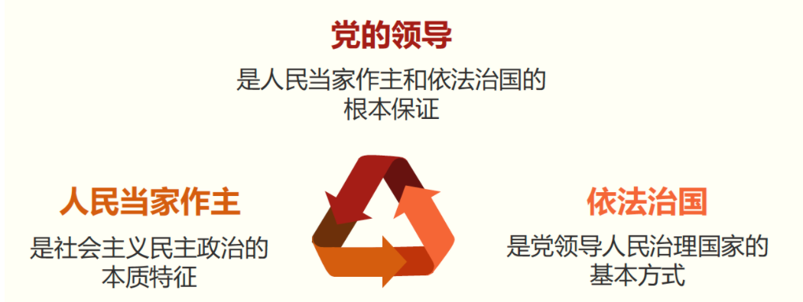

三者是一个相辅相成的有机整体，统一于我国社会主义民主政治伟大实践

> *我们说不存在“党大还是法大”的问题，是把党作为一个执政整体而言的，是指党的执政地位和领导地位而言的，具体到每个党政组织、每个领导干部，就必须服从和遵守宪法法律，就不能以党自居，就不能把党的领导作为个人以言代法、以权压法、徇私枉法的挡箭牌。这个界线一定要划分清楚。* *——2015年2月2日，习近平在省部级主要领导干部* *学习贯彻党的十八届四中全会精神全面推进依法治国专题研讨班上的讲话*

在我国，法是党的主张和人民意愿的统一体现，党领导人民制定宪法法律，党领导人民执行宪法法律，党自身必须在宪法法律范围内活动。党和法、党的领导和依法治国是高度统一的。

**2. 保持政治定力，坚持正确政治方向**

借鉴国外政治文明有益成果，但绝不能放弃中国政治制度的根本。照抄照搬他国的政治制度行不通。要坚持从国情出发、从实际出发，走适合自己的 政治道路。

中国特色社会主义政治发展道路，是近代以来中国人民长期奋斗的必然结果

> *辛亥革命之前，太平天国运动、洋务运动、戊戌变法、义和团运动、清末新政等都未能取得成功。辛亥革命之后，中国尝试过君主立宪制、帝制复辟、议会制、多党制、总统制等各种形式，各种政治势力及其代表人物纷纷登场，都没能找到正确答案。*

坚持走中国特色社会主义政治发展道路：中国特色社会主义政治发展道路是符合中国国情、保证人民当家作主的正确道路，独特的文化传统、独特的历史命运、独特的基本国情，注定了我们必然要走适合自己特点的发展道路。

> *中国共产党领导人民实行人民民主，就是保证和支持人民当家作主。保证和支持人民当家作主不是一句口号、不是一句空话，必须落实到国家政治生活和社会生活之中，保证人民依法有效行使管理国家事务、管理经济和文化事业、管理社会事务的权力。 ——2014年9月21日，习近平在庆祝 中国人民政治协商会议成立65周年大会上的讲话*

## **二、健全人民当家作主制度体系**

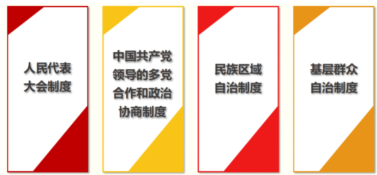

**1. 人民代表大会制度**

> *一个有5000多年文明史、几亿人口的国家建立起人民当家作主的新型政治制度，在中国政治发展史乃至世界政治发展史上都是具有划时代意义的。* *——2014年9月5日，习近平在庆祝全国人民代表大会* *成立60周年大会上的讲话*

人民代表大会制度是坚持党的领导、人民当家作主、依法治国有机统一的根本政治制度安排

在中国实行人民代表大会制度：

- 是中国人民在人类政治制度史上的伟大创造
- 是深刻总结近代以来中国政治生活惨痛教训得出的基本结论
- 是中国社会100多年激越变革、激荡发展的历史结果
- 是中国人民翻身作主、掌握自己命运的必然选择

**2. 中国共产党领导的多党合作和政治协商制度**

中国共产党领导的多党合作和政治协商制度是我国的一项基本政治制度，是中国共产党、中国人民和各民主党派、无党派人士的伟大政治创造，是从中国土壤中生长出来的新型政党制度。

中国共产党领导的多党合作和政治协商制度这一新型政党制度，**新在哪里**？

- 能够真实、广泛、持久代表和实现最广大人民根本利益、全国各族各界根本利益，有效避免了旧式政党制度代表少数人、少数利益集团的弊端。
- 把各个政党和无党派人士紧密团结起来，有效避免了一党缺乏监督或者多党轮流坐庄、恶性竞争的弊端。
- 推动决策科学化民主化，有效避免了旧式政党制度囿于党派利益、阶级利益、区域和集团利益决策施政导致社会撕裂的弊端。

充分发挥中国共产党领导的多党合作和政治协商制度的作用：进入新时代，要用好政党协商这个民主形式和制度渠道，推动协商民主广泛、多层、制度化发展，形成完整的制度程序和参与实践，保证人民在日常政治生活中有广泛持续深入参与的权利。

**3. 民族区域自治制度**

民族区域自治制度符合我国国情，在维护国家统一、领土完整，在加强民族平等团结、促进民族地区发展、增强中华民族凝聚力等方面起到了重要作用。

坚持和完善民族区域自治制度，要坚持统一与自治相结合、民族因素与区域因素相结合，把宪法和民族区域自治法的规定落实好，帮助民族自治地方发展经济、改善民生，使民族区域自治制度这一理论根源越扎越深、实践根基越打越牢。

民族区域自治制度是我国的一项基本政治制度，是中国特色解决民族问题的制度保障

像爱护自己的眼睛一样爱护民族团结，像珍视自己的生命一样珍视民族团结，像石榴籽那样紧紧抱在一起。

**4. 基层群众自治制度**

完善基层民主制度发展基层民主：

- 必须充分发挥党总揽全局、协调各方的领导核心作用
- 把党的领导贯穿基层群众自治机制建设全过程、各方面
- 确保基层民主建设始终沿着中国特色社会主义政治发展道路前进

发展适合我国国情的社会主义民主政治制度，坚持制度自信

- 中国特色社会主义民主是一个新事物，需要不断完善和发展。在坚持根本政治制度、基本政治制度的基础上，不断推进制度体系完善和发展，切实加强人民当家作主的制度保障，确保人民享有更加广泛、更加充分、更加真实的民主权利。

## **三、巩固和发展爱国统一战线**

统一战线工作做得好不好，要看交到的朋友多不多、合格不合格、够不够铁

统战工作的本质要求是大团结大联合，解决的就是人心和力量问题

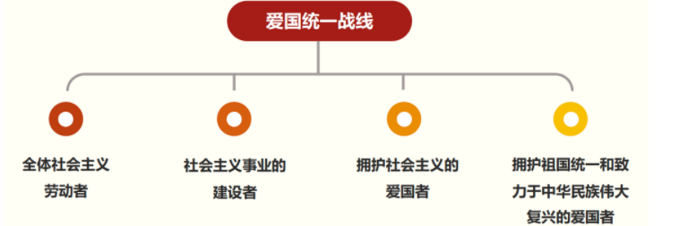

巩固和发展最广泛的爱国统一战线：

- 最根本的是要坚持党的领导
- 必须正确处理一致性和多样性关系
- 必须善于联谊交友
- 必须牢牢把握大团结大联合的主题

**1. 巩固和发展最广泛的爱国统一战线，最根本的是要坚持党的领导**

统一战线是党领导的统一战线。党对统一战线的领导主要是政治领导，即政治原则、政治方向、重大方针政策的领导，主要体现为党委领导，同时也要尊重、维护、照顾同盟者的利益，帮助党外人士排忧解难。

> *“虚心公听，言无逆逊，唯是之从。”这是执政党应有的胸襟。“凡议国事，惟论是非，不徇好恶。”这是参政党应有的担当。 ——2017年1月22日，习近平在同党外人士共迎新春时的讲话*

**2. 巩固和发展最广泛的爱国统一战线，必须正确处理一致性和多样性关系**

- 要不断巩固共同思想政治基础，包括巩固已有共识、推动形成新的共识
- 要充分发扬民主，尊重包容差异。对其他各种多样性，要尽可能通过耐心细致的工作找到最大公约数，画出最大同心圆
- 统一战线是一致性和多样性的统一体

**3. 巩固和发展最广泛的爱国统一战线，必须善于联谊交友**

统一战线是做人的工作，搞统一战线是为了壮大共同奋斗的力量。要坚持讲尊重、讲平等、讲诚恳，也要坚持讲原则、讲纪律、讲规矩，出于公心为党交一大批肝胆相照的好朋友、真朋友。

2018年3月4日，习近平看望参加全国政协十三届一次会议的民盟、致公党、无党派人士、侨联界委员，并参加联组会，听取意见和建议。

**4. 巩固和发展最广泛的爱国统一战线，必须牢牢把握大团结大联合的主题**

巩固和发展最广泛的爱国统一战线，必须高举爱国主义、社会主义旗帜，牢牢把握大团结大联合的主题，把中华儿女广泛团结起来，投身决胜全面建成小康社会、全面建设社会主义现代化国家的伟大实践。

- 全面贯彻党的民族政策，深化民族团结进步教育，铸牢中华民族共同体意识，加强各民族交往交流交融，促进各民族像石榴籽一样紧紧抱在一起，共同团结奋斗、共同繁荣发展
- 全面贯彻党的宗教工作基本方针，坚持我国宗教的中国化方向，积极引导宗教与社会主义社会相适应
- 加强党外知识分子工作，做好新的社会阶层人士工作，发挥他们在中国特色社会主义事业中的重要作用
- 构建亲清新型政商关系，促进非公有制经济健康发展和非公有制经济人士健康成长
- 广泛团结联系海外侨胞和归侨侨眷，共同致力于中华民族伟大复兴

## **四、坚持“一国两制”，推进祖国统一**

“一国两制”凝结了海纳百川、有容乃大的中国智慧

必须正确理解和把握“一国”和“两制”的关系：“一国两制”是一个完整的概念。“一国”是实行“两制”的前提和基础，“两制”从属和派生于“一国”，并统一于“一国”之内。“一国”是根，根深才能叶茂；“一国”是本，本固才能枝荣。

严格依照宪法和基本法办事

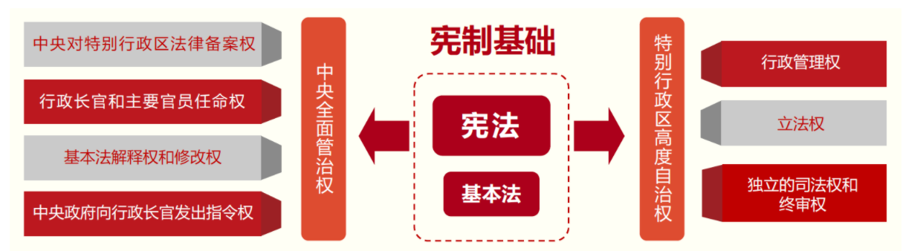

必须继续坚持“和平统一、一国两制”方针

一个中国原则：

- 两岸关系的政治基础
- 推动两岸关系和平发展最根本原则

“一国两制”是中国共产党人的伟大创造

改革开放初期，邓小平着眼实现国家完全统一，以超凡的智慧和胆略创造性地提出“一国两制”伟大构想。

“一国两制” 构想首先成功地运用于解决历史遗留的香港、澳门问题。1997年和1999年，香港、澳门先后顺利回归祖国并重新纳入国家治理体系。

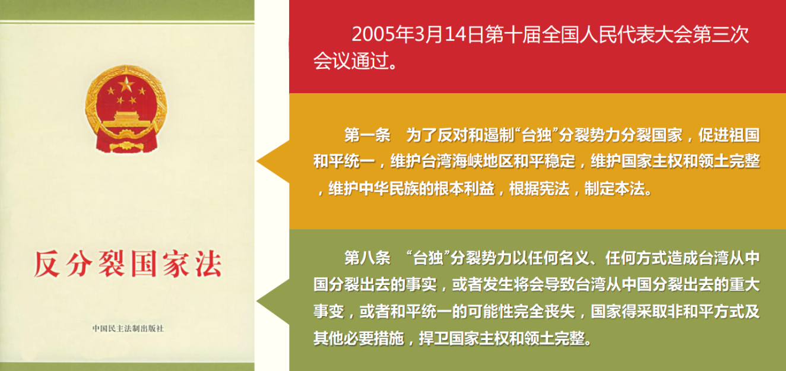

秉持“两岸一家亲”理念

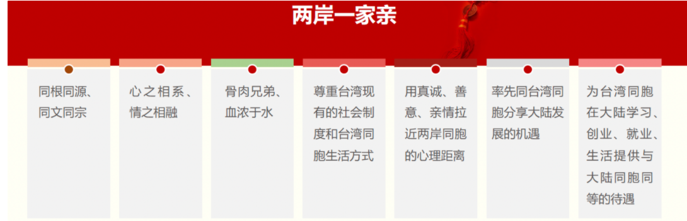

## **五、全面依法治国**

**法律是治国之重器法治是国家治理体系和治理能力的重要依托**

> *全面依法治国是中国特色社会主义的本质要求和重要保障。必须把党的领导贯彻落实到依法治国全过程和各方面，坚定不移走中国特色社会主义法治道路，完善以宪法为核心的中国特色社会主义法律体系，建设中国特色社会主义法治体系，建设社会主义法治国家，发展中国特色社会主义法治理论，坚持依法治国、依法执政、依法行政共同推进，坚持法治国家、法治政府、法治社会一体建设，坚持依法治国和以德治国相结合，依法治国和依规治党有机统一，深化司法体制改革，提高全民族法治素养和道德素质。* *——2017年10月18日，习近平在中国共产党第十九次全国代表大会上的报告*

最适合中国国情的法治道路

- 正确的法治道路书上抄不来，别人送不来，只能靠自己走出来。
- 中国特色社会主义法治道路，是我国社会主义法治建设成就和经验的集中体现，是唯一正确的道路

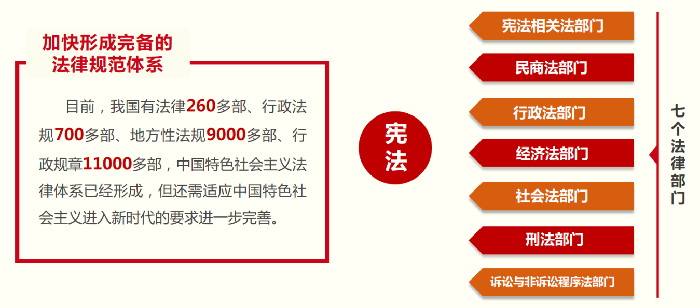

推进中国特色社会主义法治体系建设

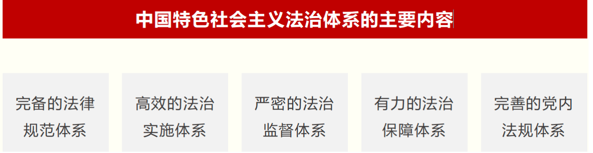

**1. 完善以宪法为核心的中国特色社会主义法律体系**

良法是善治之前提：

要紧紧围绕提高立法质量和立法效率，继续加强和改进立法工作，坚持科学立法、民主立法、依法立法，坚持立改废释并举，增强法律法规的及时性、系统性、针对性、有效性，提高法律法规的可执行性、可操作性。加强重点领域立法，及时反映新时代党和国家事业发展要求，回应人民群众 关切期待。

**2. 加快建立高效的法治实施体系**

天下之事，不难于立法，而难于法之必行

要坚持依宪治国、依宪执政，加强宪法实施，坚决纠正一切违反宪法的行为。按照有法必依、执法必严、违法必究的要求，加快完善执法、司法、守法等方面的体制机制，坚持严格执法、公正司法、全民守法，切实维护法律尊严和权威，确保法律全面有效实施。

**3.加快构建严密的法治监督体系**

没有监督的权力必然导致腐败，这是一条铁律 要以规范和约束公权力为重点，构建党统一指挥、全面覆盖、权威高效的监督体系，把党内监督同国家机关监督、民主监督、司法监督、群众监督、舆论监督贯通起来，增强监督合力，强化监督责任，提高监督实效，做到有权必有责、有责要担当、失责必追究。

**4.加快形成有力的法治保障体系**

徒善不足以为政，徒法不足以自行

要切实加强党对全面依法治国的领导，提高依法执政能力和水平，为全面依法治国提供有力的政治和组织保障。加强法治队伍建设，加强机构建设和经费保障，为全面依法治国提供有力的队伍保障和坚实的物质经费保障。改革和完善不符合法治规律、不利于依法治国的体制机制，为全面依法治国提供完备的制度保障。

**5.加快形成完善的党内法规体系**

治国必先治党

要坚持依法治国与制度治党、依规治党统筹推进、一体建设，完善党内法规制定体制机制，注重党内法规同国家法律的衔接和协调，构建以党章为根本，以民主集中制为核心，以准则、条例等中央党内法规为主干，由各领域各层级党内法规制度组成的党内法规制度体系，切实提高党内法规执行能力和水平。

深化依法治国实践

**新时代我国法治建设的指导方针：**

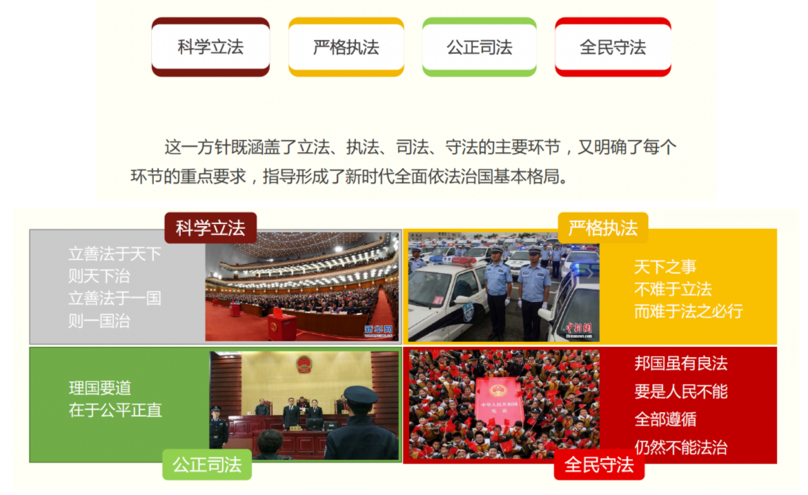

# 第四讲 中国特色社会主义市场经济建设

新中国的经济建设经历了新民主主义经济模式、计划经济模式和社会主义市场经济模式。现代市场经济起源于西方资本主义国家，其最大进步是彻底摒弃了封建时代用等级权力配置资源的方式，代之以等价自由交换为前提的市场机制，中国要实现现代化就必须在经济建设上采用现代市场经济体制。

## 一、中国怎样走上了中国特色社会主义市场经济建设道路？

**（一）国际国内形势的尖锐挑战要求中国走向市场经济建设道路**

- 首先是西方国家有宏观调控的市场经济发展绩效和东亚“四小龙”的迅速崛起的挑战。二战后，西方资本主义国家原有的“古典自由主义”被“凯恩斯主义”发展模式所取代，这种发展模式将宏观调控与市场经济充分结合，在一定程度上遏制了周期性经济危机的发生，使资本主义国家逐步进入一个比较稳定的快速发展时期，昭示了市场力量的重要性。东亚“四小龙”的成功也在于它们对市场经济和对外开放的重视，适应了新技术革命兴起和发展所带来的产业结构的大调整和转移。
- 其次是和平与发展成为时代的主题和苏联模式的衰败。20世纪70年代以后，和平力量增长、冷战趋向缓和，和平与发展成为当代世界的主题，这有助于我们争得有利的国际环境，并坚定不移地实现工作重心的转移。而此时苏联模式的粗放发展和计划经济体制的潜力已经耗尽，经济效益和经济增长速度都落后于西方国家，迫使人们去分析苏联模式的历史作用和历史局限，重新认识现代资本主义和市场经济。
- 最后是国内的发展危机要求我们改变发展模式。毛泽东时代理论上以阶级斗争为纲和僵化的社会主义观念，制度上存在的诸如压抑社会和个人的自主性和创造性、严格限制个人选择和利益追求等体制性问题，以及经济发展上的不稳定和低效率等严重问题，给中国带来了深重的发展危机。
- 这种发展危机源于苏联模式严重忽视市场的作用，忽略产业发展的平衡，不重视培育创新精神，也不能合理分配经济增长的成果，从而严重挫伤了人民群众的积极性，极大地束缚了生产力的发展，使人民群众不断增长的物质文化需要与落后的社会生产之间的矛盾越来越尖锐。
- 可见，西方国家宏观调控的市场经济的稳定发展，东亚“四小龙”的经济腾飞，和平与发展成为时代主题，苏联计划经济体制走向衰败，以及国内的发展危机，给中国带来了改变传统发展方式的尖锐挑战，带来了加速现代化建设和重新定位政府与市场关系的强大压力。

**（二）中国能够走向社会主义市场经济建设道路的一些有利条件**

- 首先是毛泽东时代的一些遗产有助于走向市场经济建设道路。包括：理论遗产方面的实事求是、群众路线、关于农轻重关系的思想、关于扩大自主权的思想、关于发展多种经济成分的思想等等；制度遗产方面的建立了近代以来第一个统一的国家和强有力的有效政府、国家动员发展体制等等；物质遗产方面的建立起的门类比较齐全的现代工业体系、大量的基础设施、初级的人力资本和技术基础等等。
- 其次是改革开放前关于市场经济理论的探索有利于我们走向市场经济建设道路。在上世纪 50~60 年代中国经济学界出现了孙冶方、顾准、卓炯等大胆探索商品经济（市场经济）理论的少数学者，发表了《把计划和统计放在价值规律的基础上》、《试论社会主义制度下的商品生产和价值规律》、《 申论社会主义制度下的商品》等文章。1979 年 3月于祖尧发表的《试论社会主义市场经济》明确提出了“社会主义市场经济”，与同年11 月邓小平讲的“社会主义也可以搞市场经济”思想相一致。这些超凡的见解虽然当时并未引起人们足够的关注，但起到了解放思想的重大作用。
- 最后是高瞻远瞩的领导集体的大力推动。总体上看，时代挑战、中国面临的发展危机、一些有利的启动条件等，只是市场取向改革发起的外在变量，如果没有体制内意志坚强和远见卓识的高层领导的大力推动，那么这种改革也断难立即成为一种新的发展战略，即便启动了也可能中途夭折，所以文革后形成的远见卓识的领导集体在其中起了重要作用 。
- 特别是邓小平既有先进的现代化理念和崇高的个人威望，又有强烈的使命感和果敢的执行力，认为贫穷不是社会主义，中国只有从旧体制中解放出来并自觉融入到世界经济全球化浪潮中，实行市场经济导向的对内改革和融入国际社会的对外开放，才有利于国家的长远发展和民族的繁荣昌盛，才能顺应中国人改变现状的愿望。这成为中国主动走向市场经济的重要推动力。

**（三）中国走向社会主义市场经济建设道路的发展过程**

- 中国市场经济建设道路经过了如下一些阶段：计划经济为主市场调节为辅，计划经济是有计划的商品经济，政府主导型的“国家调控市场，市场引导企业”，“要使市场在社会主义国家宏观调控下对资源配置起基础性作用”，“国家宏观调控下市场对资源配置起决定性作用” 。
- 可见，我们是在实践中，不断探索市场经济与社会主义能不能结合、怎样结合以及如何结合好。
- 邓小平时代以渐进式市场化改革实践和勇敢的创新精神为市场经济祛魅，解决了社会主义与市场经济能不能结合的问题。
- 江泽民时期构建了社会主义市场经济的基本框架，并从政治层面认同了新阶层的地位，实现了社会主义与市场经济的深度结合。
- 胡锦涛时期，通过贯彻落实科学发展观和构建社会主义和谐社会对市场经济建设进行校正，使之更好地体现社会主义价值目标。
- 新时代以习近平为核心的党中央协调推进“四个全面”战略布局，社会主义市场经济体制在不断完善，市场经济与社会主义正在向能结合好的方向发展，将发展成为一种较为成熟的形态。

## 二、新时代如何推进中国特色社会主义市场经济建设

新时代以来党中央统揽国内外发展大势，把握我国经济发展的新特征和新要求，大力推进社会主义经济建设，创造性地提出了关于中国经济建设的一系列重大理论观点，进一步完善了中国特色社会主义经济理论和制度。

**（一）贯彻新发展理念、构建新发展格局、深化供给侧结构性改革**

1. 贯彻新发展理念 我国经济建设已由高速增长阶段转向高质量发展阶段，战略目标是建设现代化经济体系，为此就必须坚定不移地贯彻创新、协调、绿色、开放、共享的新发展理念，并由其统领发展全局。原因在于：创新是引领发展的第一动力，协调是持续健康发展的内在要求，绿色是永续发展的必要条件和人民对美好生活追求的重要体现，开放是国家繁荣发展的必由之路，共享是中国特色社会主义的本质要求。

2. 构建新发展格局 加快构建以国内大循环为主体、国内国际双循环相互促进的新发展格局，是当前关系到我国发展全局的重大战略任务，是我们党根据我国发展阶段、环境和条件的变化，特别是基于我国比较优势的变化，审时度势而作出的重大决策。 为此首先要保证经济循环的畅通无阻，特别是供给侧的有效畅通，因为有效供给能力强大才能打通循环堵点、消除瓶颈制约、创造就业、提供收入和形成需求能力。

   其次要实现高水平的自立自强，因为科技的自立自强是促进发展大局的根本支撑，大力推动自主创新可以把发展建立在更加安全、更为可靠的基础之上。 最后必须要具备强大的国内经济循环体系和稳固的基础，以此形成对全球要素资源的强大吸引力、国际竞争中的强大竞争力、全球资源配置中的强大推动力。

3. 深化供给侧结构改革 这是当前和今后一个时期我国经济建设的重要任务和重大战略选择，符合国际发展大势和我国发展的阶段性要求。为此，要解决经济结构的失衡，改善供给结构，实现由低水平供需平衡向高水平供需平衡跃升；要把经济建设的着力点放在实体经济上，加快建设制造强国，支持传统产业的优化升级。

**（二）必须要完善社会主义市场经济体制**

- 新时代要针对仍然存在的市场秩序不规范、生产要素市场发展滞后、市场规则不统一、市场竞争不充分等问题，不断改革和完善市场经济体制，以贯彻全面深化改革、新发展理念和建设现代市场经济体系。

1. 坚持社会主义市场经济改革方向 要着力解决市场体系不完善、政府干预过多和监管不到位等问题，充分发挥市场在配置资源中的决定性作用。 为此，首先要从广度和深度上推进市场化改革，减少政府对资源的直接配置，减少政府对微观经济活动的直接干预，加快建设统一

   开放、竞争有序的市场体系，建立公平开放透明的市场规则，把市场机制能有效调节的经济活动交给市场，把政府不该管的事交给市场，让市场在所有能够发挥作用的领域充分发挥作用，推动资源配置实现效益最大化和效率最优化，让企业和个人有更多活力和更大空间去发展经济、创造财富。

   其次，政府的职责和作用主要是保持宏观经济稳定，加强和优化公共服务，保障公平竞争，加强市场监管，维护市场秩序，推动可持续发展，促进共同富裕，弥补市场失灵。可见，更好发挥政府作用并非要更多发挥政府的作用，而是要管好那些市场管不了或管不好的事。

2. 深化国有企业改革 国有企业作为国有经济的主要载体，是中国特色社会主义的重要物质基础和政治基础，是我们党执政兴国的重要支柱和依靠力量，关系到公有制主体地位的巩固、党的执政地位和执政能力、我国社会主义制度。深化国有企业改革，坚定不移地把国有企业做强做优做大，是坚持和发展中国特色社会主义的

   必然要求，也是完善社会主义市场经济体制的重要内容。 新时代深化国企改革的主要任务：完善各类国有资产管理体制；加快国有经济布局优化、结构调整、战略性重组；发展混合所有制经济；形成有限制衡的公司法人治理结构和灵活高效的市场化经营机制；加强监管以有效防止国有资产流失；培育具有全球竞争力的世界一流企业。

3. 激发市场主体活力 激发公有制经济、非公有制经济等各类市场主体活力，平等保护各类市场主体的合法权益，加强对市场主体的服务和监管，维护市场正常秩序、促进市场公平竞争，有利于充分发挥市场在资源配置中的决定性作用，促进经济社会持续健康发展。

   为此，要转变政府职能，积极简政放权，更好发挥政府作用；完善产权保护制度，深化产权制度改革；全面实施市场准入负面清单制度，清理废除妨碍统一市场和公平竞争的各种规定和做法；完善主要由市场决定价格的机制，加快要素价格市场化改革，使市场在资源要素配置中起决定性作用；促进民营企业高质量发展。

4. 创新和完善宏观调控 科学的宏观调控、有效的政府治理，是发挥社会主义市场经济体制优势的内在要求，创新和完善宏观调控，是新时代我国宏观调控的新要求。宏观调控工作要坚持稳中求进工作总基调，坚持以新发展理念统领发展全局，坚持以供给侧结构性改革为主线，适度扩大总需求，紧紧围绕加快建设现代化经济体系，不断创新思路、完善方式方法，为努力实现更高质量、更有效率、更加公平、更可持续的发展发挥作用。 具体来说，要发挥国家发展规划的战略导向作用，健全财政、货币、产业、区域等宏观政策体系，完善宏观经济政策的协调机制，注重引导市场行为和社会预期。

（**三）必须要推动形成全面开放新格局**

- 对外开放是我国的基本国策，是推动我国经济社会发展的重要动力。2008年国际金融危机爆发以来，经济全球化呈现出一系列新特征，给我国的对外开放政策带来了新机遇和新挑战，必须要实施更加积极主动的开放战略，全面提升开放型经济水平，推动形成全面开放新格局。

1. 坚持更加开放的方针政策 世界正处于大发展大变革大调整时期，我国经济也正处在转变发展方式、优化经济结构、转换增长动力的攻关期，中国应以更加开放的方针政策来应对各种挑战，这是实现中华民族繁荣富强的必由之路，是适应经济全球化新趋势的必然要求，是顺应新时代国内改革发展新要求的应有之举。
2. 推动“一带一路”建设 要以“一带一路”建设为重点，坚持引进来和走出去并重，遵循共商共建共享原则，加强创新能力的开放合作。
3. 推动高水平的对外开放 高水平对外开放包括开放的范围扩大、领域拓宽、层次加深、方式创新、布局优化、质量提升。具体来说：坚持积极主动扩大对外开放，把开放作为发展的内在要求；坚持双向开放，更好地结合引进来与走出去，以拓展经济发展空间；坚持全面开放，推动形成陆海内外联动、东西双向互济的开放格局；坚持公平开放，构建公平竞争的内外资发展环境；坚持共赢开放，推动经济全球化朝着普惠共赢方向发展；坚持包容开放，探索求同存异、包容共生的国际发展合作新途径。

## 三、中国特色社会主义市场经济建设道路的特征和成就

**(一）理论特征**

第一，中国社会主义市场经济理论具有系统的创新性。以社会主义初级阶段国情和理论为前提，在产权、分配、调节、开放等体制机制方面，在区域发展、新型农村、城镇布局、生态环境、民生改善、教科文卫体等发展建设方面，均形成较为系统的理论，把社会主义制度与市场机制统一起来，在公有制为主体的基本制度基础上建立市场经济，这是人类历史上从未有过的伟大实践和崭新的经济理论探索，突破了西方经济理论和马克思关于未来经济运行体制的设想，有着独特的创新地位。

第二，中国社会主义市场经济理论具有学理的科学性。市场经济或市场化指的是经济如何运行，主要是生产什么、生产多少、如何定价的问题，要由各类性质不同的经济主体或企业自行决策。因此，公有制或社会主义既可以与计划经济结合，也可以与市场经济结合。

第三，中国社会主义市场经济理论具有实践的可行性。社会主义市场经济成功的实践表明，社会主义可以搞市场经济，有利于中国走向世界，参与经济全球化历史进程，充分利用国内国外两个市场、两种资源来发展自己，在相互竞争、相互借鉴、相互合作中，取长补短，以更好地发挥中国的比较优势。

**(二）实践特征**

以国家自上而下的推动为主导，与民间市场因素自下而上的推动相结合。 由强势政府自上而下推动起了重要作用：有助于保持社会稳定，可以发挥政府在培育市场和保持经济稳定方面的重要作用。

民间因素自下而上的强有力推动：家庭联产承包责任制的实施，个体经济和私人企业在内的民营经济的发展。 政府推动与市场推动相结合的形式包括：放权让利；双轨制；改革从体制外向体制内逐步推进；在市场要素最多的地区率先建立初步的市场经济体系；以开放促改革，等等。

**(三）成就与问题**

创造了可与18至19世纪的英国工业革命、19世纪末20世纪初的美国崛起、二战后德国与日本的经济振兴相媲美的巨大经济建设成就，并为其他有别于西方社会的发展中国家，树立了一个经济高速发展和消除贫困的成功榜样。在取得巨大成就的同时也要注意存在的一些问题：商品市场、服务市场发展相当充分，而包括资本市场、土地市场、劳动力市场和其他一些资源市场在内的要素市场发展还很有限；市场运行的法制环境仍然是市场化的短板；市场化停滞或下滑的趋势，由权力控制市场和官商勾结的坏的市场经济因素还存在；社会分配不公和贫富差距大引发了大量的社会问题。

为此，要坚持以人民为中心的共同富裕目标、市场逻辑和法治精神，继续推进中国的深化改革；要以要素市场的市场化改革为重点深化中国的市场化改革，尽快完善市场经济体制，加强法治建设，加强政府官员的责任意识和行为规范，建设好的市场经济；要特别重视收入分配政策的调整，遏制贫富差距的扩大，使发展成果由人民共享。

# 第五讲 社会主义文化强国建设

## 一.文化的重要作用及其内核

> 文化，文化，言之固易，要正确地加以定义及完备地加以叙述，则并不是容易的事。 ——（英）马凌诺夫斯基：《文化论》，费孝通译

**文化的意涵**

> 文：即人，似人形，录人为，表人意 文者，精所聚。——《春秋纬·元苞命》 经纬天地曰文 道德博厚曰文 学勤好问曰文 慈惠爱民曰文 愍民惠礼曰文 锡民爵位曰文 ——《逸周书》卷六《谥法解》

纹理、纹路，源自惩戒，如文“贼”字以示众；后转为美饰，以表达个性。文化即人化，脱离动物性、提升人性之转化

**文化的社会价值和治理功能**

- 人文化成：以文化人、文以化人 （体）
- 文以载道，道不远人（道）
- 文者，礼教治政云儿，经国之大业，不朽之盛事（器）
- 文言志，志高则言洁，志大则辞宏，志远则旨永（用）

> 昔之图国家者，必先教百姓而亲万民。有道之主，将用其民，先和而造大事。内修文德，外治武备。 ——（战国）吴起：《吴子·图国》 圣人治天下也，先文德而后武力。凡武之兴，为不服也；文化不改，然后加诛。 ——（西汉）刘向：《说苑·指武》

国家的三重疆界

1.地理疆界：兵守

2.制度疆界：吏护

3.文化疆界：士御

**价值观界定的四句话：**

1.价值观是人们对价值问题的根本看法；（根本性）

2.价值观是人们处理价值关系时所持的立场、观点和态度的综合，体现为人们关于生活中基本价值的信念、信仰、理想等综合性的思想认知和价值标准。（综合性）

3.价值观存在于人的精神系统中，是人的精神目标系统的内核，以内在的价值选择和价值判断为前提，之后转化为行为和行动。（内在性）

4.价值观反映了主体的根本地位、利益和需要，以及主体实现自己利益和需要的能力、活动方式等方面的主观特征，常以信什么、要什么、坚持追求和实现什么等问题引发。(主观性)

塔尔科特·帕森斯(TalcottParsons，1902～1979）:

- 认识标准：价值观是一种抽象的思想观念，是生活经验的总结，主要存在于人们的大脑之中，是人们判断自己或他人言行是否重要、是否美、是否善、是否妥当的标准。
- 欣赏鉴别标准：感情色彩浓厚，爱憎、支持与反对，界限清楚；
- 选择行动标准：无形的不成文的规范性准则和规矩；
- 道德良心标准：个人良知的核心，具有道德支配作用。

所有的价值观都是基于人们内心的价值判断和价值选择，而所有的价值判断和价值选择也都基于外部事物、对象在人的认知中所形成的矛盾和悖论。简单地说，价值观成于选择中的冲突和困境，是解决矛盾、突破困境、超越冲突后的结果。

**价值悖论的生发点**

- 表层矛盾： 是VS非 善VS恶 美VS丑 公VS私
- 深层矛盾： 义VS利 德VS力 理VS欲 法VS教

## 二.社会主义文化强国建设的背景

1988年，邓小平首先提出“两个大局”的思想:

沿海地区要对外开放，使这个拥有两亿人口的广大地带较快地先发展起来，从而带动内地更好地发展，这是一个事关大局的问题。内地要顾全这个大局。反过来，发展到一定的时候，又要求沿海拿出更多力量来帮助内地发展，这也是个大局。本质上是区域发展中内地与沿海互补发展的问题。

十八大以来，习近平多次强调“统筹国内国际两个大局”:

“十三五规划”提出：“全方位对外开放是发展的必然要求。必须坚持打开国门搞建设，既立足国内，充分运用我国资源、市场、制度等优势，又重视国内国际经济联动效应，积极应对外部环境变化，更好利用两个市场、两种资源，推动互利共赢、共同发展。”积极推进“一带一路”建设，这是对邓小平“两个大局”观的继承和发展，是对继承了邓小平思想的江泽民、胡锦涛“西部大开发”战略的扩展。

**两个大局：全局与变局**

- 中华民族伟大复兴的战略全局:全局是大局，是整体目标
- 世界百年未有之大变局:变局也是大局，是具体形势

**两种方位：历史与时代**

三个前所未有：

- 前所未有地靠近世界舞台中心
- 前所未有地接近实现中华民族伟大复兴的目标
- 前所未有地具有实现这个目标的能力和信心

中国特色社会主义“新时代”特指我国发展新的时代方位

习近平：“我们必须认识到，这个新时代是中国特色社会主义新时代，而不是别的什么新时代。”

**两个目标：全面小康与现代化强国**

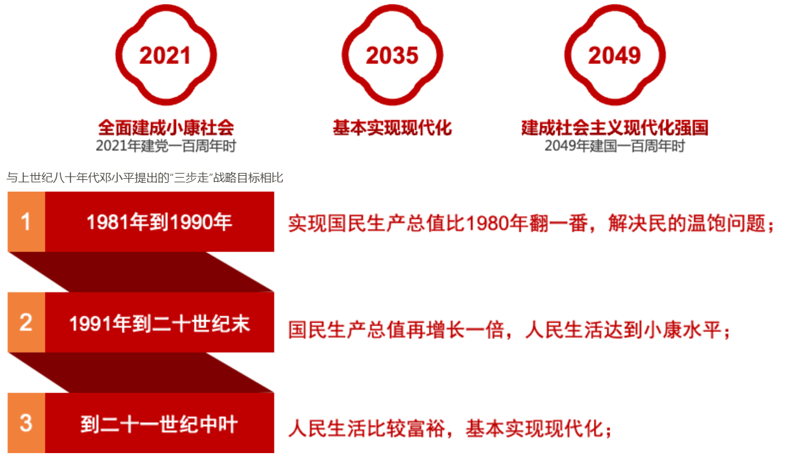

**两项使命：改革与党建**

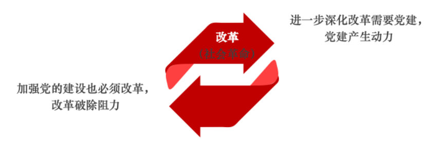

改革需要党建，党建也需要改革，二者互补，二任归一。因此说，以改革的精神抓党建。

## 三.社会主义文化强国的建设方略

当前我国文化建设的基本形势：

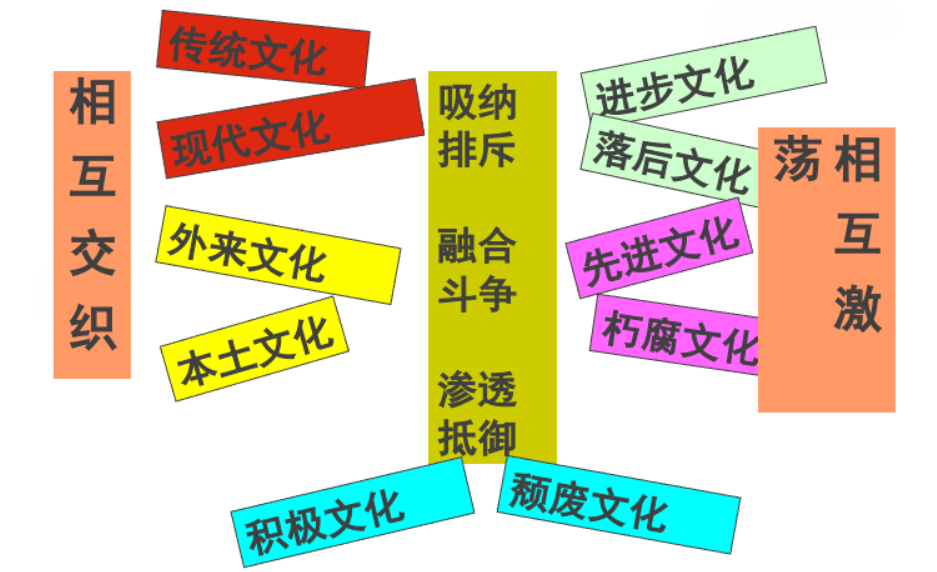

文化建设的一般关系：

```
  1.一致与和谐；
  2.继承与创新；
  3.自由与平等；
  4.模仿与创造；
  5.个人与社会；
  6.国家与世界；
              ——陈序经：《文化学概论》
```

**（一）建设文化强国，提升文化自信**

孙中山眼中的“文化之强”：

> 文化问题，就是东方文化和西方文化的比较和冲突问题。东方的文化是王道，西方的文化是霸道；讲王道是主张仁义道德，讲霸道是主张功利强权。讲仁义道德，是由正义公理来感化人；讲功利强权是用洋枪大炮来压迫人。受了感化的人，就是上国衰了几百年，还是不能忘记，还像尼泊尔至今是甘心情愿要拜中国为上邦；受了压迫的人，就是上国当时很强盛，还是时时想脱离。像英国征服了埃及，灭了印度，就是英国极强盛，埃及、印度还是时时刻刻要脱离英国，时时刻刻做独立的运动。 ——《对神户商业会议所等团体的演说》（1924年11月28日)

罗家伦的中国“弱大”论：

- 中国的出路——现代化
- 自从机械征服了距离以来，我国已托生在现代的国群里，那能不急起直追，加紧现代化？
- 我们并不是盲目从西洋，我们也不能迷信中国。我们要用新的科学方法，来判断一切，来估定各项中国文化里的成就，中国社会上的现象的本身价值。

二十世纪初期三次重大的文化论争

1.1915年《青年》创刊引起了青年派陈独秀与东方派杜亚泉的论战陈独秀：《东西方民族根本思想之差异》，文化革新杜亚泉：《静的文明与动的文明》，文化保守

1. 20年代，杨明斋《评中西文化观》——梁漱溟《东西方文化及其哲学》
2. 十教授《中国本位的文化建设宣言》——胡适、陈序经中西、古今、新旧、体用

《蝴蝶》

> 两只黄蝴蝶,双双飞上天。 不知为什么,一只忽飞回。 剩下另一只,孤单怪可怜。 也无心上天,天上太孤单。

> 文字没有古今，却有死活可道； 古人叫作“欲”，今人叫作“要”， 古人叫作“至”，今人叫作“到”， 古人叫作“溺”，今人叫作“尿”， 本来同是一字，声音少许变了， 并无雅俗可言，何必纷纷胡闹？ 至于古人叫“字”，今人叫“号”， 古人悬梁，今人上吊， 古名虽未必不佳，今名又何尝不妙？ ——胡适

党的十八大强调：“建设社会主义文化强国，关键是增强全民族文化创造活力。”———2012年党的十八大报告 十九大报告共79次提到文化，7次提到社会主义文化，4次提到中国特色社会主义文化，重点强调要建设社会主义文化强国。 文化是一个国家、一个民族的灵魂。文化兴国运兴，文化强民族强。没有高度的文化自信，没有文化的繁荣兴盛，就没有中华民族伟大复兴。要坚持中国特色社会主义文化发展道路，激发全民族文化创新创造活力，建设社会主义文化强国。 文化自信是一个国家、一个民族发展中更基本、更深沉、更持久的力量……推动中华优秀传统文化创造性转化、创新性发展，继承革命文化，发展社会主义先进文化，不忘本来，吸收外来，面向未来。 ——2017年10月18日，党的十九大报告

**《国家“十三五”时期文化发展改革规划纲要》**

文化是民族的血脉，是人民的精神家园，是国家强盛的重要支撑。坚持“两手抓、两手都要硬”，推动物质文明和精神文明协调发展，繁荣发展社会主义先进文化，是党和国家的战略方针。 —— 2017年5月7日

主要内容：

一、总体要求 （一）牢牢把握文化发展改革的指导思想 （二）把新发展理念贯穿于文化发展改革全过程 （三）全面实现文化发展改革的目标任务 二、加强思想理论建设 三、提高舆论引导水平 四、培育和践行社会主义核心价值观 五、繁荣文化产品创作生产 六、加快现代公共文化服务体系建设 七、完善现代文化市场体系和现代文化产业体系 八、传承弘扬中华优秀传统文化 九、提高文化开放水平 十、推进文化体制改革创新 十一、加强文化人才队伍建设 十二、完善和落实文化经济政策

**十九届五中全会关于文化建设**

- 繁荣发展文化事业和文化产业，提高国家文化软实力。
- 坚持马克思主义在意识形态领域的指导地位，坚定文化自信；
- 坚持以社会主义核心价值观引领文化建设；
- 加强社会主义精神文明建设；
- 围绕举旗帜、聚民心、育新人、兴文化、展形象的使命任务，促进满足人民文化需求和增强人民精神力量相统一，推进社会主义文化强国建设；
- 要提高社会文明程度，提升公共文化服务水平，健全现代文化产业体系；

**人类共同价值观范畴及社会核心价值观异同**

第一类：人类基于人之为人的本性或天性而生发或采取的原生性、刺激性、反馈性的价值判断或价值选择。 如：趋乐避苦、趋利避害；追求安全、向往快乐和幸福；追求不朽；

第二类：人类共同价值观是人类基于共同的价值标准和价值原则，对相同的价值事实或价值对象作出的大致相同的判断。这一类共同价值观都是在抽象意义和宏观层面存在的。 如：真、善、美、追求自由、平等、公正、文明；荣誉、地位、利益

**（二）推动传统文化创造性转化和创新性发展**

白居易：《与元九书》

> 唐兴二百年，其间诗人，不可胜数。所可举者。陈子昂有《感遇》诗二十首，鲍鲂有《感兴》诗十五首。又诗之豪者，世称李、杜。李之作才矣，奇矣，人不逮矣；索其风雅比兴，十无一焉。杜诗最多，可传者千余首，至于贯穿今古格律，尽工尽善，又过于李。然撮其《新安》、《石壕》、《潼关吏》、《芦子》（开）、《花门》之章，“朱门酒肉臭，路有冻死骨”之句，亦不过十三四。杜尚如此，况不逮杜者乎？仆常痛诗道崩坏，忽忽愤发，或食辍哺，夜辍寝，不量才力，欲扶起之。 自登朝来，年齿渐氏，阅事渐多，每与人言，多询时务；每读书史，多求理道，始知文章合为时而著，歌诗合为事而作。 自长安抵江西三四千里，凡乡校、佛寺、逆旅、行舟之中，往往有题仆诗者。士庶、僧徒、孀妇、处女之口，每每有咏仆诗者。

《观刈麦》（807年）

> 田家少闲月，五月人倍忙。夜来南风起，小麦覆陇黄。妇姑荷箪食，童稚携壶浆，相随饷田去，丁壮在南冈。足蒸暑土气，背灼炎天光，力尽不知热，但惜夏日长。复有贫妇人，抱子在其旁，右手秉遗穗，左臂悬敝筐。听其相顾言，闻者为悲伤。家田输税尽，拾此充饥肠。今我何功德？曾不事农桑。吏禄三百石，岁晏有余粮，念此私自愧，尽日不能忘。

《秦中吟》之《重赋》（809年）

《采地黄者》（812年）

《村居苦寒》（813年）

忆江南三首

政平讼简，贫民有犯法者，令于西湖种树若干株；富民有赎罪者，令于西湖开葑田若干亩，历任多年，湖葑尽去，树木成林”。

> 三年为刺史， 饮冰复食叶。 惟向天竺山， 取得两片石。 此抵有千金， 无乃伤清白。

知足吟（829年）

《新制绫袄成，感而有咏》（831年，时任河南尹）

《达哉乐天行》（842年，刑部尚书）

《开龙门八节石滩诗二首》（选一）（844年）

《“混元三教九流图”赞》：“佛教见性，道教保命，儒教明伦，纲常是正。农流务本，墨流备世，名流责实，法流辅制，纵横应对，小说咨询，阴阳顺天，医流原人，杂流兼通，述而不作。博者难精，精者未博。日月三光，金玉五谷，心身皮肤，鼻口耳目。为善殊途，咸归于治。曲士偏执，党同排异。毋患多歧，各有所施。要在圆融，一以贯之。三教—体，九流一源，百家—理，万法一门。”

北京故宫博物院收藏的明朝第八任皇帝成化帝朱见深登基不久绘制的《一团和气图》，并附《御制一团和气图赞》一首：“嗟！世人之有生，并戴天而履地，既均禀以同赋，何彼殊而此异。惟堑智者，以自私外形，骸而相忌，虽近在於一门，乃逺同於四裔。伟者达人，遐观高视，谈笑有仪，俯仰不愧，合三人以为一，达一心之无二，忘彼此之是非，蔼一团之和气。噫！和以召和，明良其类，以此同事事必成，以此建功功必备。岂无斯人辅予盛治？披图以观，有概予志。聊援笔以写，怀庶以警俗而励世。”

**（三）推动文明交流与互鉴**

文明因交流而多彩，因互鉴而丰富

**（四）推动文化观念创新**

文化变革引发经济变革和科技进步

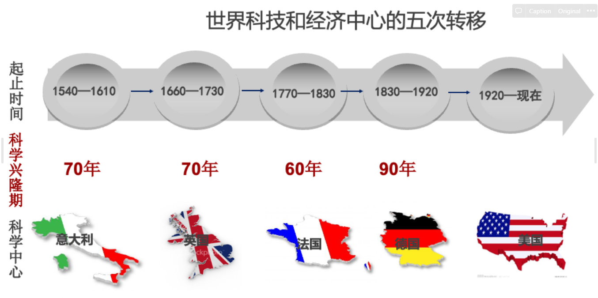

**文化变革与世界科技、经济中心的五次转移**

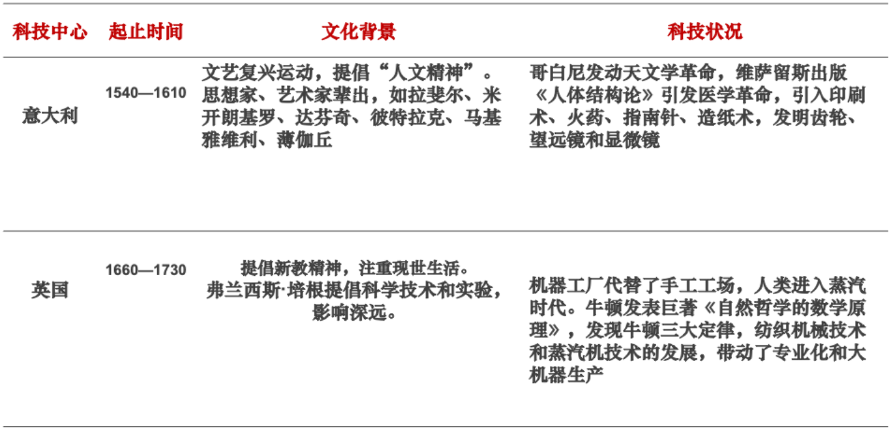

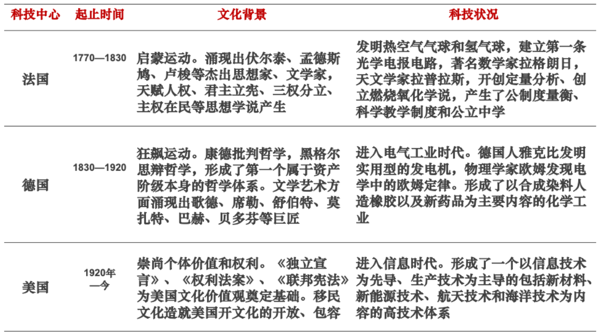

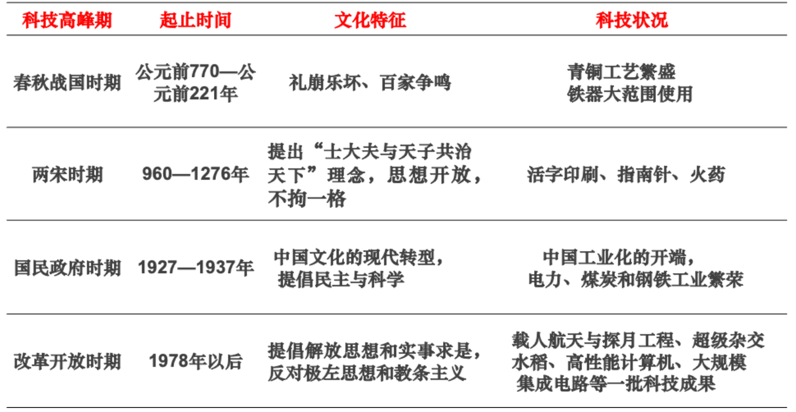

2008年，北京求是园文化传播有限公司在英国伦敦注册成立NEW CLASSIC PRESS(新经典出版社)，是第一家在国外设立出版社的中国民营文化企业， 擅长在海外推广红书。

四达时代是非洲发展最快、影响最大的数字电视运营商。2002年至今，已经在非洲23个国家注册成立公司，用户超过400万，覆盖非洲80%的人口。

习近平： “‘文化走出去’ 要持续抓，民营企业的经验要总结，不断使‘文化走出去’ 提质增效。 ”

# 第六讲 习近平生态文明思想概论

## 一、研究文献评述

**研究文献评述**

“习近平生态文明思想研究”作为一个学术议题领域或方向，至少有着如下三个基本视角。其一，“习近平新时代中国特色社会主义思想”理论体系（或政治意识形态）视角；其二，发展中国家经济社会现代化发展的“绿化”（或绿色可持续发展）视角；其三，环境人文社会科学学科（或生态文化理论）视角。

以2012年十八大和2017年十九大为标志，经历了从“生态文明建设系列重要论述”到“生态文明思想”、从更多是概念范畴到较为完整理论体系、从党和政府治国理政重大战略到全社会全方位实践的变化过程，逐渐成为当代中国社会主义生态文明理论与实践的统摄性规范引领，并因而构成了一个多学科视域下都值得系统与深入探究的议题领域。

依据2021年12月6日“知网”统计，以“习近平生态文明思想”和“习近平生态文明思想研究”为主题词文献检索结果分别是：2021（835）、2020（908）、2019（1307）、2018（998）、2017（185）、2016（73）、2015（43）、2014（35）、2013（1）和2021（308）、2020（395）、2019（507）、2018（376）、2017（115）、2016（50）、2015（28）、2014（29）

2013年9月初，也就是党的十八大召开近一年之后，“习近平同志关于生态文明建设重要论述”这一提法，成为最先被提出与采用的概括性用语。代表性文章是时任环保部部长周生贤的“走向生态文明新时代：学习习近平同志关于生态文明建设的重要论述”和时任国家林业局局长赵树丛的“为实现中国梦创造更好生态条件：深刻领会习近平同志关于生态文明建设的重要讲话精神”。

**研究文献概述**

差不多又一年之后，“习近平生态文明建设思想”这一学理意涵更为丰富的概念化形式或表述，进入学界视野并引起关注。代表性论文分别是刘希刚、王永贵发表在《河海大学学报（哲社版）》2014年第4期的“习近平生态文明建设思想初探”和胡敏发表在《中国青年报》2014年12月8日的“打造生态文明新常态：习近平生态文明建设思想评述”。

2015年，“习近平生态文明建设思想”逐渐成为学界更加普遍性的用法。尤为重要的是，刘鹏在《南京工业大学学报（社科版）》2015年第3期发表的“习近平生态文明思想研究”和唐小芹在《中南林业科技大学学报（社科版）》2015年第6期发表的“论习近平生态文明思想的时代意义”，差不多同时明确使用了“习近平生态文明思想”这一概念。

自2016年起，习近平生态文明思想研究呈现为视野拓宽、多层面展开的新格局，并逐渐聚焦于如下三大议题领域或方向：一是关于习近平生态文明思想的理论渊源与形成发展过程；二是关于习近平生态文明思想的理论意涵及其特征；三是关于习近平生态文明思想的政策落实和地方实践。

2017年的习近平生态文明思想研究，虽然在论文发表数量上有了较大幅度增加，但在整体上延续了前一年的研讨架构和议题领域，即分别聚焦于关于习近平生态文明思想的理论渊源与形成发展过程、理论意涵及其特征、政策落实和地方实践，而“习近平生态文明思想”或“习近平生态文明建设思想”已经成为两个交互使用的概念性表述。

2017年党的十九大，尤其是“习近平新时代中国特色社会主义思想”的正式确立，对于随后的习近平生态文明思想研究产生了巨大影响，包括次年“习近平生态文明思想”这一伞形概念的确认，而这期间出现的短暂而重要的过渡性表述，有“习近平生态文明建设重要战略思想”“习近平新时代中国特色社会主义生态文明建设思想”“习近平新时代生态文明思想”等。

十九大之后学界对于习近平生态文明思想的研究，同时得到了党和政府对于习近平新时代中国特色社会主义思想的大力宣传阐释和党的十九大精神与战略部署强有力贯彻落实的推动。比如，2017年底国家社科基金设立“研究阐释党的十九大精神国家社科基金专项课题”和2018年国家社科基金重大招标项目与教育部哲学社科研究重大课题攻关项目，都单设了此类选题。

2018年的习近平生态文明思想研究，尽管论文发表数量上的大幅度增加和个别问题阐述论证上的细化深入，仍可以大致归纳为如下三个议题领域或方向：理论渊源与形成发展过程、理论意涵及其特征、政策落实与地方（全球）实践，其中，对于第二个议题领域或方向的探讨明显占据了大部分比重。

2019年的习近平生态文明思想研究，如果仍按照前述的三个议题领域或方向来概括归纳，即它的理论渊源与形成发展过程、理论意涵及其特征、政策落实与地方（全球）实践，那么，除了论文发表数量的持续增加，更值得关注的是这三个维度的具体构成更为丰满（比如国际维度），而且大多数议题的学理性探讨质性更加凸显。

部分由于年初突发的全球新冠疫情，2020年的习近平生态文明思想研究，在论文发表数量和总体质量上都受到一定影响，而所刊发论文仍可以大致归纳为三个主要议题领域或方向：关于习近平生态文明思想的理论渊源与形成发展过程、理论意涵及其特征、政策落实与地方（全球）实践。

**研究文献评述**

迄今为止编辑出版的习近平总书记关于生态文明建设重要论述的专题著作主要有如下三部：一是由浙江人民出版社2007年出版的《之江新语》；二是由外文出版社分别于2014年、2017年和2020年出版的《习近平谈治国理政》（三卷）；三是由中央文献出版社2017年出版的《习近平关于社会主义生态文明建设论述摘编》。

学术论著：2015年李军等撰著的《走向生态文明新时代的科学指南：学习习近平同志生态文明建设重要论述》；2017年张云飞和李娜合著的《开创社会主义生态文明新时代》；2018年黄承梁撰写的《新时代生态文明建设思想概论》；2019年潘家华等著的《生态文明建设的理论构建与实践探索》，而明确以“习近平生态文明思想”为题的是2020年李捷著的《学习习近平生态文明思想问答》和2021年生态环境部组织撰写的《习近平生态文明思想读本》。

## 二、理论来源和基础

作为一个完整的人文社会科学理论体系，习近平生态文明思想的理论来源和基础主要有如下三个，马克思主义生态理论及其世界观方法论——决定着其政治取向和价值定位，环境人文社会科学研究成果——提供着来自当代人文社会科学的批判性反思视角与科学认知，中华优秀传统生态文化——延承着历久弥新的民族文化与思维认知传统。

**一、马克思主义生态理论来源和基础**

这里所指的“马克思主义生态理论（学）”，不仅同时涵盖马克思主义哲学视域下的人与自然辩证关系思想、马克思主义政治经济学视域下的资本（反生态）逻辑批判及其超越思想、科学社会主义理论谱系之下作为一个系统性整体（包括生态维度）的中国特色社会主义理论，还同时包括马克思恩格斯等经典作家、欧美生态马克思主义者和当代中国马克思主义生态学者的有关论述。

1）自20世纪90年代初以来，国内学界围绕着或基于马克思恩格斯本人著述的马克思主义生态思想研究的论著已经有许多，但就它们与习近平生态文明思想的内在契合性或直接相关性来说，尤其需要强调的是这一思想的如下三个层面或维度：马克思主义哲学视域下的人与自然“辩证”关系思想；马克思主义政治经济学视域下的生态政治经济学“红绿”分析；科学社会主义理论视域下的生态文明社会与文化愿景。

2）长期以来，生态马克思主义或生态社会主义被视为一个当代国外马克思主义或社会主义流派来理解对待。但必须承认，无论是对于马克思恩格斯生态思想的梳理阐发还是对于现实资本主义社会（世界）的生态批判，它都发挥了不容忽视的作用，从而构成了我们所意指的马克思主义生态理论构建的重要基础或思想来源。

3）在不断诠释阐发马克思恩格斯的生态思想和批判性分析欧美生态马克思主义者的生态批判理论的过程中，我国的马克思主义哲学、政治经济学和中国特色社会主义理论研究者也致力于从现实背景和语境出发，建构当代中国特色马克思主义生态理论，而这其中较为成熟的就是一种狭义界定的“社会主义生态文明理论”。

可以理解的是，除了党的十八大报告和十九大报告分别明确提到“努力走向社会主义生态文明新时代”和“牢固树立社会主义生态文明观”，彰显了我国生态文明及其建设的社会主义本质特征，习近平总书记关于社会主义生态文明建设的系列重要论述中对于上述三类文献来源和研究成果的直接性引用，基本上属于第一类的范围。

比如，在“纪念马克思诞辰200周年大会上的讲话”中，他具体阐述了新时代中国共产党人学习和实践马克思主义的九个主要方面：关于社会发展规律的思想、关于坚守人民立场的思想、关于生产力和生产关系的思想、关于人民民主的思想、关于文化建设的思想、关于社会建设的思想、关于人与自然关系的思想、关于世界历史的思想、关于马克思主义政党建设的思想。

**二、环境人文社会科学研究成果来源和基础**

广义上的中国环境人文社会科学研究，是自20世纪80年代初开始我国人文社会科学学界对日渐凸显的生态环境问题不断做出回应与主动理论建构所形成的众多新兴、交叉和边缘学科的总称——大致对应于同样作为一个庞大学科集群存在的“环境自然科学”和“环境工程技术”，而它又可以依据其人文学科或社会科学的母体学科性质，进一步划分为环境人文或社科两大类别。而且，在绝大多数情况下，“环境”这一前缀修饰性术语可以与“生态”替换使用（意涵略有差异）。

如果以党的十八大报告和十九大报告、《习近平关于社会主义生态文明建设论述摘编》、《习近平谈治国理政》（三卷）和《之江新语》等为基础性文献，那么就可以发现，虽然直接形式的环境人文社科理论观点引用并不是太多，但却提出了大量明显具有环境人文社科学科意蕴或特征的重要论断或阐述。

比如，关于环境史学的直接引用或重要表述有：“历史地看，生态兴则文明兴，生态衰则文明衰。古今中外，这方面的事例众多”（《在十八届中央政治局第六次集体学习时的讲话》，2013年5月24日）；“应对雾霾、改善空气质量的首要任务是控制PM2.5。雾霾问题，发达国家都有过，像德国的鲁尔区、英国的伦敦、法国的巴黎和里昂都走过这个路，美国纽约和洛杉矶也是”（《在北京市考察工作结束时的讲话》，2014年2月26日）。

习近平生态文明思想的形成与发展，离不开我国环境人文社会科学研究在过去四十多年中的学术积淀、学科成长和理论创新。同时，习近平总书记关于生态文明及其建设重要论述，提出了许多值得从环境人文社科学科视角加以深入研讨的重大学术议题，构成了我国学界进一步进行学理性阐发并构建中国特色环境人文社会科学话语体系的规约引领。

**三、中华优秀传统生态文化来源和基础**

中华优秀传统生态文化是习近平生态文明思想的另一个重要理论来源和基础。习近平总书记多次强调指出，顺应自然、追求天人合一，是中华民族自古以来的理念，也是我国现代化建设的重要遵循。当然，也不宜把这种继承与弘扬关系做过于简单化或夸大意义上的解读。

习近平总书记关于生态文明及其建设的阐述，的确包含着非常丰富的传统文化元素，并在一定程度上深化或“中国化”了我们对于生态文明及其建设的理论与政策意涵的既有认知。这种特色阐述，廓清了我们理解与应对当代中国生态环境问题的传统文化语境和脉络，还彰显了我们思考与谋划当代中国生态文明建设的中华传统文化话语和思维传承。

但必须明确，传统文化元素更多是润饰与丰富习近平总书记生态文明及其建设阐述的话语语境或言说风格，而不是构成了一个独立的思想体系维度。即，传统文化元素对于习近平总书记深入阐释与大众化传播生态文明的自然观、经济观、社会观和政治与国际合作观都是大有裨益的，但却很难说由此可以决定其中任何一个议题观点的本质性意涵。

## 三、形成与发展过程

对习近平生态文明思想形成发展过程的历时性考察，包括两个相互联系的侧面或线索。

一是生态环境议题在中国共产党及其所领导政府的理论认知与执政实践中政治重要性和议事日程地位的不断提升，逐渐成为统领性绿色意识形态和环境治国理政方略，可以概括为习近平生态文明思想作为中国特色社会主义理论生态维度的新时代样态的历史生成。

二是习近平总书记本人的生态文明思想的孕育、形成和发展过程，逐渐从最初的地方性绿色执政理念扩展成为一个内容丰富的、指导当代中国社会主义生态文明建设实践的完整理论体系，可以概括为习近平生态文明思想作为以习近平总书记为主要创立者的理论体系的形成历程。

1）毛泽东“改善环境、勤俭节约”思想对于改革开放之前的“第一个三十年”（1949~1978），或者说毛泽东的生态环境保护治理或广义的生态文明建设思想，学界迄今并没有一个权威性的概括性术语甚或共同理解，更多关注的是他关于“植树造林”“兴修水利”“计划生育”“勤俭建国”等方面论述。

其正确方法是，将其置于建国初的异常复杂而相对不利的国内外环境中，并充分考虑到那时全社会所形成的对于我国社会主义建设目标与路径的主导性立场认知。然后就不难理解，虽然并未占据像今天这样的优先或重要地位，该议题领域的政治与政策还是有着属于那个时代的鲜明特点，并呈现为一个逐渐变得重要性凸显和渐趋体系化的动态过程。

当然，确实也存在如何理解毛泽东时代包括他本人生态环境保护治理思想的局限性问题。其中包括，一是如何认识像河南林县红旗渠、三门峡水库和葛洲坝水库等超大规模或难度水利枢纽工程所展示出的“向自然界开战”“敢叫日月换新天”的观念倾向？二是如何认识毛泽东对于社会主义现代化建设过程中工业化和城市化目标及其实现与生态环境保护治理之间关系的理解。

2）邓小平环境保护基本国策思想 改革开放第一个十年间，党和政府明确将环境保护作为我国的一项基本国策，陆续通过《环境保护法》（1989）、《海洋保护法》（1982）、《水污染防治法》（1984）、《大气污染防治法》（1987）等法律法规并组建国家环境保护局（1988）， 初步形成全国环境保护的法制局面。

生态环境保护治理公共政策的确立，直接性标志是1973年8月5~20日由国务院委托国家计委组织召开的第一次全国环境保护大会。会议讨论通过了“全面规划、合理布局、综合利用、化害为利、依靠群众、大家动手、保护环境、造福人民”的环保工作32字方针和第一个政策文件《关于保护和改善环境的若干规定》。随后，国务院环境保护领导小组及其办公室于1974年5月成立。

在1983年12月底开始举行的第二次全国环境保护会议上，保护环境被确立为“国家基本国策”。时任国务院副总理万里在开幕式讲话中最先提出，保护环境是我们国家的一项基本国策，是一件关系到子孙后代的大事。自此，“环境保护基本国策”不仅成为我国环境保护事业的战略方针，也成为中国特色社会主义现代化建设所理应遵循的重要原则。

从回顾性视点来看，这一基本国策的贯彻落实确实存在不如人意之处，其成因则是多方面和复杂的。基本国策的严格贯彻落实，同时需要一种体系化、专业化与法制化的生态环境保护治理国家体制和认同支持性的大众绿色政治文化，而这一基本国策所处于的改革开放初期大背景，还注定了它的贯彻落实过程中难以避免的“去政治化”甚或“去社会主义化”效应，其结果则是呈现为以欧美国家为摹本的生态环境治理公共政策化。

除此之外，还可以从《邓小平文选》（三卷）等主要文献中，概括出邓小平本人关于生态环境保护治理的至少如下四个方面的议题性阐述或观点：在植树造林、保护生态方面；在人口、资源、环境和经济发展之间辩证关系方面；在加强环保法制化方面；在强化环保执法与行政管理方面，等等。

3）江泽民实施可持续发展战略思想 相较于改革开放后的“第一个十年”，1989~2002年的十三年间或江泽民总书记主政时期的生态环境保护治理或广义的生态文明建设政治与政策的最大特点，是“实施可持续发展战略”理念与政策的逐步提出和贯彻落实。相应地，可持续发展或可持续性逐渐成为我国不断走向“绿化”的社会主义现代化建设事业的重要原则性考量或检验。

1992年党的十四大报告提出了加速改革开放、推动经济发展和社会全面进步而必须努力实现的十大任务，其中第九个是“不断改善人民生活，严格控制人口增长，加强环境保护”；1997年党的十五大报告的主题是高举邓小平理论伟大旗帜，把建设有中国特色社会主义全面推向21世纪。对于生态环境保护治理议题，报告在第五部分“经济体制改革和经济发展战略”的第六子项“实施科教兴国和可持续发展战略”中做了阐述。

2002年11月8～14日，江泽民在十六大报告中总结过去5年的工作和13年的基本经验，其中把实施可持续发展战略，实现经济发展和人口、资源、环境相协调写入了党领导人民建设中国特色社会主义必须坚持的基本经验，强调实现全面建设小康社会的宏伟目标，必须使可持续发展能力不断增强，生态环境得到改善，资源利用效率显著提高，促进人与自然的和谐，推动整个社会走上生产发展、生活富裕、生态良好的文明发展道路。

十六大报告包含了三个绿色新理念或新提法：其一，实施可持续发展战略、增强可持续发展能力，成为党和政府的绿色政治意识形态与发展战略的更加明确清晰的表述；其二，保护资源开始与环境保护连用，成为“环境保护基本国策”的更全面概括形式；其三，生态环境保护治理首次被提升到了“人与自然和谐”“生产发展、生活富裕、生态良好的文明发展道路”“科技含量高、经济效益好、资源消耗低、环境污染少、人力资源优势得到充分发挥的新型工业化路子”新高度。

除了上述党的十四大、十五大、十六大报告中的相关阐述，还可以在《江泽民文选》（三卷）等主要文献中发现江泽民总书记本人关于生态环境保护治理的大量直接性论述，或者说内容丰富的生态文明建设思想。这其中，既有关于促进人与自然和谐相处、经济发展与人口资源环境相协调的马克思主义自然生态观或人与自然关系思想的理论阐述，也包括关于加强自然资源和生态环境保护治理、促进可持续发展议题性政策论述或观点。

4）胡锦涛建设“两型社会”思想 2002~2012年是中国特色社会主义现代化建设理论与实践探索的多重意义上的转型或过渡时期。在“科学发展观”的统摄性话语之下，对生态环境保护治理的政治意识形态和政策重要性的理论概括形式，发生了从“两型社会建设”到“生态文明建设”的迅速转变过程，结果是，“生态文明建设”在党的十七大上被确定为一个更具权威性的表述。

在2005年3月举行的中央人口资源环境工作座谈会上，胡锦涛首次提出“建立资源节约型、环境友好型社会”，而同年10月举行的十六届五中全会，正式把“建设资源节约型、环境友好型社会”确定为国民经济与社会发展中长期规划的一项战略任务，从而做到“统筹人与自然和谐发展”。

此外，2003年9月11日，中共中央、国务院发布关于加快林业发展的决定，明确提出“建设山川秀美的生态文明社会”。这是党和国家的重要文件首次明确使用生态文明这一概念。随后十六届三中全会“科学发展观”和四中全会“和谐社会”都包含与彰显生态文明的重要性。

2007年党的十七大报告在第四部分“实现全面建设小康社会奋斗目标的新要求”中首次提出了“生态文明”这一概念。此外，还在第五部分“促进国民经济又好又快发展”的第四个战略层面“加强能源资源节约和生态环境保护、增强可持续发展能力”中，具体阐述了推进生态文明建设的重要战略与政策要求，包括“基本国策”“建设两型社会”“可持续发展体制机制”“应对气候变化”等主题内容。

——“建设生态文明，基本形成节约能源资源和保护生态环境的产业结构、增长方式、消费模式。循环经济形成较大规模，可再生能源比重显著上升。主要污染物排放得到有效控制，生态环境质量明显改善。生态文明观念在全社会牢固树立。”

“（四）加强能源资源节约和生态环境保护，增强可持续发展能力。坚持节约资源和保护环境的基本国策，关系人民群众切身利益和中华民族生存发展。必须把建设资源节约型、环境友好型社会放在工业化、现代化发展战略的突出位置，落实到每个单位、每个家庭。要完善有利于节约能源资源和保护生态环境的法律和政策，加快形成可持续发展体制机制。落实节能减排工作责任制。开发和推广节约、替代、循环利用和治理污染的先进适用技术，发展清洁能源和可再生能源，保护土地和水资源，建设科学合理的能源资源利用体系，提高能源资源利用效率。发展环保产业。加大节能环保投入，重点加强水、大气、土壤等污染防治，改善城乡人居环境。加强水利、林业、草原建设，加强荒漠化石漠化治理，促进生态修复。加强应对气候变化能力建设，为保护全球气候作出新贡献。”

自此，生态文明建设成为一个内容更丰富、相互间有着内在联系的政策话语体系，一个容纳了过去改革开放30年、甚至新中国60年的党和政府生态环境保护治理核心理念与战略的统一性话语体系。与其他四大话语体系相比，生态文明及其建设成为一个具有更丰富理论意涵、但又可以较好地涵盖这些概念术语的内涵外延的统摄性伞形概念。

此后的历届中央全会公报，比如十七届四中全会公报（2009年9月18日）、十七届五中全会公报（2010年10月18日）等中，都明确提到“生态文明建设”的成效与要求，只不过与其他建设关系的具体表述并没有形成固定的样式，一般是“以及生态文明建设”、“以及生态文明建设和党的建设”等。

“7.23”重要讲话：**“三个发展”**： “推进生态文明建设，是涉及生产方式和生活方式根本性变革的战略任务，必须把生态文明建设的理念、原则、目标等深刻融入和全面贯穿到我国经济、政治、文化、社会建设的各方面和全过程，坚持节约资源和保护环境的基本国策，着力推进绿色发展、循环发展、低碳发展，为人民创造良好生产生活环境。”

此外，还可以从《胡锦涛文选》（三卷）等主要文献中发现胡锦涛总书记本人关于生态环境保护治理尤其是生态文明建设的更多直接性议题政策阐述，或者说“生态文明建设思想”：关于生态环境保护治理工作的重要性；关于统筹人与自然和谐发展、建设“两型社会”；关于促进生态文明建设及其宣传教育。

上述追溯性分析表明，新中国成立70年以来，毛泽东的“改善环境、勤俭节约”思想、邓小平的“环境保护基本国策”思想、江泽民的“实施可持续发展战略”思想、胡锦涛的“两型社会建设”思想，分别代表了中国共产党不同历史阶段的关于生态环境保护治理或广义的生态文明建设的统摄性核心理念或政治意识形态，并依此指引或规约了相应时期的国家生态环境保护治理话语与政策体系的构建及其贯彻落实。

1）萌生孕育阶段（1982~2007）：地方主政时期生态文明建设理论思考及其实践； 2）形成确立阶段（2007~2018）：中央主政时期生态文明建设理论思考及其实践； 3）丰富发展阶段（2018~2020）：2018年“5.18讲话”之后的生态文明建设理论思考及其实践。

------

1）河北正定：1982年3月到1985年5月，习近平作为县委副书记、书记在河北正定工作了三年零两个月。他对正定改革发展思考及其实践探索的一个重要方面，就是努力将全县经济发展与生态环境保护有机结合起来，并提出创造了一系列富于开拓性、前瞻性地方做法与经验，成为生态文明建设思想的最早萌生。

福建：1985年6月到2002年10月，习近平总书记在福建省工作了17年半的时间。此间，习近平在积极探索环境保护基本国策落实机制路径的同时，开始从人类可持续发展的视角，尤其是人与自然的和谐发展和中华民族的永续发展，来思考如何切实促进现实中的生态环境保护治理与生态文明建设实践。因而，这一时段标志着习近平总书记本人生态文明建设理念和战略的孕育成型，而福建是习近平生态文明思想的重要孕育地与先行实践地。

在担任厦门市委常委、副市长期间，系统阐发了厦门必须立足于自然风景资源保护及其合理开发的绿色发展思路；在担任宁德地委书记期间，高度重视林业、农业对于改善生态环境的基础效用，同时强调区域脱贫发展必须基于农林业的经济、社会与生态效益的均衡统一；在担任福州市委书记期间，从省城经济社会发展整体战略高度来把握布局生态环境建设治理；在担任福建省长期间，从省域层面系统考虑规划生态环境保护治理与生态文明建设。

浙江：从2002年10月到2007年3月，习近平在浙江工作了4年半时间。那时，在环境保护基本国策和实施可持续发展战略导向的基础上，全面落实科学发展观与建设“两型社会”逐渐成为党和政府统领性的绿色政治意识形态与政策话语。此间，习近平不仅系统阐述了“绿水青山就是金山银山”的生态文明建设核心理念，还通过推进“绿色浙江”建设和“八八战略”等重大举措积极践行这一理念，从而标志着习近平总书记本人生态文明思想的孕育成熟。

《之江新语》的生态文明思想 2007年出版的《之江新语》，收入了习近平总书记2003年2月至2007年3月关于生态文明及其建设的重要论述。而在这232篇短论中，关于生态文明及其建设主题的阐述大致有20 篇。

其中，最为重要的自然是关于“绿水青山就是金山银山”的论述或理念。这一提法在该著作中也有一个逐渐阐发的过程。除了2005年8月24日的集中性阐述，相关论述还有三处：一是2003年8月8日论述自觉自为对于环境保护和生态省建设的重要性，二是2006年3月23日系统阐述了“两座山”之间既有矛盾又可辩证统一的关系，三是2006年9月15日论述如何破解经济发展和环境破坏的“两难”悖论。

从生态省建设到美丽乡村建设，从“绿水青山就是金山银山”到“生态兴则文明兴、生态衰则文明衰”，不仅构成了一个特色鲜明的全面实施可持续发展战略、积极推进“两型社会”建设的范例性区域或省域版本，而且初步形成了一个以“两（座）山”重要理念和生态省建设、美丽乡村建设等战略为基石构建起来的生态文明建设话语与实践体系。

上海：从2007年3月到10月，习近平总书记在上海工作了7个月时间。在这一较短时间内，他开展了大量的行业与基层调研工作，并在此基础上对于上海市第九次党代会报告所做的未来发展规划提出了“四个放在”的明确要求。与此同时，在生态环境保护治理与生态文明建设方面，他也在不同时间、不同场合做了多次理论阐述与政策部署，并因而对上海的生态文明建设实践产生了十分重要的引领性作用。

总之，在长达25年的地方主政实践经历中，习近平总书记本人的生态文明及其建设思想经历了一个孕育萌生、成型与成熟的过程，其主要标志是形成了以“两（座）山”理念为核心的生态环境保护治理与绿色发展理论。就此而言，地方主政尤其是福建和浙江的主政履历构成了习近平生态文明思想的极其重要的实践基础或源泉，而这些不同时段的理论与政策阐述，也是习近平生态文明思想的不容忽视的重要组成部分或初步表述。

2）从2007~2018年，习近平进京工作，担任党和国家的主要领导人。他关于生态环境保护治理和生态文明建设的理论与战略思考上升到国家全局层面，而“习近平生态文明思想”也就进入了形成确立阶段。可以把这一阶段大致划分为三个小的时段：党的十七大之后、十八大之前；十八大和十九大之间；十九大之后到2018年全国生态环境保护大会。

十七大之后、十八大之前（2007~2012）：作为即将履新的党和国家主要领导人，习近平在党的十七大报告的起草、讨论与批准和日后的贯彻落实过程中发挥着举足轻重的作用。在随后的五年当中，习近平总书记既有许多就全国各地的生态文明建设实践所做的具体性政策指示或指导，也有很多在国际场合关于我国生态环境议题国际合作的立场与政策阐述，从而构成了习近平生态文明思想形成确立过程中的一个重要时段。

十八大和十九大之间（2012~2017）：十八大报告对于我国生态文明建设的系统性阐述，体现了一种重大的质的变化，构成了中国共产党历史上第一个包括政治哲学理念、未来社会愿景与重大战略举措的“绿色政纲”或生态文明建设纲领，而习近平本人作为报告起草的总负责人，对于达成这种变化无疑发挥了主要领导者的作用。因而可以说，党的十八大报告，标志着“习近平生态文明思想”的初步形成。

**党的十八大报告及其新突破**

“建设生态文明，是关系人民福祉、关乎民族未来的长远大计。面对资源约束趋紧、环境污染严重、生态系统退化的严峻形势，必须树立尊重自然、顺应自然、保护自然的生态文明理念，把生态文明建设放在突出地位，融入经济建设、政治建设、文化建设、社会建设各方面和全过程，努力建设美丽中国，实现中华民族永续发展。”

着重强调了“建设生态文明”长远（关系人民福祉、关系民族未来）/现实（资源约束、环境污染、生态退化）重要性及其作为“中国特色社会主义”总体布局之要素地位——“融入经济建设、政治建设、文化建设、社会建设各方面和全过程 ”，而根本目标是“努力建设美丽中国，实现中华民族永续发展”； 与此同时，核心理念是“尊重自然、顺应自然、保护自然 ”，其中已蕴涵了我们党对自然非经济或独立价值的理解与认可，因而只讲“五位一体”和“美丽中国”是不全面的。

“坚持节约资源和保护环境的基本国策，坚持节约优先、保护优先、自然恢复为主的方针，着力推进绿色发展、循环发展、低碳发展，形成节约资源和保护环境的空间格局、产业结构、生产方式、生活方式，从源头上扭转生态环境恶化趋势，为人民创造良好生产生活环境，为全球生态安全作出贡献。”

明确阐述了大力推进生态文明建设的总体思路，即在坚持“基本国策”（节约资源和保护环境）基础上实施“三个发展”（绿色发展、循环发展和低碳发展），其核心是实现节约资源与保护环境的“空间格局、产业结构、生产方式、生活方式”，从而服务于如下具体性“绿色目标”：“从源头上扭转生态环境恶化趋势，为人民创造良好生产生活环境，为全球生态安全作出贡献”。

具体论述了大力推进生态文明建设或实施“三个发展”的四个层面或重点领域，即“优化国土空间开发格局”、“全面促进资源节约”、“加大自然生态系统和环境保护力度”、“加强生态文明制度建设”。有了这样一系列具体规定，“大力推进生态文明建设”才会成为未来十年甚至更长时间党和政府的政治/行动指南，其中第一条和第四条的地位更是得到了凸显（尤其是与“十七大”报告相比）。

“我们一定要更加自觉地珍爱自然，更加积极地保护生态，努力走向社会主义生态文明新时代。”

再次强调了一种新生态文明观（“珍爱自然”、“保护生态”）及其对于“社会主义生态文明（或者说一种生态的社会主义）建设”的重要意义；这应该是党和政府正式文件中首次明确使用“社会主义生态文明”概念。

《中国共产党党章》与生态文明 总纲（第九段） “跨入新世纪，我国进入全面建设小康社会、加快推进社会主义现代化的新的发展阶段。必须按照中国特色社会主义事业总体布局，全面推进经济建设、政治建设、文化建设、社会建设、生态文明建设。”

总纲（第十八段） “中国共产党领导人民建设社会主义生态文明。树立尊重自然、顺应自然、保护自然的生态文明理念，坚持节约资源和保护环境的基本国策，坚持节约优先、保护优先、自然恢复为主的方针，坚持生产发展、生活富裕、生态良好的文明发展道路。着力建设资源节约型、环境友好型社会，形成节约资源和保护环境的空间格局、产业结构、生产方式、生活方式，为人民创造良好生产生活环境，实现中华民族永续发展。”

**“十八大”报告的核心点与突破点**

1）新理念：更加系统地概括与贯穿了一种“生态文明观”或者说一种更文明的生态认知：“尊重自然、顺应自然、保护自然”（第一段）；“节约优先、保护优先、自然恢复为主的方针”（第二段）；“控制开发强度，给自然留下更多修复空间”（第三段）；“更加自觉地珍爱自然，更加积极地保护生态”（第七段）等，这些具有“环境主义”甚或“生态主义”性质的理解是中共政治意识形态中的崭新元素。 2）新定位：第一次明确把生态文明建设与经济、政治、文化和社会建设一起共同列为中国特色社会主义现代化建设总体布局的核心性要素，并要求将其贯彻于其中的“各个方面和全过程”。这样一种“五位一体”的总体布局意味着，党和政府改革开放以来一直采用的“以经济建设为中心”提法正在渐趋调整为一种更加平衡、全面与科学的表述。 3）新战略：清晰而具体地阐述了“大力推进生态文明建设”或实施“三个发展”的战略性思路与政策着力点：优化国土空间开发格局、全面促进资源节约、加大自然生态和环境保护力度、加强生态文明制度建设。这些全新战略考量将会成为新一届中央政府和各级地方政府的执政与政策“硬约束”，有人形象地称之为“政府的自我革命”。

**十八大之后的三个主要政策文件**

三中全会《决定》：约2万字，分16个部分、60项：一、全面深化改革的重大意义和指导思想；二、坚持和完善基本经济制度；三、加快完善现代市场体系；四、加快转变政府职能；五、深化财税体制改革；六、健全城乡发展一体化体制机制；七、构建开放型经济新体制；八、加强社会主义民主政治制度建设；九、推进法治中国建设；十、强化权力运行制约和监督体系；十一、推进文化体制机制创新；十二、推进社会事业改革创新；十三、创新社会治理体制；十四、加快生态文明制度建设；十五、深化国防和军队改革；十六、加强和改善党对全面深化改革的领导。

政治解读： 总的来说，第51条“健全自然资源资产产权制度和用途管制制度”和第53条“实行资源有偿使用制度和生态补偿制度”，属于生态（环境）经济制度的范畴，而第52条“划定生态保护红线”和第54条“改革生态环境保护管理体制”，属于生态环境管治体制的范畴；

2015年3月24日，中央政治局审议通过了《关于加快推进生态文明建设的意见》。全文共9个部分、35条，包括总体要求（指导思想、基本原则、主要目标）、强化主体功能定位、推动技术创新和结构调整、全面促进资源节约循环高效利用加快利用方式根本转变、加大自然生态系统和环境保护力度切实改善生态环境质量、健全生态文明制度体系、加强生态文明建设统计监测和执法监督、加快形成推进生态文明建设的良好社会风尚、切实加强组织领导。

2015年9月，中共中央、国务院印发了《生态文明体制改革总体方案》，强调推进建设健全自然资源资产产权制度、建立国土空间开发保护制度、建立空间规划体系、完善资源总量管理和全面节约制度、健全资源有偿使用和生态补偿制度、建立健全环境治理体系、健全环境治理和生态保护市场体系、完善生态文明绩效评价考核和责任追究制度，并将各部门自行开展的综合性生态文明试点统一为国家试点试验，各部门要根据各自职责予以指导和推动。

**党的十九大报告及其新视野**

十九大报告关于生态文明建设的阐述，特别值得关注的是一种大格局或结构性的变化。它使得我们对于大力推进生态文明建设战略的认知与贯彻实施，更明确地置于“新时代中国特色社会主义思想”的宏大语境与话语体系之下。

从十九大报告的整体架构来看，除了独立性的第九部分，集中阐述生态文明建设议题的论述主要有三处：一是第一部分“过去五年的工作和历史性变革”，其中将过去五年的生态文明建设努力概括为“生态文明建设成效显著”。

“大力度推进生态文明建设，全党全国贯彻绿色发展理念的自觉性和主动性显著增强，忽视生态环境保护的状况明显改变。生态文明制度体系加快形成，主体功能区制度逐步健全，国家公园体制试点积极推进。全面节约资源有效推进，能源资源消耗强度大幅下降。重大生态保护和修复工程进展顺利，森林覆盖率持续提高。生态环境治理明显加强，环境状况得到改善。引导应对气候变化国际合作，成为全球生态文明建设的重要参与者、贡献者、引领者”。

这表明，十八大所确立的将生态文明建设融入其他“四大建设”的各个方面与全过程的“五位一体”总布局要求，以及四大战略部署，正在得到扎实推进、政绩斐然。就此而言，生态文明建设无疑是过去五年中党和政府全面深化改革成效最为突出的政策议题领域之一，并构成了我国正在悄然发生的全方位、深层次、根本性、历史性变革的重要维度。

二是第三部分“新时代中国特色社会主义思想和基本方略”，其中将“坚持人与自然和谐共生”作为十四个基本方略之一。

“建设生态文明是中华民族永续发展的千年大计。必须树立和践行绿水青山就是金山银山的理念，坚持节约资源和保护环境的基本国策，像对待生命一样对待生态环境，统筹山水林田湖草系统治理，实行最严格的生态环境保护制度，形成绿色发展方式和生活方式，坚定走生产发展、生活富裕、生态良好的文明发展道路，建设美丽中国，为人民创造良好生产生活环境，为全球生态安全作出贡献”。

这表明，以习近平总书记重要论述和我国长期以来凝练形成的生态环境治理原则与体制为指针，通过大力推进生态文明建设来逐步实现人与自然的和谐共生，已经成为我国新时代中国社会主义建设的重要理论遵循与实践方略。

三是第四部分“决胜全面建成小康社会、开启全面建设社会主义现代化国家新征程”，其中对新时代中国特色社会主义不同发展阶段的生态文明建设目标做出了明晰的构想与规划。

“从现在到2020年，是全面建成小康社会决胜期”，其间要统筹推进“五大建设”和其他国家战略，突出抓重点、补短板、强弱项，特别是要坚决打好（赢）防范化解重大风险、精准脱贫、污染防治的攻坚战（“蓝天保卫战”）；“从2020年到2035年，在全面建成小康社会的基础上，再奋斗十五年，基本实现社会主义现代化”，到那时，“生态环境根本好转、美丽中国目标基本实现”；“从2035年到本世纪中叶，在基本实现现代化的基础上，再奋斗十五年，把我国建成富强民主文明和谐美丽的社会主义现代化强国”，到那时，“我国物质文明、政治文明、精神文明、社会文明、生态文明将全面提升”。

可以看出，对于我国生态文明建设的阶段性目标，十九大报告第一次做出了如此明确的远景规划，即“打好污染防治的攻坚战”、“生态环境根本好转、美丽中国目标基本实现”和“生态文明全面提升”。需要强调的是，这种目标规划既是十分宏大的和雄心勃勃的，同时又是着眼于现实国情的和经过艰巨努力后可以实现的。

具体到第九部分，“加快生态文明体制改革、建设美丽中国”的阐述，既在篇章结构和主体内容上保持了与十八大报告的对应性和连续性，又有着明显的创新性特点。从生态文明及其建设的理论创新与实践指引的角度来看，这一篇章具有如下**三个方面的主要特点**：

第一，进一步强调了习近平总书记生态文明思想对于我国生态文明理论与实践的指导引领作用。报告指出，“人与自然是生命共同体，人类必须尊重自然、顺应自然、保护自然。人类只有遵循自然规律才能有效防止在开发利用自然上走弯路，人类对大自然的伤害最终会伤及人类自身，这是无法抗拒的规律”；

“我们要建设的现代化是人与自然和谐共生的现代化，既要创造更多物质财富和精神财富以满足人民日益增长的美好生活需要，也要提供更多优质生态产品以满足人民日益增长的优美生态环境需要。必须坚持节约优先、保护优先、自然恢复为主的方针，形成节约资源和保护环境的空间格局、产业结构、生产方式、生活方式，还自然以宁静、和谐、美丽”。

可以看出，这些论述既保留了十八大报告中已经包含的习近平总书记关于人与自然关系的诸多重要论断，同时又增加了他的一些最新阐述和最新提法。尤其是，“人与自然是生命共同体”既是习近平总书记的一个核心性观点，也构成了这一篇章、特别是前两个自然段的理论性阐释的基础性论断。

第二，明确规定了以加快体制改革与制度创新来引领生态文明建设。在接下来的第3~6自然段中，报告分别从“推进绿色发展”、“着力解决突出环境问题”、“加大生态系统保护力度”、“改革生态环境监管体制”四个层面，详细阐述了未来五年甚至更长时间内生态文明建设的战略部署或任务总要求。

应该说，这四个层面的具体内容，既是新时代中国特色社会主义思想的“坚持人与自然和谐共生”方略的合逻辑展开（尤其是第一个和第四个层面），也是这一篇章的第一、第二自然段所阐述的人与自然关系新观念和“人与自然和谐共生的现代化”观的内在要求，同时也科学概括了我国过去五年大力推进生态文明建设过程中所取得的一些新经验、所开启的一些新探索。

第三，首次提出了“社会主义生态文明观”的新概念。报告指出，“生态文明建设功在当代、利在千秋。我们要牢固树立社会主义生态文明观，推动形成人与自然和谐发展现代化建设新格局，为保护生态环境作出我们这代人的努力”。

一方面，这一提法是对十八大报告已经提及的“走进社会主义生态文明新时代”的前后呼应，另一方面，其核心意涵仍应阐释为“推动形成人与自然和谐发展现代化新格局”的一种理论与意识自觉，也就是服务于“我们这代人的”保护生态环境努力的绿色政治共识。当然，学界确有对“社会主义生态文明新时代”、“社会主义生态文明观”等概念做出更加系统性、理论化的阐发与概括。

《中华人民共和国宪法》与生态文明:

第三十二条 “推动物质文明、政治文明、精神文明、社会文明、生态文明协调发展，把我国建设成为富强民主文明和谐美丽的社会主义现代化强国，实现中华民族伟大复兴。”（以及第四十六条国务院职责）

在2018年5月18~19日举行的（第八次）全国生态环境保护大会上，习近平总书记所做的重要讲话系统归纳了“习近平生态文明思想”或“习近平新时代中国特色社会主义生态文明思想”的理论要点及其对于我国生态文明建设的现实指导意义。这次大会标志着“习近平生态文明思想”这一表述正式得到官方确认。

“5.18”《讲话》着重阐发了如下六条相互关联的基本原则或“六大原则”：坚持人与自然和谐共生、绿水青山就是金山银山、良好生态环境是最普惠的民生福祉、山水林田湖草是生命共同体、用最严格制度最严密法治保护生态环境、共谋全球生态文明建设。

3）习近平生态文明思想的丰富与发展：2018年“5.18”《讲话》至今，习近平总书记关于我国生态文明建设的理论与实践又做出了许多重要阐述，比如2020年6月出版的《习近平谈治国理政》（第三卷）所收录的三篇文献。

习近平总书记2018年4月26日《在深入推动长江经济带发展座谈会上的讲话》和2019年9月18日《在黄河流域生态保护和高质量发展座谈会上的讲话》（分别发表于《求是》2019年第17、第20期），要求“长江经济带应该走出一条生态优先、绿色发展的新路子”，并全面推进“黄河流域生态保护和高质量发展” ，从而构成了国家目前为止最大的“（江河）流域生态文明建设推进战略”。

2019年10月31日通过的《中共中央关于坚持和完善中国特色社会主义制度 推进国家治理体系和治理能力现代化若干重大问题的决定》，在系统阐述中国特色社会主义国家制度和国家治理体系框架及其现代化总体目标要求的同时，在第十部分从“实行最严格的生态环境保护制度”“全面建立资源高效利用制度”“健全生态保护和修复制度”“严明生态环境保护责任制度”等四个方面阐述了我国生态文明制度体系现代化建设的整体目标要求。

2020年10月十九届五中全会通过了《建议》。其中，“十四五”规划目标是：生态文明建设实现新进步，国土空间开发保护格局得到优化，生产生活方式绿色转型成效显著，能源资源配置更加合理、利用效率大幅提高，主要污染物排放总量持续减少，生态环境持续改善，生态安全屏障更加牢固，城乡人居环境明显改善。

2021年“七一”重要讲话，系统总结了中国共产党生态文明理念及其实践的百年探索经验，同时也提出了一系列重大理论与实践问题：如何使全党更加自觉地学习贯彻并在实践中创新运用习近平生态文明思想；如何更有效地把“生态优先、绿色发展”等新理念、原则和战略制度化融入新时代中国特色社会主义建设各方面全过程；如何更积极面对后新冠疫情时代生态文明建设的国内外机遇与挑战。

十九届六中全会《决议》第四大部分的第九章，系统概括了党的十八大以来我国生态文明建设理论与实践所取得的巨大成就，带来了我国生态环境保护治理领域的许多长期性、根本性、全局性变化。这表明，生态文明建设国家战略已经纳入到新时代中国特色社会主义现代化建设的重要议事日程，习近平生态文明思想已经成为新时代中国特色社会主义思想的重要组成部分。

因而，十九大以来习近平总书记关于生态文明建设的论述，可大致归纳为如下三种情况：一是阐释强调党的十八大报告、十九大报告和“5.18”《讲话》的精神实质；二是结合全国各地实际做出更具针对性、更加细致的生态文明建设战略部署与任务要求；三是对于生态文明建设实践中新经验新情况新议题所做出的新概括新判断新阐释。

## 四、理论体系意涵

习近平生态文明思想是一个有着明确的理论议题回应、理论知识架构和理论构建逻辑的系统性政策话语和理论话语体系。基于此，可以依据“十八大报告”“十九大报告”和“5.18”《讲话》这三部最权威文献，对习近平生态文明思想的理论体系意涵分别加以概括，或称之为“三大样态”，并进而归纳阐释它的**十个核心范畴和八个基本命题**。

1）**“十八大报告”体系**：十八大报告的系统性阐述构成了对当代中国语境下为什么建设生态文明、建设什么样的生态文明和如何建设生态文明等重大理论与实践问题的完整性回答，是一种明显不同于以往的、对党和政府生态环境保护治理政治与政策的再意识形态化，从而蕴含着或导向一种新的政治定位和政策体系重构。

对于第一个问题，即新时代为什么要大力推进生态文明建设，十八大报告所做的阐述是相对简略的，更加侧重于回答它的政策目标是什么和如何去做。具体包括：其一，这是由生态文明建设的长远性基础地位所决定的；其二，这是由于国内外生态环境保护治理现状所造就的现实需要；其三，这是为了回应日趋强烈的环境民生政治关切；其四，这是基于中国特色社会主义制度本质和根本追求的政治考量，即“努力走向社会主义生态文明新时代”。

对于第二个问题，即新时代建设什么样的生态文明，它阐述了一个多层次的目标愿景构想：一是总体性目标，即“努力建设美丽中国，实现中华民族永续发展”；二是体制性变革或阶段性发展目标，即“形成节约资源和保护环境的空间格局、产业结构、生产方式、生活方式，从源头上扭转生态环境恶化趋势，为人民创造良好生产生活环境，为全球生态安全作出贡献”；三是议题领域性目标，也就是生态文明建设四大议题领域所致力于实现的主要目标。

对于第三个问题，即如何建设生态文明，党的十八大报告用大部分篇幅做了较为详细的阐述，其核心之点则是如何把生态文明建设放在更加突出地位，并融入到其他“四大建设”的各方面和全过程。概言之，它包括如下三个层面的内容：一是树立生态文明意识理念，二是坚持生态文明建设的重大方针原则，三是落实四大战略部署及任务总要求。

习近平生态文明思想的第一个理论样态，可以概括为以“努力建设美丽中国、实现中华民族永续发展”为统领目标的多重目标体系，将长远根本重要性与现实重要性相结合考虑而做出的重大政治决断，作为中国特色社会主义事业“五位一体”总体布局之“一位”并必须融入到其他“四大建设”各方面和全过程的国家重大战略，构成了对新时代中国为什么、建设什么样的和如何建设生态文明的系统性科学回答，以及渐次递进的理论阐述（构建）逻辑。

2）**“十九大报告”体系**：理解与确定十九大报告相关论述作为习近平生态文明思想的理论形态之一地位，最为直接的方法是将其与十八大报告相对照，看它是否以及在何种程度上对关于生态文明建设的三个基础性理论问题——为什么、是什么和如何做——做出了系统性的回答，从而构成了一种原有体系基础上的完善或不同视角下的诠释阐述。

理解党的十九大报告关于生态文明建设阐述的重要切入点，尤其是其中所蕴含着的“为什么——是什么——如何做”的内在逻辑，是梳理清楚它与“习近平新时代中国特色社会主义思想”和“四新”逻辑之间的关系，因而可以将上述二者结合起来理解为对于新时代中国为什么建设生态文明和建设什么样的生态文明的系统性回答。

在此基础上，我们就可以明确党的十九大报告关于推进生态文明及其建设的阐述是否以及在何种意义上还构成了对于如何建设这样一种生态文明的体系性论述，具体包括“树立生态文明意识理念”“坚持生态文明建设既定目标与原则方针”和“落实（新）四大战略部署及任务总要求”等三个方面。

因而，加上分开阐述的另外两个层面，即“为什么”和“是什么”，十九大报告关于生态文明及其建设的论述，可以大致理解为一个为什么进行生态文明体制改革（建设）、建设什么样的生态文明制度体系和如何进行生态文明制度体系改革（建设）的系统性回答，从而构成了习近平生态文明思想的、继十八大报告之后的另一个理论样态。

3）**“5.18”《讲话》体系**：这篇讲话从马克思主义哲学理论立场对新时代中国为什么建设生态文明、建设什么样的生态文明、怎样建设生态文明的重大理论和实践问题做了全面而系统性阐述，从而构成了一个具有独立而完整的“为什么——是什么——如何做”三重维度下的环境社会政治话语理论，是标志习近平生态文明思想正式确立的权威文献。

对于第一个问题“为什么”，即新时代中国大力推进生态文明及其建设的必要性和重大意义，《讲话》概括为如下四个要点：对人类文明发展史过程中正反两方面经验教训的反思总结；对马克思主义人与自然关系思想的继承发展；对当代中国社会主义现代化建设的自然生态基础的理性判断；党和政府十八大之后所明确确立的治国理政长期方略。

对于第二个问题“是什么”，即新时代中国生态文明建设的理论意涵与未来愿景，《讲话》所着重阐发的新时代推进生态文明建设必须坚持的基本原则或“六大原则”：并非只是通常意义上的理论观念，而是明确包含着行动准则或指南的规范性意涵，因而需要同时从“新理念新思想新战略（构想）”的意义上来理解。也正因为如此，可以将其理解为对于新时代中国生态文明建设愿景目标的粗线条勾勒，也即是对“建设什么样的生态文明”问题的回答。

对于第三个问题“如何做”，即当代中国生态文明建设实践的重大战略部署及任务总要求，《讲话》重点阐述了“坚决打好污染防治攻坚战”和“加强党对生态文明建设的领导”这两个方面。比如，对于前者，《讲话》着重强调了“加快构建生态文明体系”“全面推动绿色发展”等六个议题领域。

总之，从“为什么——是什么——如何做”的三维理论架构来看，“5.18”《讲话》首次全面而系统地阐述了以习近平总书记为核心的当代中国共产党人对于我国生态文明及其建设的重大意义、理论意涵与未来愿景和重大战略部署及任务总要求的主要观点和政策主张。

**十个核心概念**：“社会主义生态文明建设”“中华民族永续发展•美丽中国”“资源节约与环境保护基本国策•可持续发展战略•两型社会建设•节约优先、保护优先、自然恢复为主方针”“分阶段构建的节约资源、保护环境的空间格局、产业结构、生产方式、生活方式”“人与自然和谐共生的现代化”“绿色发展”“生态文明制度体系”“全球生态文明建设”“人与自然生命共同体•山水林田湖草沙生命共同体•人类命运共同体”和“尊重自然、顺应自然、保护自然”。

我们既可以把“社会主义生态文明建设”作为最高伞形概念，构建起一个由这十个基础性概念所组成的、包括“总体目标”“基本理念”“主要原则”“重点任务”“国际维度”等关键元素的生态文明及其建设政策话语体系构架，也可以从“三个共同体”这一“核心理念”出发逻辑地推演出一个从理论到实践、从国内到国际的理论话语体系构架。

与上述十个核心范畴相并列的八个基本命题分别是：“生态兴则文明兴、生态衰则文明衰”“绿水青山就是金山银山”“保护生态环境就是保护生产力、改善生态环境就是发展生产力”“生态系统保护建设必须按照系统工程的思路全方位、全地域、全过程开展”“良好生态环境是最普惠的民生福祉”“保护生态环境必须依靠制度、依靠法治”“建设美丽中国必须化为人民自觉行动”“中国是全球生态文明建设的重要参与者、贡献者、引领者”。

这八个基本命题中除了第一个和最后一个，其他六个都是关于为什么做和如何做好广义的生态环境保护治理或生态文明建设的问题，而它们共同的“主语”都是新时代中国或我们自己。如此一来，就可以清晰地发现这些命题之间的内在逻辑架构：第一个命题所阐述的生态与文明之间的支撑依存关系即“生态文明史观”是全部理论展开的基础或起点，然后是第二个至第七个命题所分别阐述的生态文明建设与经济发展、生产力发展、民生福祉的相辅相成关系和生态文明建设过程中系统整体思路方法、制度法治渠道路径和全民动员参与行动的极端重要性，最后则是第八个命题所阐述的国内与全球生态文明建设的一致性统一性。

## 五、理论与实践意义

习近平生态文明思想尚处在不断创新与发展过程之中，这意味着它的理论意涵甚或形态架构仍有可能会发生某些新的重要变化，而我们对它的学习与理解也会发生相应的提升改变。同时，习近平生态文明思想所依托的新时代中国特色社会主义生态文明建设实践尚处在全面深入推进的阶段。因而，习近平生态文明思想是一个其理论引领与实践指导价值将不断得以现实展现的话语理论体系。

**（一）概括习近平生态文明思想的理论意义或价值的方法有许多，但最为直接的路径是阐明它作为一种话语理论体系（“思想”）的主要性质与特征。具体说来，可以分别从“时代表征”“理论品格”和“理论贡献”这三个层面来加以归纳论述。**

1）时代表征：基于对我国社会主要矛盾及其阶段性变化的辩证分析，它科学回答了为什么和如何“大力推进生态文明建设”这一“新时代之问”。也就是说，之所以提出并实施大力推进生态文明建设这一党和政府的治国理政重大方略，是中国共产党作为马克思主义执政党对这一社会主要矛盾阶段性变化的积极回应。

2）理论品格：作为一种话语理论体系，习近平生态文明思想的最明显特点或质性，无疑是它的问题导向或实践指向和政策话语特征。进一步说，习近平生态文明思想不仅具有丰富完整的体系性意涵，即对新时代中国为什么要大力推进生态文明建设以及如何建设生态文明的系统性科学回答，还有着自己特色鲜明的理论品格：主体性、科学性和大众性

3）理论贡献：它作为一个独立的话语理论体系，可以从如下三个理论维度或视域来理解把握：当代中国的马克思主义生态学或“红绿”变革理论、新时代中国特色社会主义思想体系的重要构成部分、中国共产党与时俱进的绿色政治意识形态和环境治国理政方略。相应地，对于习近平生态文明思想的理论价值或贡献，我们也可以从这三个层面来加以总结与概括。

习近平生态文明思想基于当代中国的社会主义生态文明建设实践大大丰富拓展了马克思主义生态学或“红绿”变革理论的时代意涵，尤其是如何在社会主义初级阶段制度与社会条件下推进社会公平正义原则与生态可持续性考量的内在结合和相互促进；坚实构筑起了对新时代中国特色社会主义思想及其实践的重要内容与政治合法性支撑，从而使之在整个中国特色社会主义理论、制度、道路与文化体系中享有一种承前启后、继往开来的重要节点地位；实质性革新完善了中国共产党作为马克思主义执政党的绿色政治意识形态和环境治国理政方略，从而可以更加自信与富有成效地带领全国人民实现中国特色社会主义基本制度框架下的环境治理体系与治理能力现代化。

与此同时，习近平新时代中国特色社会主义生态文明思想与生态文明建设实践之间是一种辩证统一关系。基于此，可以把新时代中国特色社会主义生态文明建设实践界定为一个生态环境公共政策体系重建、社会整体制度框架生态化重构和社会公众主体观念行为绿色重塑等三重意义上的社会生态转型或“绿化”过程，而在这三个层面上习近平生态文明思想都会发挥重要指引与促动作用。

1）推动国家生态环境公共政策体系重建，尤其是实现生态环境治理体系与治理能力的现代化。 2）促进社会整体制度框架的生态化重构，尤其是将生态文明建设融入到其他“四大建设”各方面和全过程。 3）引领社会公众主体观念行为的绿色重塑，尤其是牢固树立社会主义生态**文明观。**

**（二）世界意义是习近平生态文明思想的理论与实践意义的重要构成性方面。这里的“世界意义”是指习近平新时代中国特色社会主义生态文明思想的世界范围重要性和影响，尤其是它对广义的全球生态环境保护治理的理论话语议题和政策制度实践的拓展、引领与推动作用**

1）理论维度：其一，它是面向广大发展中国家的绿色现代化发展理论，尤其是针对如何同时解决“不发展”和“非绿色发展”的难题；其二，它是当今时代的马克思主义生态学或“红绿”社会政治变革理论，尤其是强调通过对资本主义历史性替代所实现的社会主义政治和生态可持续性考量的制度化结合来应对生态环境挑战或危机；其三，它是当代中国版本或风格的环境人文社会科学理论，尤其是将环境人文社会科学形塑为生态文明建设人文社会科学

2）实践维度：习近平生态文明思想在倡导与推动国际生态环境保护治理合作方面提出了许多重大制度与政策创议，使当代中国成为全球生态文明建设的重要参与者、贡献者和引领者的同时，也在发挥着日益扩大的世界性影响：其一，推进以联合国平台为中枢的国际生态环境保护治理合作；其二，促进以发展中国家为核心的全球绿色发展互惠合作；其三，推动构建基于国际新秩序理念与目标的人类（地球）命运共同体建设。

总体而言，习近平生态文明思想已经成为我国社会主义生态文明建设的理论引领与实践遵循和一个系统完整的理论话语与政策体系，并且仍处在不断丰富发展过程之中。因而，在学理性研究方面，尤其需要持续关注如下三个问题：学理性阐释与学科支撑；自身理论话语体系构建；实践案例分析与提升。

# 第七讲 中国特色社会主义社会建设

## 概念

- 什么是社会：

> *在实际工作中，我们既要从“大社会”着眼，把和谐社会建设落实到包括经济建设、政治建设、文化建设、社会建设和党的建设等在内的党和国家全部工作之中；又要从“小社会”着手，以解决人民群众最关心、最直接、最现实的利益问题为重点，着力发展社会事业、促进社会公平正义、建设和谐文化、完善社会管理、增强社会创造活力，走共同富裕道路，推动社会建设与经济建设、政治建设、文化建设协调发展。* *——胡锦涛，《在中共十六届六中全会第二次全体会议上的讲话》*

- 现代化建设

> *如果我们不建设起强大的现代化的工业、现代化的农业、现代化的交通运输业和现代化的国防，我们就不能摆脱落后和贫困，我们的革命就不能达到目的。* *——一届人大《政府工作报告》* *在中国共产党的坚强领导下，发展社会主义市场经济、社会主义民主政治和社会主义先进文化，不断促进社会主义物质文明、政治文明和精神文明的协调发展，推进中华民族的伟大复兴。* *——十六大报告*

- 四位一体

> *要适应我国社会的深刻变化，把和谐社会建设摆在重要位置，注重激发社会活力，促进社会公平和正义，增强全社会的法律意识和诚信意识，维护社会安定团结。* *——《中共中央关于加强党的执政能力建设的决定》要按照中国特色社会主义事业总体布局，全面推进经济建设、政治建设、文化建设、社会建设，促进现代化建设各个环节、各个方面相协调，促进生产关系与生产力、上层建筑与经济基础相协调。* *——十七大报告*

- 基本内涵

> *全面落实经济建设、政治建设、文化建设、社会建设、生态文明建设五位一体总体布局，促进现代化建设各方面相协调，促进生产关系与生产力、上层建筑与经济基础相协调，不断开拓生产发展、生活富裕、生态良好的文明发展道路。* *——十八大报告* *提高保障和改善民生水平，加强和创新社会治理。* *——十九大报告*

## 背景

- 时代背景

> *从计划经济到社会主义市场经济* *一方面，经过长期发展，我们积累了较为雄厚的物质技术条件，可以在推进全面协调可持续发展上有更大作为；另一方面，城乡区域发展不平衡、经济社会发展不协调、经济发展与人口资源环境不适应等问题更加突出地摆在了我们面前。* *——胡锦涛，《深入学习领会科学发展观》*

> *计划经济时期，我国实行以“单位制”和城市街居、农村社队制结合的基层社会管理模式，党和政府主要通过单位、街居、社队联系群众，整合社会利益，调解社会矛盾。现在，机关和企事业单位等承担的社会管理功能大部分已经剥离出去，越来越多的人由“单位人”变成“社会人”。非公有制经济组织、新社会组织等快速发展，城乡流动人口大量增加，新的社会阶层不断出现，在我国活动和生活的境外组织和个人越来越多，导致城乡结构、就业结构、人口结构、居住结构等发生重大变化。* *——胡锦涛，《论加强和创新社会管理》*

## 经验

- 党的领导

> *离开社会稳定，不仅改革发展不可能顺利推进，而且已经取得的成果也会丧失。从世界范围看，许多国家由于政局动荡、社会动乱，不仅失去发展机遇，也给这些国家的人民带来深重灾难。* *——习近平，《在十八届中央政治局第二次集体学习时的讲话》* *民粹主义是造成“中等收入陷阱”的根源。它有两个突出特点，一是政治上搞盲目民主化，意见纷杂，无法集中力量办事；二是过度福利化，用过度承诺讨好民众，结果导致效率低下、增长停滞、通货膨胀，收入分配最终反而恶化。* *——习近平，《在中央经济工作会议上的讲话》*

- 基本国情

> *发展基本医疗卫生服务要同我国国情和发展阶段相适应，重点是保障人民群众得到基本医疗卫生服务的机会，而不是简单的平均化。我国人口众多，仍处于并将长期处于社会主义初级阶段，拓展基本医疗卫生服务的内涵和标准要量力而行、尽力而为，不能不切实际作出承诺，把胃口吊得过高。* *——习近平，《在全国卫生与健康大会上的讲话》*

- 社会治理

> *国家治理体系和治理能力是一个国家的制度和制度执行能力的集中体现，两者相辅相成，单靠哪一个治理国家都不行。治理国家，制度是起根本性、全局性、长远性作用的。然而，没有有效的治理能力，再好的制度也难以发挥作用。* *——习近平，《在省部级主要领导干部学习贯彻十八届三中全会精神全面深化改革专题研讨班上的讲话》* *随着互联网特别是移动互联网发展，社会治理模式正在从单向管理转向双向互动，从线下转向线上线下融合，从单纯的政府监管向更加注重社会协同治理转变。* *——习近平，《在十八届中央政治局第三十六次集体学习时的讲话》*

- 发展方向

> *我们的人民热爱生活，期盼有更好的教育、更稳定的工作、更满意的收入、更可靠的社会保障、更高水平的医疗卫生服务、更舒适的居住条件、更优美的环境，期盼孩子们能成长得更好、工作得更好、生活得更好。人民对美好生活的向往，就是我们的奋斗目标。* *——习近平，《人民对美好生活的向往，就是我们的奋斗目标》*

- 社会保障

> *从今年开始，从试点单位开始，年满60岁的农民，每月可以拿到55块钱。这个钱并不多，但它跨越了一个时代。* *——2009年12月温家宝接受新华社记者专访* *经过多年努力，我们已基本改变了农民的事农民办的做法，基本建立了覆盖全国的免费义务教育制度、新型农村合作医疗制度、农村最低生活保障制度、新型农村社会养老保险制度，在制度上实现了从无到有的历史性转变。* *——习近平，《在中央农村工作会议上的讲话》*

- 历史耐心

> *西方发达国家是一个“串联式”的发展过程，工业化、城镇化、农业现代化、信息化顺序发展，发展到目前水平用了二百多年时间。我们要后来居上，把“失去的二百年”找回来，决定了我国发展必然是一个“并联式”的过程，工业化、信息化、城镇化、农业现代化是叠加发展的。* *——习近平，《十八届中央政治局第九次集体学习时的讲话》* *要有足够的历史耐心，把可能出现的各种问题想在前面，切忌贪大求快、刮风搞运动，防止走弯路、翻烧饼。* *——习近平，《把乡村振兴战略作为新时代“三农”工作总抓手》*

© [JackHCC](https://github.com/JackHCC) 北京大学


